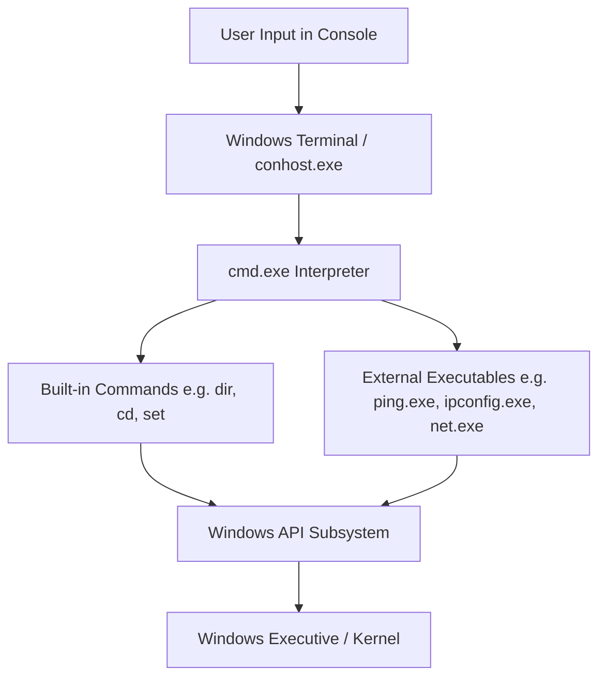
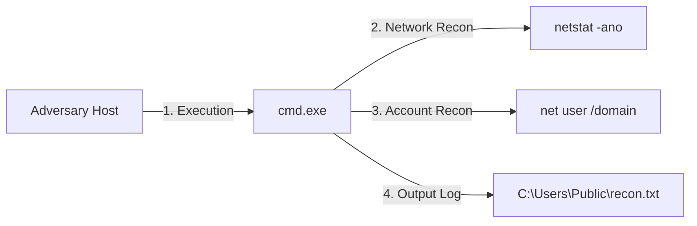

# Chapter 04 — Command Prompt (CMD)

## Introduction

The **Command Prompt** (commonly referred to as **CMD** or `cmd.exe`) is the default command-line interpreter for the Microsoft Windows operating system. Unlike graphical user interfaces (GUIs) where operations are performed using a mouse, icons, and menus, a command-line interface (CLI) allows users, system administrators, and security professionals to interact with the operating system by typing text-based commands.

Command Prompt has been a core component of Windows for decades. Although modern Windows environments rely heavily on PowerShell for advanced administration and automation, CMD remains universally available on virtually every Windows system—from legacy Windows XP workstations to modern Windows 11 and Windows Server 2022 installations.

For SOC Analysts, Incident Responders, and Threat Hunters, mastering CMD is mandatory. Adversaries frequently leverage CMD to perform living-off-the-land (LotL) reconnaissance, execute malicious scripts, create persistence, and manipulate system configurations without downloading external tools.

---

## Learning Objectives

Students should be able to:

- Explain the architecture, history, and role of Command Prompt within Windows.
- Distinguish between standard user and elevated (Administrator) CMD execution contexts.
- Navigate the Windows directory structure using relative and absolute paths.
- Perform core file management, system enumeration, process control, and network discovery operations.
- Utilize output redirection (`>`, `>>`, `2>`) and command piping (`|`) to filter and process data.
- Construct and analyze basic Windows Batch scripts (`.bat` / `.cmd`).
- Identify common attacker command-line techniques, Living-off-the-Land (LotL) binaries, and associated security event logs.

---

## Why Blue Teams Care

Command Prompt is one of the most frequently abused native binaries in Windows environments. Security operations teams analyze CMD activities for several critical reasons:

1. **Living-off-the-Land (LotL) Execution**: Attackers prefer native tools because they rarely trigger basic security alerts. An attacker who gains initial access will often spawn `cmd.exe` to execute host discovery commands like `whoami`, `net user`, `ipconfig`, and `tasklist`.
2. **Malware & Stager Invocation**: Malicious documents (macros), phishing attachments, or compromise vectors frequently execute hidden CMD processes (e.g., `cmd.exe /c start /min ...`) to download payload stagers or initiate PowerShell scripts.
3. **Command Line Audit Logging**: Event logs record exact command arguments executed via CMD (Event ID 4688 with process command-line logging enabled, or Sysmon Event ID 1). Threat hunters analyze these logs to reconstruct adversary behavior.
4. **Emergency Incident Response**: During live incident response on a compromised host, responders may need to perform fast triage via CLI when graphical interfaces are unavailable, unresponsive, or disabled by ransomware.

---

## Core Concepts

### 1. Command Interpreter vs. Shell vs. GUI

- **Graphical User Interface (GUI)**: Uses visual components (`explorer.exe`) such as windows, icons, and buttons. High usability, but slow for repetitive tasks and difficult to log programmatically.
- **Command Line Interpreter (CLI)**: Accepts text inputs, interprets them, and passes instructions to the underlying Windows API.
- **Shell**: The user interface for access to an operating system's services. CMD is a command-line shell for Windows.

### 2. Architecture: `cmd.exe` vs `conhost.exe`

In modern Windows, when you launch Command Prompt:
1. `cmd.exe` executes as the command interpreter (processing syntax, built-in commands, and scripts).
2. `conhost.exe` (Console Window Host) or `OpenConsole.exe` / `Windows Terminal` manages the user interface window, buffer, rendering text, and input event handling.



### 3. Execution Context: Standard User vs. Elevated (Administrator)

Windows enforces Access Control Lists (ACLs) and User Account Control (UAC). Command Prompt inherits the security context of the user who launched it:

- **Standard User CMD**: Operates with restricted privileges (Medium Integrity Level). Cannot modify system files (`C:\Windows`), alter global registry keys (`HKLM`), stop core services, or modify user accounts.
- **Elevated CMD (Run as Administrator)**: Operates with administrative privileges (High Integrity Level). Allows system modifications, driver management, network configuration, and service manipulation.

> **Blue Team Insight**
> 
> Attackers aim to elevate `cmd.exe` from Medium Integrity to High/System Integrity. SOC Analysts monitor for privilege escalation markers where standard processes launch elevated `cmd.exe` instances via UAC bypass techniques.

---

## Practical Examples

### File & Directory Navigation

| Command | Description | Example Syntax |
|---|---|---|
| `cd` | Display or change current directory | `cd C:\Users\Public` |
| `dir` | List files and subdirectories | `dir /a /o:d` |
| `mkdir` / `md` | Create a new directory | `mkdir C:\Triage` |
| `rmdir` / `rd` | Remove a directory | `rmdir /s /q C:\TempDir` |

#### Output Example: `dir`
```cmd
C:\Users\Analyst> dir C:\Windows\System32\drivers\etc

 Directory of C:\Windows\System32\drivers\etc

08/02/2026  10:00 AM    <DIR>          .
08/02/2026  10:00 AM    <DIR>          ..
05/10/2025  12:00 PM             824 hosts
05/10/2025  12:00 PM             368 lmhosts.sam
05/10/2025  12:00 PM             407 networks
05/10/2025  12:00 PM             798 protocol
05/10/2025  12:00 PM          1,163 services
               5 File(s)          3,560 bytes
               2 Dir(s)  45,210,112,000 bytes free
```

---

### System Enumeration Commands

```cmd
:: Display detailed system configuration information
systeminfo

:: Display host computer name
hostname

:: Display Windows operating system version
ver

:: Display current logged-in user and security privileges
whoami /all
```

> **Blue Team Insight**
> 
> Running `whoami /all` returns the current user's SID, group memberships, and assigned privileges (e.g., `SeDebugPrivilege`, `SeImpersonatePrivilege`). Adversaries run `whoami /all` immediately after gaining initial access to check if privilege escalation is needed.

---

### Process Enumeration & Control

```cmd
:: List all running processes with PID and Memory usage
tasklist

:: List processes with services hosted in each process
tasklist /svc

:: Terminate a process by Process ID (PID) forcefully
taskkill /PID 4820 /F

:: Terminate a process by executable name
taskkill /IM malicious.exe /F
```

---

### Network Discovery Commands

```cmd
:: Display IP addresses, subnet mask, and default gateway
ipconfig /all

:: Display active network connections and listening ports with associated PIDs
netstat -ano

:: Test IP connectivity to a remote host
ping 192.168.1.1

:: Trace route to target host
tracert 8.8.8.8

:: Query DNS records
nslookup domain.com

:: Display Address Resolution Protocol (ARP) cache table
arp -a
```



---

### User & Group Management Commands

```cmd
:: List all local user accounts on the machine
net user

:: Display detailed information for a specific user account
net user Administrator

:: Create a new local user account
net user JohnDoe P@ssword123! /add

:: Add user to local Administrators group
net localgroup Administrators JohnDoe /add

:: List members of the local Administrators group
net localgroup Administrators
```

---

### Environment Variables, Redirection, & Pipes

#### Environment Variables
Environment variables store system settings and dynamic paths:
- `%SYSTEMROOT%`: Usually `C:\Windows`
- `%USERPROFILE%`: Usually `C:\Users\<Username>`
- `%TEMP%`: Path to temporary directory

```cmd
echo %USERPROFILE%
set
```

#### Output Redirection & Piping
- `>`: Overwrite file with command output.
- `>>`: Append command output to file.
- `2>`: Redirect error stream.
- `|`: Pass output of left command as input to right command.

```cmd
:: Redirect systeminfo to a text file
systeminfo > C:\Users\Public\sysinfo.txt

:: Append netstat output to existing file
netstat -ano >> C:\Users\Public\sysinfo.txt

:: Find lines containing "ESTABLISHED" connections
netstat -ano | findstr "ESTABLISHED"
```

---

### Windows Batch Scripts (`.bat` / `.cmd`)

Batch scripts store sequential CMD commands executed automatically.

```cmd
@echo off
:: Triage Collector Script
echo [+] Collecting System Information...
hostname > C:\Triage\summary.txt
whoami /all >> C:\Triage\summary.txt

echo [+] Collecting Active Connections...
netstat -ano | findstr /i "ESTABLISHED" >> C:\Triage\summary.txt

echo [+] Collection Complete.
```

> **Warning**
> 
> Attackers often drop obfuscated batch scripts in `%TEMP%` or `C:\Users\Public` to execute persistence mechanisms or launch hidden downloads.

---

## Blue Team Investigation Notes

> **Blue Team Insight: Detecting Suspicious `cmd.exe` Flags**
> 
> Adversaries execute commands non-interactively using specific switches:
> - `cmd.exe /c`: Carries out the command specified by string and then terminates.
> - `cmd.exe /k`: Carries out command and remains open.
> - `cmd.exe /q`: Turns echo off.
> - `cmd.exe /v:on`: Enables delayed environment variable expansion (used in obfuscation).
> 
> Example suspicious parent-child process relationship:
> `WINWORD.EXE` -> `cmd.exe /c powershell.exe -ExecutionPolicy Bypass -enc ...`

---

## Common Mistakes

| Mistake | Consequence | How to Avoid |
|---|---|---|
| Running admin commands in standard CMD | Command fails with "Access is denied" error. | Right-click CMD and select **Run as administrator**. |
| Using single `>` instead of `>>` | Existing log data is accidentally overwritten. | Double-check redirection operators (`>` overwrites, `>>` appends). |
| Forgetting quotes around paths with spaces | CMD interprets space as argument separator (`cd C:\Program Files` fails). | Enclose paths with spaces in double quotes: `cd "C:\Program Files"`. |
| Assuming CMD is PowerShell | Running PowerShell cmdlets like `Get-Process` in CMD returns error. | Use CMD equivalent (`tasklist`) or type `powershell` to launch PowerShell. |

---

## Best Practices

1. **Enable Command Line Process Auditing**: Configure Group Policy (`Computer Configuration -> Administrative Templates -> System -> Audit Process Creation -> Include command line in process creation events`) to populate Event ID 4688 with full arguments.
2. **Deploy Sysmon**: Use Sysmon Event ID 1 (Process Creation) to monitor parent-child process pairs (e.g., MS Office launching CMD).
3. **Restrict CMD Access for Standard Users**: Use Software Restriction Policies or AppLocker/WDAC to block non-administrative execution of `cmd.exe` on high-risk workstations where command line usage is unnecessary.

---

## Summary

- Command Prompt (`cmd.exe`) is the legacy command interpreter built into Microsoft Windows.
- It operates in two privilege contexts: Standard User (Medium Integrity) and Administrator (High Integrity).
- Essential operations include navigation (`cd`, `dir`), process management (`tasklist`, `taskkill`), system discovery (`systeminfo`, `whoami`), user management (`net user`), and networking (`ipconfig`, `netstat`).
- Output can be redirected using `>`, `>>`, and piped into commands like `findstr`.
- Blue teams monitor `cmd.exe` execution because attackers rely on it heavily for Living-off-the-Land (LotL) tactics.

---

## Key Commands

| Command | Purpose | Example |
|---|---|---|
| `whoami` | Displays current user and privilege tokens | `whoami /priv` |
| `systeminfo` | Displays host OS, hotfixes, and hardware attributes | `systeminfo` |
| `tasklist` | Displays active processes and PIDs | `tasklist /svc` |
| `taskkill` | Terminates process by PID or Name | `taskkill /PID 1234 /F` |
| `netstat` | Displays network connections and listening ports | `netstat -ano` |
| `net user` | Queries or modifies user accounts | `net user Administrator` |
| `net localgroup` | Queries or modifies local security groups | `net localgroup Administrators` |
| `findstr` | Searches for text strings inside output/files | `netstat -ano \| findstr 443` |
| `ipconfig` | Displays IP network configuration | `ipconfig /all` |
| `sfc` | System File Checker (scans system integrity) | `sfc /scannow` |

---

## Quick Quiz

1. **Which process is responsible for command-line syntax parsing in Command Prompt?**
   - A) `explorer.exe`
   - B) `cmd.exe`
   - C) `conhost.exe`
   - D) `svchost.exe`

2. **What is the outcome of using the `>` operator in CMD?**
   - A) Appends output to an existing file
   - B) Overwrites the target file with command output
   - C) Sends input to a network socket
   - D) Pipes output to PowerShell

3. **Which command displays active network connections along with the associated Process ID (PID)?**
   - A) `ipconfig /all`
   - B) `netstat -ano`
   - C) `tasklist /svc`
   - D) `route print`

4. **Which `cmd.exe` switch carries out a specified command string and immediately terminates?**
   - A) `/k`
   - B) `/r`
   - C) `/c`
   - D) `/q`

5. **Which command lists all members belonging to the local Administrators group?**
   - A) `net user Administrators`
   - B) `net localgroup Administrators`
   - C) `whoami /groups`
   - D) `tasklist /admin`

6. **Which command is used to forcefully terminate a process with PID 2048?**
   - A) `taskkill /PID 2048 /F`
   - B) `stop-process -id 2048`
   - C) `del /PID 2048`
   - D) `net stop 2048`

7. **What information does the `whoami /all` command provide?**
   - A) Domain controllers and network shares
   - B) Current user SID, group memberships, and assigned privileges
   - C) Operating system build and installation date
   - D) Password hash of the logged-in user

8. **Which environment variable stores the path to the Windows system directory (e.g., `C:\Windows`)?**
   - A) `%USERPROFILE%`
   - B) `%APPDATA%`
   - C) `%SYSTEMROOT%`
   - D) `%TEMP%`

9. **Which tool / event source records process creation events including full command-line arguments in Windows?**
   - A) Event ID 4688 / Sysmon Event ID 1
   - B) Event ID 4624 / Sysmon Event ID 3
   - C) Event ID 1102 / Sysmon Event ID 10
   - D) Event ID 7045 / Sysmon Event ID 12

10. **Which command searches for the specific term "ESTABLISHED" in text output?**
    - A) `grep "ESTABLISHED"`
    - B) `findstr "ESTABLISHED"`
    - C) `select-string "ESTABLISHED"`
    - D) `search "ESTABLISHED"`

---

### Quiz Answers

1. **B** (`cmd.exe`)
2. **B** (Overwrites the target file with command output)
3. **B** (`netstat -ano`)
4. **C** (`/c`)
5. **B** (`net localgroup Administrators`)
6. **A** (`taskkill /PID 2048 /F`)
7. **B** (Current user SID, group memberships, and assigned privileges)
8. **C** (`%SYSTEMROOT%`)
9. **A** (Event ID 4688 / Sysmon Event ID 1)
10. **B** (`findstr "ESTABLISHED"`)

---

## Further Reading

- [Microsoft Learn: Command Prompt Overview](https://learn.microsoft.com/en-us/windows-server/administration/windows-commands/windows-commands)
- [Microsoft Documentation: Windows Commands Reference](https://learn.microsoft.com/en-us/windows-server/administration/windows-commands/cmd)
- [Sysinternals Utilities - Microsoft Learn](https://learn.microsoft.com/en-us/sysinternals/)
- [MITRE ATT&CK: Command and Scripting Interpreter: Windows Command Shell (T1059.003)](https://attack.mitre.org/techniques/T1059/003/)
