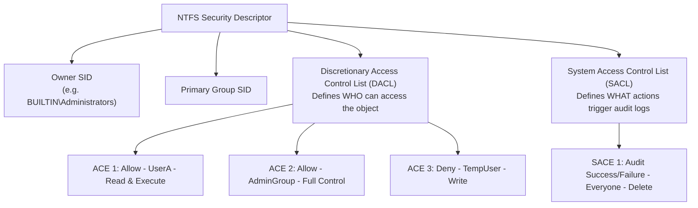
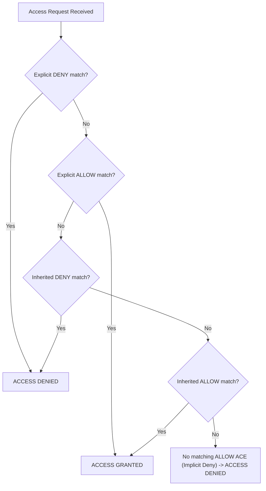

# Chapter 07 — NTFS Permissions & Access Control

## Introduction

In modern multi-user operating systems, controlling access to sensitive files, directories, and system resources is a fundamental requirement. The Windows operating system uses the **New Technology File System (NTFS)** to manage file storage, enforce granular security boundaries, and restrict user access through robust authorization mechanisms.

NTFS Permissions dictate exactly which users, security groups, or system services can view, modify, execute, or delete specific files and folders. These permissions are enforced by the Windows Kernel whenever an application or user attempts to open a handle to a file object.

For Blue Team professionals—including SOC Analysts, Incident Responders, and Systems Auditors—understanding NTFS access control is essential. Attackers routinely search for weak directory permissions to escalate privileges, hijack vulnerable service binaries, establish persistence, or exfiltrate sensitive corporate data.

---

## Learning Objectives

Students should be able to:

- Explain the architecture of NTFS Security Descriptors, DACLs, SACLs, and ACEs.
- Differentiate between Discretionary Access Control Lists (DACLs) and System Access Control Lists (SACLs).
- Describe Standard NTFS permissions (Read, Write, Read & Execute, List Folder Contents, Modify, Full Control) and Special Permissions.
- Analyze permission inheritance rules, parent-child folder propagation, and inheritance blocking.
- Evaluate Effective Permissions and apply evaluation rules (Deny overrides Allow, explicit overrides inherited).
- Manage file ownership and modify Access Control Lists using `icacls.exe`, `takeown.exe`, and PowerShell (`Get-Acl`, `Set-Acl`).
- Configure object access auditing and analyze Security Event Logs (Event IDs 4663 and 4656).

---

## Why Blue Teams Care

Access control is a core pillar of host security and forensic investigation:

1. **Privilege Escalation via Weak File Permissions**: Adversaries search for system service executables, configuration files, or scheduled task scripts that grant Write `(W)` or Modify `(M)` access to standard `Users`. Replacing a legitimate binary with a malicious payload allows instant privilege escalation to `NT AUTHORITY\SYSTEM`.
2. **Data Exfiltration & Confidentiality Breaches**: Overshared network drives and permissive folder ACLs allow unauthorized accounts to browse and steal sensitive documents.
3. **Forensic Auditing & Object Tracking**: By configuring SACLs on sensitive files (e.g. database files, domain hashes, configuration files), Blue Teams generate Event ID 4663 whenever a user reads, modifies, or deletes targeted objects.
4. **Restoring Hardened Baselines**: During incident containment, responders must rapidly strip unauthorized permissions, re-establish strict access boundaries, and transfer ownership back to trusted security principals.

---

## Core Concepts

### 1. Security Descriptors, ACLs, and ACEs

Every NTFS file and folder object carries an invisible security data structure called a **Security Descriptor**.



- **Discretionary Access Control List (DACL)**: Contains Access Control Entries (ACEs) that specify which users or groups are allowed or denied access to the object.
- **System Access Control List (SACL)**: Specifies auditing rules for the object. Generates security event logs when users interact with the object.
- **Access Control Entry (ACE)**: An individual record within an ACL containing:
  - A Trustee (User, Group, or Service SID).
  - An Access Type (`Allow` or `Deny`).
  - Access Mask (Specific permissions like Read, Write, Delete).
  - Inheritance flags.

---

### 2. Standard vs. Special NTFS Permissions

NTFS categorizes permissions into **Standard Permissions** (easy-to-use bundles) and **Special Permissions** (granular individual rights):

| Standard Permission | Description | Includes |
|---|---|---|
| **Read** | View file contents, folder contents, and file metadata. | Read Data, Read Attributes, Read Extended Attributes, Read Permissions. |
| **Write** | Create new files, overwrite existing files, modify attributes. | Write Data, Append Data, Write Attributes, Write Extended Attributes. |
| **Read & Execute** | Read files and run executable programs (`.exe`, `.bat`, `.ps1`). | Read permissions + Traverse Folder / Execute File. |
| **List Folder Contents** | View filenames inside a directory (applies to folders). | Read & Execute rights scoped to folder objects. |
| **Modify** | Read, Write, Execute, and Delete files and subfolders. | Read + Write + Execute + Delete. |
| **Full Control** | Complete control over object, including changing permissions and taking ownership. | All permissions + Change Permissions + Take Ownership. |

---

### 3. Permission Inheritance & Evaluation Order

When a user requests access to a file, Windows evaluates ACEs in the DACL using strict precedence rules:



#### Key Rules of Access Evaluation:
1. **Explicit permissions override Inherited permissions**. An explicit `Allow` on a file overrides an inherited `Deny` from its parent folder.
2. **Deny ACEs override Allow ACEs** at the same level of the hierarchy.
3. **Permissions are Cumulative**: If a user belongs to Group A (`Read`) and Group B (`Write`), their effective permission is `Modify/Read+Write`.
4. **Implicit Deny**: If no matching `Allow` ACE exists for the user or their groups, access is denied by default.

---

## Practical Examples

### Inspecting & Modifying Permissions with `icacls.exe`

`icacls.exe` is the native command-line utility for inspecting and managing NTFS access control lists.

```cmd
:: Display ACLs for a specific file or folder
icacls C:\Windows\System32\cmd.exe

:: Grant explicit Read and Execute access to a local user
icacls C:\Data\Report.docx /grant AnalystJohn:(RX)

:: Remove all permissions for a specific group
icacls C:\Data\Report.docx /remove "Users"

:: Disable inheritance on a folder and copy existing inherited ACEs as explicit ACEs
icacls C:\Confidential /inheritance:d

:: Restore default inherited permissions recursively
icacls C:\Confidential /reset /T
```

#### Permission Notation Legend in `icacls`
- `(F)`: Full Control
- `(M)`: Modify
- `(RX)`: Read & Execute
- `(R)`: Read-Only
- `(W)`: Write-Only
- `(I)`: Permission inherited from parent container
- `(OI)`: Object Inherit (applies to files)
- `(CI)`: Container Inherit (applies to subfolders)

---

### Managing ACLs via PowerShell (`Get-Acl` & `Set-Acl`)

```powershell
# Retrieve and view detailed Access Control List
$Acl = Get-Acl -Path "C:\Confidential"
$Acl.Access | Format-Table IdentityReference, FileSystemRights, AccessControlType, IsInherited

# Disable Inheritance and remove inherited ACEs
$Acl.SetAccessRuleProtection($true, $false) # Protect = true, PreserveInherited = false

# Define a new explicit Access Rule granting Full Control to Administrators
$Rule = New-Object System.Security.AccessControl.FileSystemAccessRule(
    "BUILTIN\Administrators",
    "FullControl",
    "ContainerInherit, ObjectInherit",
    "None",
    "Allow"
)
$Acl.AddAccessRule($Rule)

# Apply updated ACL to disk
Set-Acl -Path "C:\Confidential" -AclObject $Acl
```

---

### File Ownership & Reclaiming Access (`takeown.exe`)

When permissions are misconfigured or corrupt, even Administrators may be denied access. An Administrator can take ownership of any file, which automatically restores their right to modify the DACL.

```cmd
:: Take ownership of a file as the local Administrators group
takeown /F C:\LockedFile.dat /A

:: Take ownership of an entire directory tree recursively
takeown /F C:\RestrictedFolder /R /A /D Y
```

---

## Blue Team Investigation Notes

> **Blue Team Insight: Auditing Object Access (Event ID 4663)**
> 
> To generate audit logs for file access, configure a System Access Control List (SACL) on the targeted file/folder, and ensure **Audit Object Access** is enabled in Local Security Policy (`secpol.msc`).
> 
> Key Event IDs in the `Security` Event Log:
> - **Event ID 4656**: A handle to an object was requested (logs intent).
> - **Event ID 4663**: An attempt was made to access an object (logs actual access with process details and specific rights requested, e.g. `READ_DATA`, `WRITE_DATA`, `DELETE`).
> - **Event ID 4670**: Permissions on an object were changed.

---

## Common Mistakes

| Mistake | Consequence | How to Avoid |
|---|---|---|
| Leaving `Users:(F)` on Root Drives | Standard users can write malicious binaries to `C:\` or service paths. | Keep standard NTFS restrictions on root and system folders. |
| Overusing Deny ACEs | Deny ACEs cause unexpected access blockages due to high precedence. | Remove Allow ACEs instead of adding explicit Deny ACEs whenever possible. |
| Forgetting Inheritance Propagation | Setting folder permissions without `(OI)(CI)` leaves inner files unprotected. | Use `(OI)(CI)` flags or `/T` switch when applying folder permissions. |

---

## Best Practices

1. **Follow the Principle of Least Privilege (PoLP)**: Grant only the minimum permissions necessary for users to perform their job functions.
2. **Assign Permissions to Groups, Not Users**: Create role-based security groups (e.g. `Finance_Read_Group`) and assign permissions to groups rather than individual user SIDs.
3. **Disable Inheritance on Sensitive Repositories**: Convert inherited ACEs to explicit ACEs and remove `BUILTIN\Users` from confidential data directories.
4. **Audit Sensitive File Operations**: Apply SACLs to critical files (e.g., SAM database backups, configuration files) and send Event ID 4663 to SIEM.

---

## Summary

- NTFS Permissions control file and directory access using Security Descriptors, DACLs, SACLs, and ACEs.
- DACLs determine access (`Allow`/`Deny`), while SACLs define security audit events.
- Precedence hierarchy dictates that Explicit Deny > Explicit Allow > Inherited Deny > Inherited Allow.
- Command-line utilities (`icacls`, `takeown`) and PowerShell cmdlets (`Get-Acl`, `Set-Acl`) provide granular control over access lists and file ownership.
- Monitoring Event IDs 4663 and 4670 enables tracking of file tampering and unauthorized permission changes.

---

## Key Commands

| Command / Cmdlet | Purpose | Example |
|---|---|---|
| `icacls` | Displays or modifies file/folder ACLs | `icacls C:\Data` |
| `takeown` | Reclaims file or directory ownership | `takeown /F C:\Folder /A /R` |
| `Get-Acl` | Gets the ACL for a resource in PowerShell | `Get-Acl C:\Confidential` |
| `Set-Acl` | Sets the ACL for a resource in PowerShell | `Set-Acl -Path C:\Data -AclObject $acl` |
| `icacls /grant` | Grants explicit user permissions | `icacls C:\File.txt /grant User:(RX)` |
| `icacls /remove` | Removes user/group permissions from DACL | `icacls C:\File.txt /remove Users` |

---

## Quick Quiz

1. **Which component of a Security Descriptor specifies which users are allowed or denied access to a file?**
   - A) System Access Control List (SACL)
   - B) Discretionary Access Control List (DACL)
   - C) Relative Identifier (RID)
   - D) Master File Table ($MFT)

2. **What rule takes top precedence during NTFS access evaluation at the same level?**
   - A) Inherited Allow
   - B) Explicit Allow
   - C) Explicit Deny
   - D) Inherited Deny

3. **Which standard NTFS permission allows a user to read, write, execute, and delete files, but NOT change permissions or take ownership?**
   - A) Full Control
   - B) Modify
   - C) Read & Execute
   - D) Write

4. **In `icacls` notation, what does the `(I)` flag indicate?**
   - A) Inherited from parent container
   - B) Invalid permission entry
   - C) Integrity level restriction
   - D) Interactive user only

5. **Which command-line utility allows an Administrator to forcibly claim file ownership when locked out by DACLs?**
   - A) `icacls`
   - B) `takeown`
   - C) `attrib`
   - D) `cipher`

6. **What does an explicit Deny ACE on a file do to an inherited Allow ACE?**
   - A) It is ignored
   - B) It overrides the inherited Allow ACE
   - C) It converts into an Allow ACE
   - D) It causes a system crash

7. **Which Windows Security Event ID logs specific object access attempts (such as reading or writing a file) when SACLs are configured?**
   - A) Event ID 4624
   - B) Event ID 4688
   - C) Event ID 4663
   - D) Event ID 7045

8. **What do the `(OI)(CI)` flags represent when applying permissions to a folder?**
   - A) Read-Only and Hidden
   - B) Object Inherit and Container Inherit (propagates to child files and folders)
   - C) Owner Identical and Group Identical
   - D) Operating System Internal

9. **Which PowerShell cmdlet is used to commit modified Access Control Objects back to disk?**
   - A) `Get-Acl`
   - B) `Set-Acl`
   - C) `New-AccessRule`
   - D) `Grant-Permission`

10. **Why do attackers seek out write permissions on Windows service executables?**
    - A) To compress system logs
    - B) To replace legitimate service binaries and achieve privilege escalation to `SYSTEM`
    - C) To disable network card drivers
    - D) To bypass BitLocker encryption

---

### Quiz Answers

1. **B** (Discretionary Access Control List (DACL))
2. **C** (Explicit Deny)
3. **B** (Modify)
4. **A** (Inherited from parent container)
5. **B** (`takeown`)
6. **B** (It overrides the inherited Allow ACE)
7. **C** (Event ID 4663)
8. **B** (Object Inherit and Container Inherit)
9. **B** (`Set-Acl`)
10. **B** (To replace legitimate service binaries and achieve privilege escalation to `SYSTEM`)

---

## Further Reading

- [Microsoft Learn: Access Control Overview](https://learn.microsoft.com/en-us/windows/security/identity-protection/access-control/access-control)
- [Microsoft Documentation: icacls Reference](https://learn.microsoft.com/en-us/windows-server/administration/windows-commands/icacls)
- [Microsoft Learn: How Access Check Works](https://learn.microsoft.com/en-us/windows/win32/secauthz/how-dacls-control-access-to-an-object)
- [MITRE ATT&CK: File and Directory Permissions Modification (T1222.001)](https://attack.mitre.org/techniques/T1222/001/)
