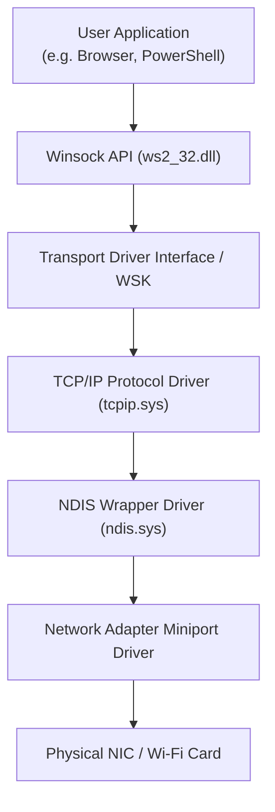
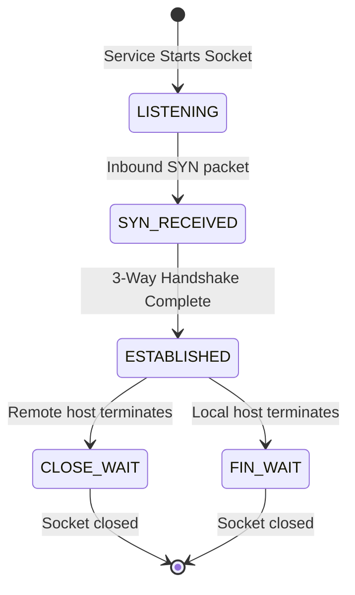

# Chapter 09 — Windows Networking Fundamentals

## Introduction

Networking is the nervous system of modern enterprise IT infrastructure. Every web request, authentication exchange, remote administration session, and security log transfer occurs over network sockets using standard networking protocols implemented within the Windows operating system.

Windows incorporates a comprehensive networking stack supporting IPv4, IPv6, TCP, UDP, DNS, ARP, DHCP, and enterprise management protocols like SMB (Server Message Block), RDP (Remote Desktop Protocol), and WinRM (Windows Remote Management).

For Blue Teams, network monitoring and endpoint socket inspection are critical. Attackers rely on network communications for Command-and-Control (C2) beaconing, lateral movement between endpoints, data exfiltration, and internal network discovery.

---

## Learning Objectives

Students should be able to:

- Explain the Windows Network Stack architecture, NDIS drivers, and Winsock API.
- Query and configure IPv4/IPv6 interface properties using `ipconfig`, `netsh`, and PowerShell (`Get-NetIPAddress`, `Get-NetAdapter`).
- Analyze active TCP/UDP network connections, listening ports, and socket states (`netstat -ano`, `Get-NetTCPConnection`).
- Understand Domain Name System (DNS) operation, inspect/flush local DNS cache, and edit the `hosts` file.
- Describe Address Resolution Protocol (ARP), inspect ARP cache (`arp -a`), and identify ARP spoofing indicators.
- Examine routing tables, default gateways, and trace network paths (`route print`, `tracert`, `pathping`, `Test-NetConnection`).
- Configure Windows Firewall rules and audit active profiles via `netsh advfirewall` and PowerShell.
- Identify common enterprise remote management protocols and their security implications (SMB 445, RDP 3389, WinRM 5985/5986, RPC 135).
- Audit network connection logs (Sysmon Event ID 3, Windows Firewall Logs).

---

## Why Blue Teams Care

Network interfaces are primary attack vectors and indicators of compromise:

1. **Detecting C2 Beacons**: Malware establishes outgoing TCP/HTTPS sessions to external command-and-control servers. SOC analysts identify these sockets via `netstat` and Sysmon Event ID 3.
2. **Lateral Movement Detection**: Adversaries move laterally across internal networks using native protocols (SMB, WinRM, WMI, RDP). Monitoring inbound connections to port 445 or 5985 flags unauthorized lateral movement.
3. **DNS Tunneling & Exfiltration**: Attackers abuse DNS queries to bypass perimeter firewalls and exfiltrate data. Auditing host DNS caches and query logs reveals malicious domain lookups.
4. **Host Hardening via Windows Firewall**: Disabling unnecessary listening ports and restricting administrative ports (RDP/SMB) to trusted management subnets blocks unauthorized access.

---

## Core Concepts

### 1. Windows Network Stack Architecture

Network traffic flows from applications down through the Winsock API, through protocol drivers (`tcpip.sys`), to the Network Driver Interface Specification (NDIS) layer, and out the physical Network Interface Card (NIC).



---

### 2. Network Sockets & Connection States

A network socket is defined by a **5-Tuple**: (Source IP, Source Port, Destination IP, Destination Port, Protocol).

#### Common TCP Socket States:
- `LISTENING`: The process is waiting for incoming network connection requests.
- `ESTABLISHED`: An active, open data connection exists between the host and a remote endpoint.
- `TIME_WAIT`: Socket closed, waiting to ensure remote host received acknowledgment.
- `CLOSE_WAIT`: Remote host initiated close, local host waiting to close socket.



---

### 3. Key Windows Enterprise Management Protocols

| Protocol | Default Port | Transport | Purpose & Blue Team Risk |
|---|---|---|---|
| **SMB** (Server Message Block) | **445** | TCP | File sharing & Named Pipes. Targeted for Lateral Movement & Ransomware. |
| **RDP** (Remote Desktop) | **3389** | TCP | Graphical remote desktop access. Targeted for brute-force & credential abuse. |
| **WinRM** (Windows Remote Mgmt) | **5985** (HTTP) / **5986** (HTTPS) | TCP | PowerShell Remoting. Abused for remote command execution. |
| **RPC** (Remote Procedure Call) | **135** | TCP | Endpoint Mapper. Used for remote WMI and DCOM execution. |
| **DNS** (Domain Name System) | **53** | UDP/TCP | Hostname resolution. Abused for C2 tunneling and exfiltration. |

---

## Practical Examples

### Interface & Network Discovery

```cmd
:: Display complete IP network configuration
ipconfig /all

:: Display active ARP table (IP to MAC mappings)
arp -a

:: Display IPv4 Routing Table
route print
```

```powershell
# PowerShell: Enumerate network adapters
Get-NetAdapter | Format-Table Name, InterfaceDescription, Status, LinkSpeed

# PowerShell: Retrieve IPv4 address configuration
Get-NetIPAddress -AddressFamily IPv4 | Select-Object InterfaceAlias, IPAddress, PrefixLength
```

---

### Socket & Port Inspection (`netstat` & `Get-NetTCPConnection`)

```cmd
:: List all active connections and listening ports with PID
netstat -ano

:: Filter netstat output for listening ports
netstat -ano | findstr "LISTENING"
```

```powershell
# PowerShell: Get active TCP connections with process names
Get-NetTCPConnection -State Established | Select-Object LocalAddress, LocalPort, RemoteAddress, RemotePort, OwningProcess, @{Name="ProcessName";Expression={(Get-Process -Id $_.OwningProcess).ProcessName}}

# PowerShell: Test TCP port connectivity to remote host
Test-NetConnection -ComputerName 192.168.1.1 -Port 445
```

---

### DNS Investigation & Troubleshooting

```cmd
:: Display local DNS Resolver Cache
ipconfig /displaydns

:: Clear/Flush local DNS Cache
ipconfig /flushdns

:: Query DNS record via nslookup
nslookup malicious-domain.com 8.8.8.8
```

```powershell
# PowerShell: Resolve DNS domain details
Resolve-DnsName -Name google.com -Type A
```

> **Note**
> 
> The local `hosts` file (`C:\Windows\System32\drivers\etc\hosts`) overrides DNS resolution. Always inspect this file during malware investigations.

---

### Windows Firewall Configuration (`netsh` & PowerShell)

```cmd
:: View status of all Firewall profiles (Domain, Private, Public)
netsh advfirewall show allprofiles

:: Create Firewall rule blocking outbound traffic to specific IP
netsh advfirewall firewall add rule name="Block_C2_IP" dir=out action=block remoteip=198.51.100.45
```

```powershell
# PowerShell: View enabled Firewall rules
Get-NetFirewallRule -Enabled True | Select-Object DisplayName, Direction, Action

# PowerShell: Create inbound firewall rule for custom app
New-NetFirewallRule -DisplayName "Allow SOC Agent" -Direction Inbound -LocalPort 8080 -Protocol TCP -Action Allow
```

---

## Blue Team Investigation Notes

> **Blue Team Insight: Network Connection Logging (Sysmon Event ID 3)**
> 
> While `netstat` provides a snapshot of current connections, transient network beacons may close before manual inspection.
> 
> Deploy **Sysmon Event ID 3 (Network Connection Introduced)** to generate persistent audit logs containing:
> - Source IP & Port
> - Destination IP & Port (and resolved Hostname)
> - Initiating Process Name & PID
> - User Account Context
> 
> Correlate Sysmon Event ID 3 with firewall logs to detect unauthorized outbound connections to known Malicious C2 IP addresses.

---

## Common Mistakes

| Mistake | Consequence | How to Avoid |
|---|---|---|
| Forgetting PID to Process Mapping | Identifying an IP in `netstat` without checking the PID leaves the source process unknown. | Always match PID from `netstat -ano` to `tasklist` or `Get-Process`. |
| Ignoring Transient Connections | Short-lived HTTP beacons close quickly, missing manual CLI detection. | Enable Sysmon Event ID 3 or endpoint network logging. |
| Neglecting the `hosts` File | Troubleshooting DNS issues without checking `hosts` hides local IP redirection. | Inspect `C:\Windows\System32\drivers\etc\hosts` early in triage. |

---

## Best Practices

1. **Disable Legacy Protocols**: Disable NetBIOS over TCP/IP and LLMNR (Link-Local Multicast Name Resolution) to prevent credential poisoning attacks (e.g. Responder).
2. **Restrict Administrative Remote Ports**: Block inbound ports 445 (SMB), 3389 (RDP), and 5985 (WinRM) from public networks using Windows Firewall.
3. **Enable Network Auditing**: Deploy Sysmon Event ID 3 across enterprise endpoints to log all outbound network sockets.
4. **Monitor DNS Cache & Anomalous Queries**: Audit high-frequency DNS requests to uncommon TLDs indicative of C2 communication or DNS tunneling.

---

## Summary

- The Windows network stack routes traffic through Winsock, `tcpip.sys`, NDIS, and physical NICs.
- Active network connections are defined by 5-tuple sockets and tracked via `netstat -ano` and `Get-NetTCPConnection`.
- Core enterprise protocols (SMB 445, RDP 3389, WinRM 5985) require strict firewall restrictions.
- DNS resolution can be inspected (`ipconfig /displaydns`), flushed (`ipconfig /flushdns`), and tested (`nslookup`/`Resolve-DnsName`).
- Sysmon Event ID 3 provides essential network connection logging for Threat Hunting.

---

## Key Commands

| Command / Cmdlet | Purpose | Example |
|---|---|---|
| `ipconfig /all` | Displays complete network adapter details | `ipconfig /all` |
| `netstat -ano` | Lists active sockets, listening ports, and PIDs | `netstat -ano` |
| `arp -a` | Displays IP-to-MAC resolution table | `arp -a` |
| `tracert` | Traces network routing path to destination | `tracert 8.8.8.8` |
| `Test-NetConnection` | Tests IP connectivity and specific TCP port | `Test-NetConnection 192.168.1.1 -Port 3389` |
| `Get-NetTCPConnection` | Retrieves active TCP sockets in PowerShell | `Get-NetTCPConnection -State Established` |
| `netsh advfirewall` | Manages Windows Firewall settings | `netsh advfirewall show allprofiles` |

---

## Quick Quiz

1. **Which command displays all active TCP sockets, listening ports, and associated Process IDs (PIDs)?**
   - A) `ipconfig /all`
   - B) `netstat -ano`
   - C) `arp -a`
   - D) `route print`

2. **Which port is used by default for Server Message Block (SMB) file sharing and lateral movement?**
   - A) 80
   - B) 445
   - C) 3389
   - D) 5985

3. **Which file on a Windows system allows local hostname-to-IP overrides prior to querying DNS servers?**
   - A) `C:\Windows\System32\drivers\etc\hosts`
   - B) `C:\Windows\System32\config\SAM`
   - C) `C:\Windows\System32\networks`
   - D) `C:\Windows\System32\dns.ini`

4. **Which command flushes the local Windows DNS resolver cache?**
   - A) `ipconfig /renew`
   - B) `ipconfig /flushdns`
   - C) `netsh dns reset`
   - D) `clear-host`

5. **Which protocol resolves IPv4 network addresses to hardware Physical MAC addresses?**
   - A) DNS
   - B) DHCP
   - C) ARP
   - D) ICMP

6. **What port is used for default unencrypted Windows Remote Management (WinRM)?**
   - A) 22
   - B) 3389
   - C) 5985
   - D) 8080

7. **Which PowerShell cmdlet performs diagnostic testing of remote IP connectivity and specific TCP port availability?**
   - A) `Ping-Host`
   - B) `Test-NetConnection`
   - C) `Get-NetworkStatus`
   - D) `Connect-Socket`

8. **Which Sysmon Event ID logs host network connection events including initiating process names and destination IPs?**
   - A) Event ID 1
   - B) Event ID 3
   - C) Event ID 4624
   - D) Event ID 7045

9. **What TCP connection state indicates that a service is active and waiting for incoming connections?**
   - A) ESTABLISHED
   - B) LISTENING
   - C) TIME_WAIT
   - D) CLOSE_WAIT

10. **Which command line tool is used to manage Windows Firewall profiles and add custom firewall rules?**
    - A) `icacls`
    - B) `netsh advfirewall`
    - C) `sc.exe`
    - D) `wmic`

---

### Quiz Answers

1. **B** (`netstat -ano`)
2. **B** (445)
3. **A** (`C:\Windows\System32\drivers\etc\hosts`)
4. **B** (`ipconfig /flushdns`)
5. **C** (ARP)
6. **C** (5985)
7. **B** (`Test-NetConnection`)
8. **B** (Event ID 3)
9. **B** (LISTENING)
10. **B** (`netsh advfirewall`)

---

## Further Reading

- [Microsoft Learn: Windows TCP/IP Architecture](https://learn.microsoft.com/en-us/windows-server/networking/technologies/netsh/netsh-contexts)
- [Microsoft Documentation: Windows Firewall with Advanced Security](https://learn.microsoft.com/en-us/windows/security/operating-system-security/network-security/windows-firewall/)
- [Sysinternals Utilities - TCPView](https://learn.microsoft.com/en-us/sysinternals/downloads/tcpview)
- [MITRE ATT&CK: Remote Services: SMB/Windows Admin Shares (T1021.002)](https://attack.mitre.org/techniques/T1021/002/)
