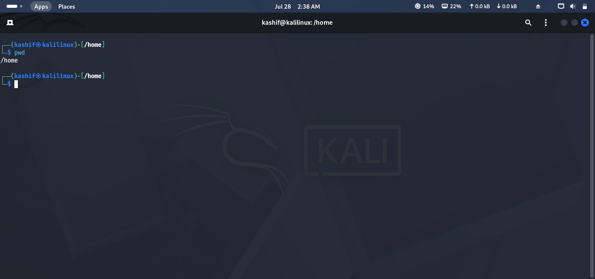
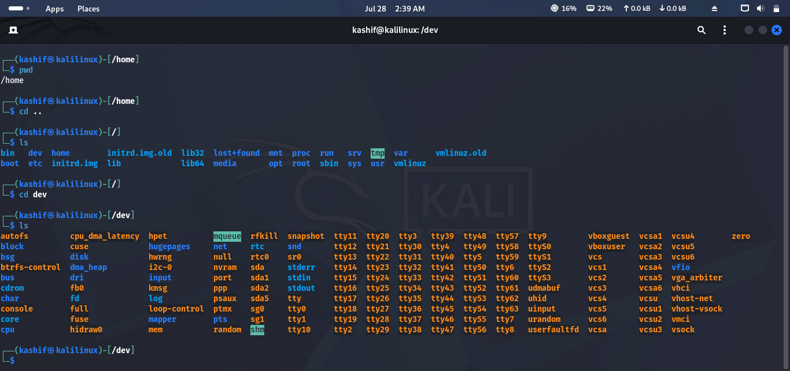
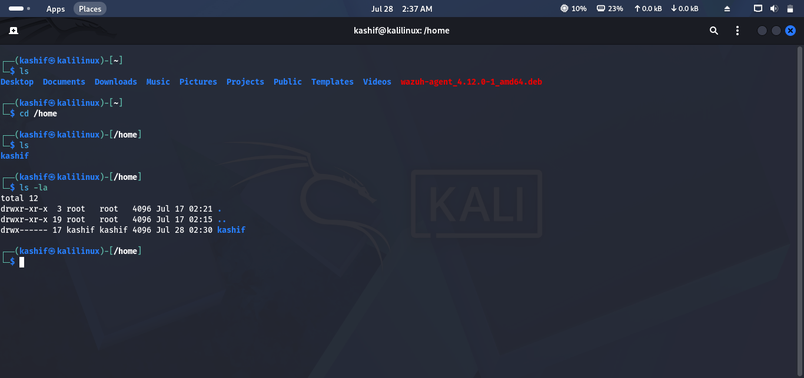
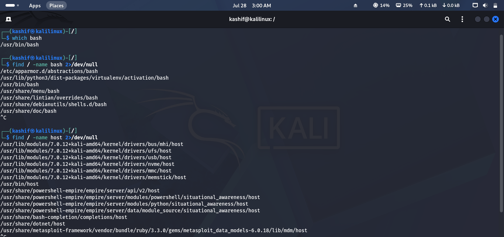
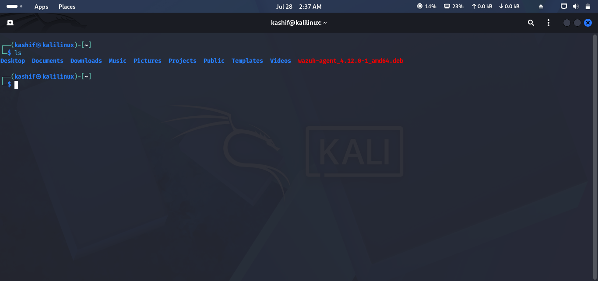

# Lab 02 Solution – Linux File System Exploration

## Overview

This solution demonstrates one possible approach to completing **Lab 02 – Lost in the File System**.

> **Note:** Commands and outputs may vary depending on your Linux distribution.

---

# Task 1 – Determine Your Current Location

### Approach

Before exploring the system, identify your current working directory.

### Command

```bash
pwd
```

### Expected Output

```text
/home/kali
```

### Screenshot



---

# Task 2 – Explore the Linux File System

### Approach

Navigate to the root directory and examine the major Linux folders.

### Commands

```bash
cd /
ls
```

Explore the following directories:

```text
/etc
/var
/home
/usr
/boot
/dev
/proc
```

For each directory, observe its purpose.

| Directory | Purpose |
|-----------|---------|
| `/etc` | System configuration files |
| `/var` | Logs and variable data |
| `/home` | User home directories |
| `/usr` | Installed applications |
| `/boot` | Boot loader and kernel files |
| `/dev` | Device files |
| `/proc` | Process and kernel information |

### Screenshot



---

# Task 3 – Find Hidden Files

### Approach

Return to your home directory and display all hidden files.

### Commands

```bash
cd ~
ls -la
```

You should see hidden files similar to:

- `.bashrc`
- `.profile`
- `.config`

### Screenshot



---

# Task 4 – Locate Important Files

### Approach

Use Linux search commands to locate important system files.

### Commands

Locate the Bash executable:

```bash
which bash
```

Locate the hosts file:

```bash
find / -name hosts 2>/dev/null
```

Locate the passwd file:

```bash
find / -name passwd 2>/dev/null
```

Locate the sudoers file:

```bash
find / -name sudoers 2>/dev/null
```

### Screenshot



---

# Task 5 – Explore Your Home Directory

### Approach

Navigate through your home directory and identify the default user folders.

### Command

```bash
cd ~
ls
```

Common folders include:

- Desktop
- Documents
- Downloads
- Pictures
- Music
- Videos

### Screenshot



---

# Task 6 – Document Your Findings

Create a short report summarizing your observations.

Example:

| Directory | Purpose |
|-----------|---------|
| `/etc` | Stores system configuration files |
| `/var` | Contains logs and variable data |
| `/home` | Stores user files |
| `/usr` | Contains installed applications |
| `/proc` | Provides process and kernel information |

---

# Challenge Answers

| Challenge | Answer |
|-----------|--------|
| Bash executable | `which bash` |
| Shadow file | `/etc/shadow` |
| System logs | `/var/log` |
| Hidden configuration file | `.bashrc` (or similar) |
| Temporary files | `/tmp` |

----

## 🎉 Lab Complete!

Congratulations! You have successfully completed **Lab 02 – Lost in the File System**.

You should now be able to:

- Navigate the Linux file system.
- Identify major Linux directories.
- View hidden files.
- Locate important system files.
- Use basic Linux search commands.

Continue to **Lab 03 – The Terminal Apprentice**.