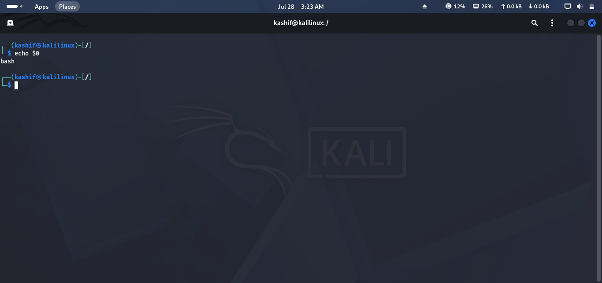
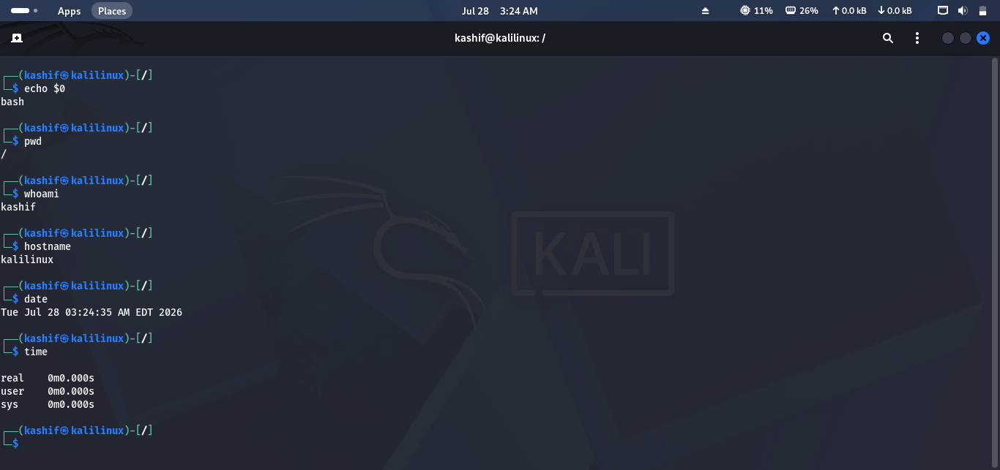
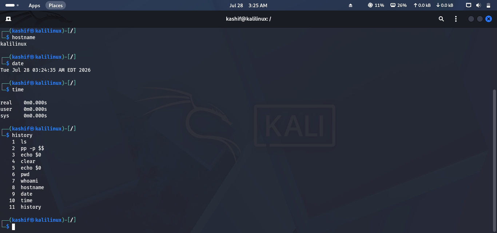
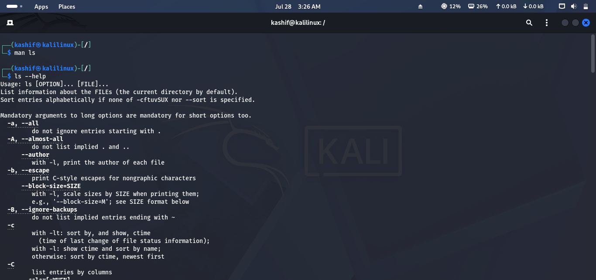
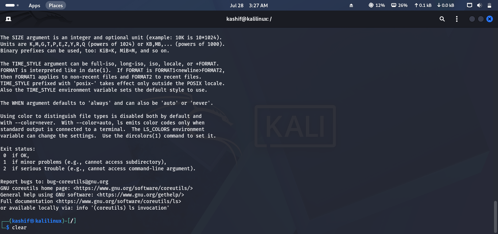

# Lab 03 Solution – Shell & Terminal Basics

## Overview

This solution demonstrates one possible approach to completing **Lab 03 – Shell & Terminal Basics**.

> **Note:** Outputs may vary depending on your Linux distribution and shell configuration.

---

# Task 1 – Open the Terminal

### Approach

Launch the terminal and identify the shell currently running on your system.

### Commands

```bash
echo $SHELL
```

or

```bash
echo $0
```

### Expected Output

```text
/bin/bash
```

### Screenshot



---

# Task 2 – Execute Basic Commands

### Approach

Run a few common Linux commands and observe their output.

### Commands

```bash
pwd
whoami
hostname
date
```

To see how Linux handles an invalid command, try:

```bash
abcd
```

### Expected Result

- Displays your current directory.
- Shows the logged-in user.
- Displays the system hostname.
- Prints the current date and time.
- Returns an error for an invalid command.

### Screenshot



---

# Task 3 – View Command History

### Approach

Display previously executed commands and navigate through them.

### Command

```bash
history
```

Use the **↑** and **↓** arrow keys to browse previous commands.

### Screenshot



---

# Task 4 – Access Command Documentation

### Approach

Use Linux's built-in help resources to learn about commands.

### Commands

View the manual page:

```bash
man ls
```

View a command's help menu:

```bash
ls --help
```

View Bash documentation:

```bash
info bash
```

> Press **q** to exit the `man` or `info` pages.

### Screenshot



---

# Task 5 – Auto-Completion & Terminal Organization

### Approach

Use keyboard shortcuts to improve efficiency.

### Practice

- Type:

```text
cd Do
```

Then press **Tab** to auto-complete the directory name.

Clear the terminal when finished:

```bash
clear
```

or press:

```text
Ctrl + L
```

### Screenshot



---

# Task 6 – Create a Personal Command Reference

Create a simple note containing the commands you learned.

| Command | Purpose |
|---------|---------|
| `pwd` | Show current directory |
| `whoami` | Display current user |
| `hostname` | Show system hostname |
| `date` | Display current date and time |
| `history` | View previously executed commands |
| `man` | Read manual pages |
| `--help` | Display command help |
| `clear` | Clear the terminal |

Save your notes in a text or Markdown file for future reference.

---

# Challenge Answers

| Challenge | Solution |
|-----------|----------|
| Current shell | `echo $SHELL` |
| Manual page for `ls` | `man ls` |
| Recent command history | `history` |
| Auto-complete | Press **Tab** |
| Bash version | `bash --version` |

---

## 🎉 Lab Complete!

Congratulations! You have successfully completed **Lab 03 – Shell & Terminal Basics**.

You should now be able to:

- Work confidently in the Linux terminal.
- Identify your current shell.
- Execute basic Linux commands.
- Access built-in documentation.
- Use command history efficiently.
- Improve productivity with auto-completion.
- Keep your terminal workspace organized.

Continue to **Lab 04 – Hunt Through the Directories**.
