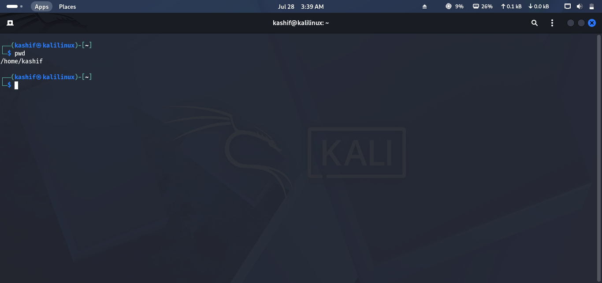
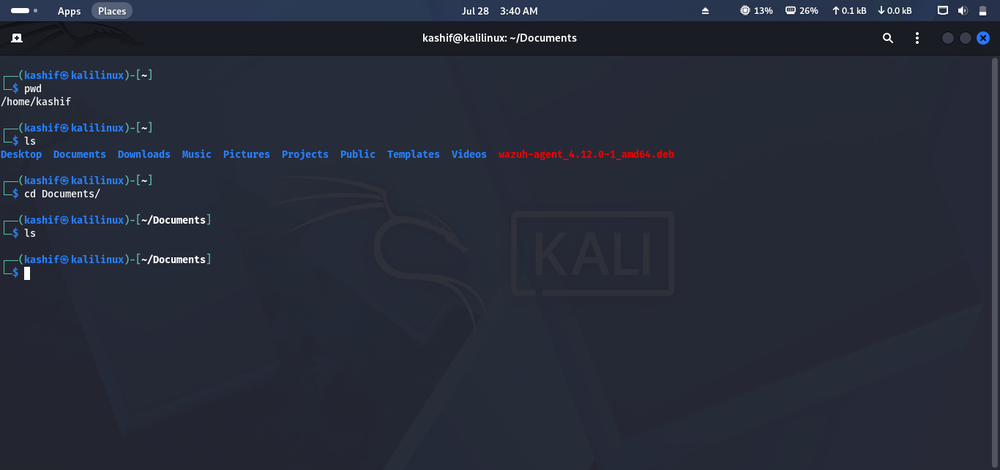
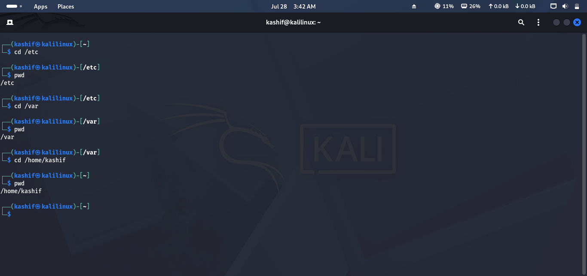
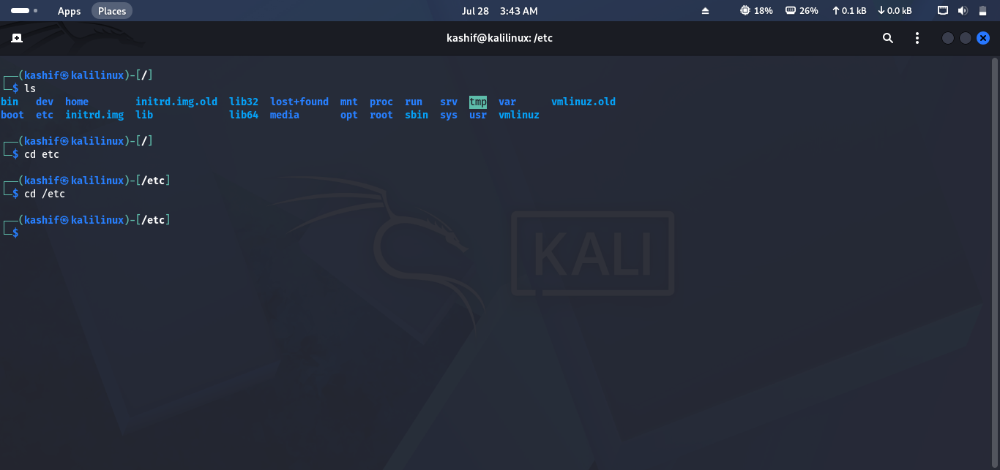
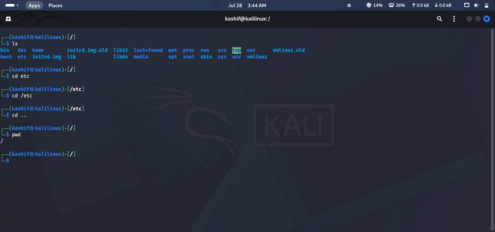
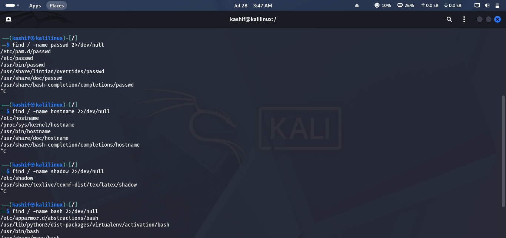
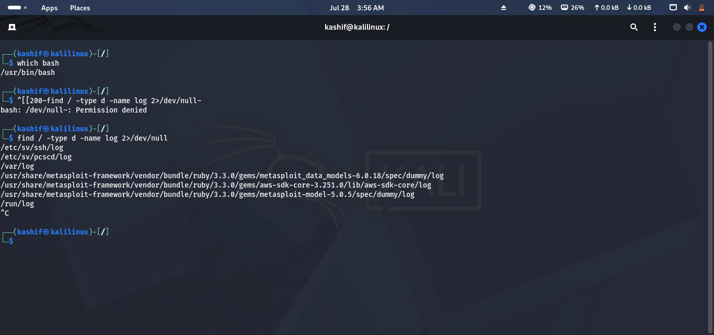

# Lab 04 Solution – Navigation Commands

## Overview

This solution demonstrates one possible approach to completing **Lab 04 – Navigation Commands**.

> **Note:** Your output may vary depending on your Linux distribution and current directory.

---

# Task 1 – Verify Your Current Location

### Approach

Before navigating the system, determine your current working directory.

### Command

```bash
pwd
```

### Expected Output

```text
/home/kali
```

### Screenshot



---

# Task 2 – Explore Your Home Directory

### Approach

Navigate to your home directory and list the default folders created for your user account.

### Commands

```bash
cd ~
ls
```

Common folders include:

- Desktop
- Documents
- Downloads
- Music
- Pictures
- Videos

### Screenshot



---

# Task 3 – Navigate the File System

### Approach

Move between common Linux directories using the `cd` command.

### Commands

```bash
cd /
cd /etc
cd /var
cd /usr
cd /tmp
cd ~
```

Use the following command after each move to verify your location:

```bash
pwd
```

### Screenshot



---

# Task 4 – Practice Relative and Absolute Paths

### Approach

Navigate to the same directory using both absolute and relative paths.

### Absolute Path

```bash
cd /etc
```

### Relative Path

```bash
cd ..
cd etc
```

> Relative paths depend on your current location, while absolute paths always begin from the root directory (`/`).

### Screenshot



---

# Task 5 – Return to Previous Directories

### Approach

Linux remembers your previous working directory.

### Commands

Return to the previous directory:

```bash
cd -
```

Move to the parent directory:

```bash
cd ..
```

Return to your home directory:

```bash
cd ~
```

### Screenshot



---

# Task 6 – Locate Important Files & Directories

### Approach

Use Linux search commands to locate important files and directories.

### Commands

Locate the `passwd` file:

```bash
find / -name passwd 2>/dev/null
```

Locate the `hosts` file:

```bash
find / -name hosts 2>/dev/null
```

Locate the `shadow` file:

```bash
find / -name shadow 2>/dev/null
```

Locate the Bash executable:

```bash
which bash
```

Locate the system log directory:

```bash
find / -type d -name log 2>/dev/null
```

### Screenshot





---

# Task 7 – Document Your Investigation

Create a short report summarizing your findings.

| Item | Example Result |
|------|----------------|
| Current Directory | `/home/kali` |
| Home Directory | `/home/kali` |
| Previous Directory | `cd -` |
| Log Directory | `/var/log` |
| Passwd File | `/etc/passwd` |
| Hosts File | `/etc/hosts` |
| Shadow File | `/etc/shadow` |
| Bash Executable | `/usr/bin/bash` *(may vary)* |

Save your report as a Markdown or text file.

# Challenge Answers

| Challenge | Answer |
|-----------|--------|
| Navigate to `/etc` | `cd /etc` |
| Return home | `cd` or `cd ~` |
| Previous directory | `cd -` |
| Locate shadow | `find / -name shadow 2>/dev/null` |
| System logs | `/var/log` |
| Current directory | `pwd` |

---

## 🎉 Lab Complete!

Congratulations! You have successfully completed **Lab 04 – Navigation Commands**.

You should now be able to:

- Navigate confidently using Linux commands.
- Understand the difference between absolute and relative paths.
- Switch between directories efficiently.
- Locate important files and directories.
- Record accurate file paths during investigations.

Continue to **Lab 05 – File & Directory Management**.
