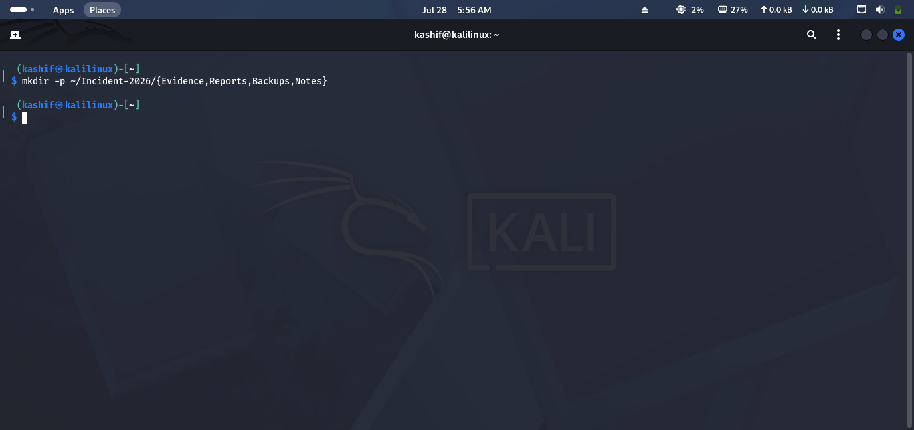
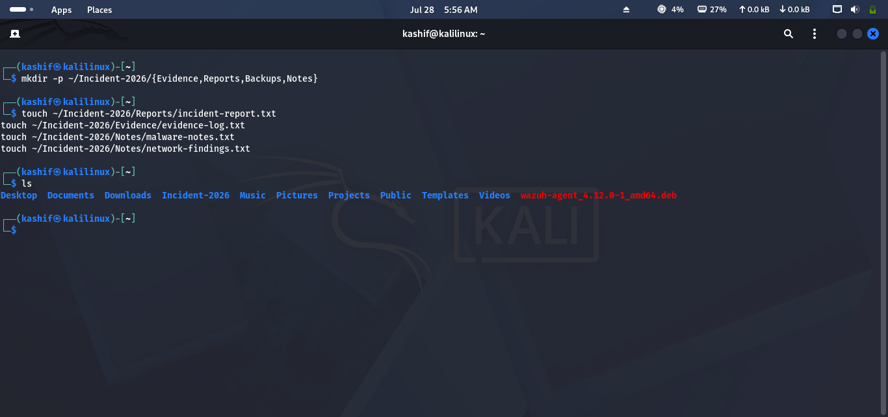
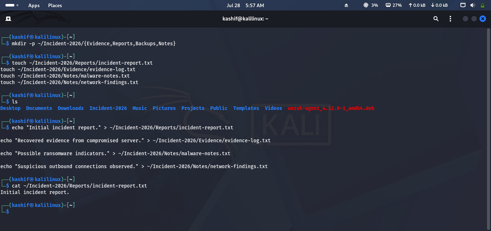
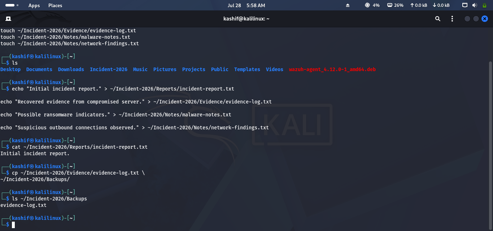
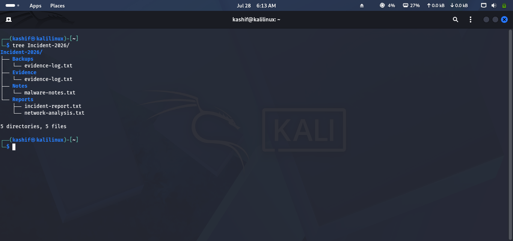
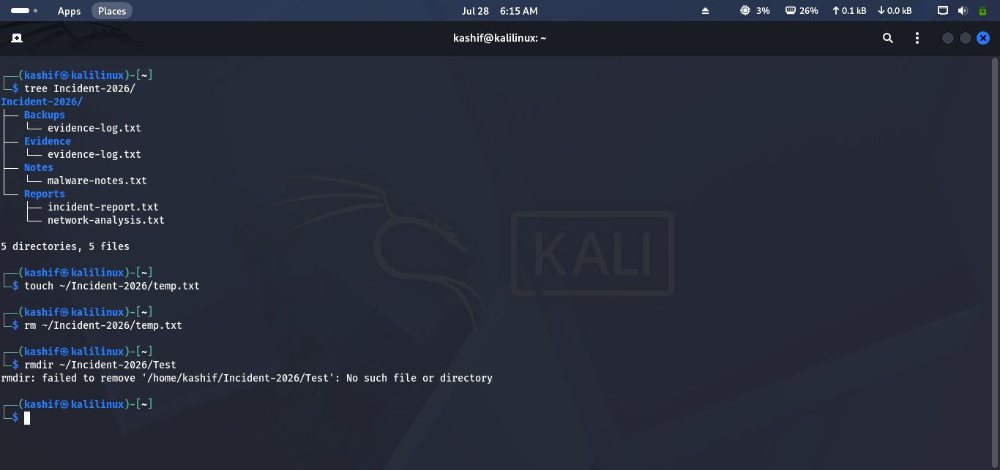
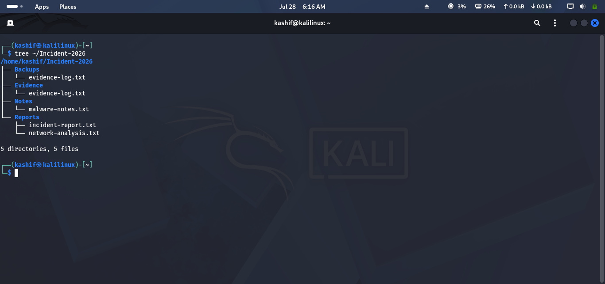

# Lab 05 Solution – File & Directory Management

## Overview

This solution demonstrates one possible approach to completing **Lab 05 – File & Directory Management**.

> **Note:** Your file names and directory structure may differ slightly from the examples shown below.

---

# Task 1 – Create an Investigation Workspace

### Approach

Create a workspace to organize the investigation and separate different types of evidence.

### Commands

```bash
mkdir -p ~/Incident-2026/{Evidence,Reports,Backups,Notes}
```

Verify the structure:

```bash
tree ~/Incident-2026
```

> If `tree` is not installed, use:

```bash
ls -R ~/Incident-2026
```

### Screenshot

```md

```

---

# Task 2 – Create Investigation Files

### Approach

Create empty files to represent investigation documents.

### Commands

```bash
touch ~/Incident-2026/Reports/incident-report.txt
touch ~/Incident-2026/Evidence/evidence-log.txt
touch ~/Incident-2026/Notes/malware-notes.txt
touch ~/Incident-2026/Notes/network-findings.txt
```

Verify:

```bash
find ~/Incident-2026
```

### Screenshot

```md

```

---

# Task 3 – Record Investigation Notes

### Approach

Add sample information to each file and verify the contents.

### Commands

```bash
echo "Initial incident report." > ~/Incident-2026/Reports/incident-report.txt

echo "Recovered evidence from compromised server." > ~/Incident-2026/Evidence/evidence-log.txt

echo "Possible ransomware indicators." > ~/Incident-2026/Notes/malware-notes.txt

echo "Suspicious outbound connections observed." > ~/Incident-2026/Notes/network-findings.txt
```

Display a file:

```bash
cat ~/Incident-2026/Reports/incident-report.txt
```

### Screenshot

```md

```

---

# Task 4 – Copy Critical Evidence

### Approach

Create backup copies before making any changes.

### Commands

```bash
cp ~/Incident-2026/Evidence/evidence-log.txt \
~/Incident-2026/Backups/
```

Verify:

```bash
ls ~/Incident-2026/Backups
```

### Screenshot

```md

```

---

# Task 5 – Move & Rename Files

### Approach

Organize the investigation by moving files into the correct folders and giving them meaningful names.

### Commands

Rename a file:

```bash
mv ~/Incident-2026/Notes/network-findings.txt \
~/Incident-2026/Notes/network-analysis.txt
```

Move the file:

```bash
mv ~/Incident-2026/Notes/network-analysis.txt \
~/Incident-2026/Reports/
```

Verify:

```bash
tree ~/Incident-2026
```

### Screenshot

```md

```

---

# Task 6 – Remove Unnecessary Files

### Approach

Delete temporary files and remove empty directories.

### Commands

Create a temporary file:

```bash
touch ~/Incident-2026/temp.txt
```

Remove it:

```bash
rm ~/Incident-2026/temp.txt
```

Remove an empty directory:

```bash
rmdir ~/Incident-2026/Test
```

> **Note:** `rmdir` only removes empty directories.

### Screenshot

```md

```

---

# Task 7 – Verify the Investigation Workspace

### Approach

Review the final directory structure and ensure everything is organized correctly.

### Commands

```bash
tree ~/Incident-2026
```

or

```bash
find ~/Incident-2026
```

Your workspace should contain:

- Evidence
- Reports
- Backups
- Notes

Confirm that:

- Investigation files are organized.
- Backup copies exist.
- No unnecessary files remain.

### Screenshot

```md

```

---

# Challenge Answers

| Challenge | Solution |
|-----------|----------|
| Create Incident-2026 | `mkdir Incident-2026` |
| Create investigation files | `touch` |
| Backup directory | `cp` |
| Rename file | `mv old new` |
| Move file | `mv source destination` |
| Delete empty directory | `rmdir directory_name` |

## 🎉 Lab Complete!

Congratulations! You have successfully completed **Lab 05 – File & Directory Management**.

You should now be able to:

- Create and organize directories.
- Create and edit files.
- Copy important evidence safely.
- Move and rename files.
- Remove unnecessary files and folders.
- Maintain a structured investigation workspace.

Continue to **Lab 06 – Users & Groups**.