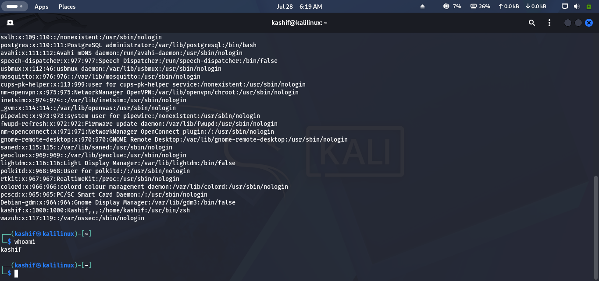
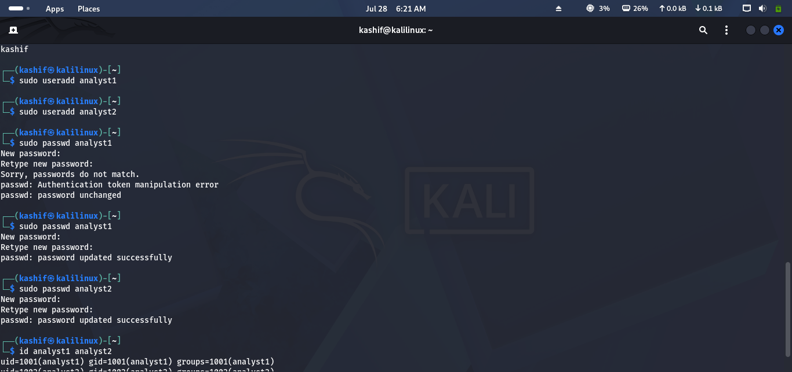
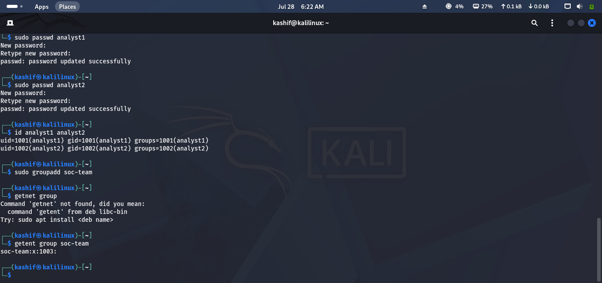
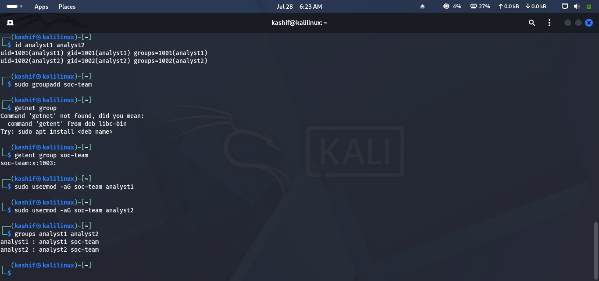
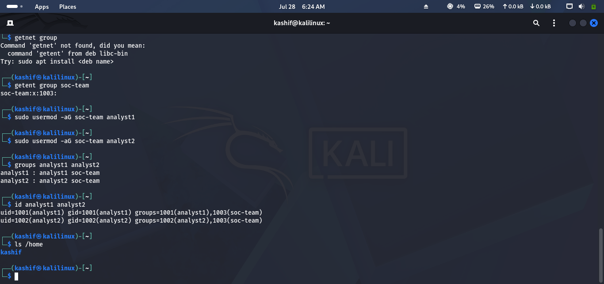
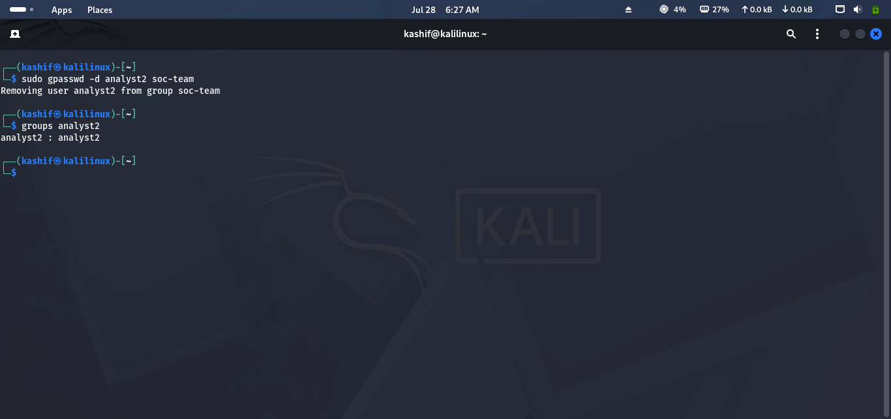

# Lab 06 Solution – Users & Groups

## Overview

This solution demonstrates one possible approach to completing **Lab 06 – Users & Groups**.

> **Note:** Most commands require **sudo** privileges.

---

# Task 1 – Review Existing Accounts

### Approach

Review the existing user accounts on the system and identify the default administrator account.

### Commands

View all users:

```bash
cat /etc/passwd
```

Display the current user:

```bash
whoami
```

### Screenshot

```md

```

---

# Task 2 – Create New Analyst Accounts

### Approach

Create two new user accounts and assign passwords.

### Commands

```bash
sudo adduser analyst1
sudo adduser analyst2
```

Set passwords during the setup process or use:

```bash
sudo passwd analyst1
sudo passwd analyst2
```

Verify the users:

```bash
id analyst1
id analyst2
```

### Screenshot

```md

```

---

# Task 3 – Create a Security Team

### Approach

Create a Linux group to represent the SOC team.

### Command

```bash
sudo groupadd soc-team
```

Verify the group:

```bash
getent group soc-team
```

### Screenshot

```md

```

---

# Task 4 – Assign Analysts to the Team

### Approach

Add both analyst accounts to the newly created group.

### Commands

```bash
sudo usermod -aG soc-team analyst1
sudo usermod -aG soc-team analyst2
```

Verify group membership:

```bash
groups analyst1
groups analyst2
```

### Screenshot

```md

```

---

# Task 5 – Verify User Information

### Approach

Review important account details for each analyst.

### Commands

```bash
id analyst1
id analyst2
```

Check the home directory:

```bash
ls /home
```

The output displays:

- User ID (UID)
- Group ID (GID)
- Group memberships
- Home directory

### Screenshot

```md

```

---

# Task 6 – Test User Access

### Approach

Switch to one of the analyst accounts and verify that the login works correctly.

### Commands

```bash
su - analyst1
```

Verify the account:

```bash
whoami
pwd
```

Return to your administrator account:

```bash
exit
```
---

# Task 7 – Remove an Analyst from the Team

### Approach

Simulate an employee leaving the SOC by removing one analyst from the security group.

### Command

```bash
sudo gpasswd -d analyst2 soc-team
```

Verify the change:

```bash
groups analyst2
```

> The user account remains active but is no longer a member of the **soc-team** group.

### Screenshot

```md

```

---

# Challenge Answers

| Challenge | Solution |
|-----------|----------|
| Create analyst accounts | `sudo adduser analyst1`, `sudo adduser analyst2` |
| Create group | `sudo groupadd soc-team` |
| Add users to group | `sudo usermod -aG soc-team username` |
| Verify membership | `groups username` or `id username` |
| Switch user | `su - username` |
| Remove user from group | `sudo gpasswd -d username soc-team` |

---

## 🎉 Lab Complete!

Congratulations! You have successfully completed **Lab 06 – Users & Groups**.

You should now be able to:

- Create Linux user accounts.
- Create and manage groups.
- Add and remove users from groups.
- Verify user and group information.
- Switch between user accounts.
- Apply basic Identity and Access Management (IAM) practices.

Continue to **Lab 07 – File Permissions & Ownership**.