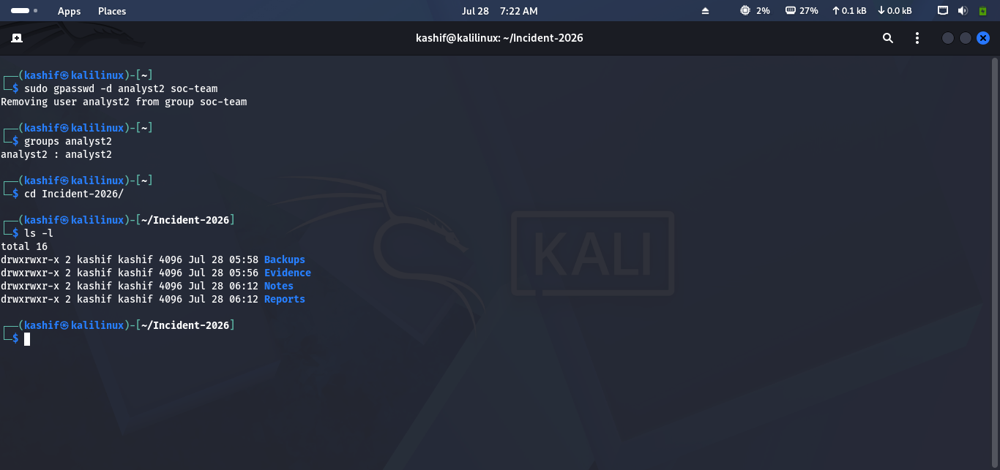
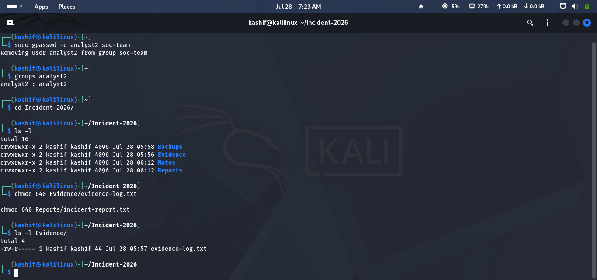
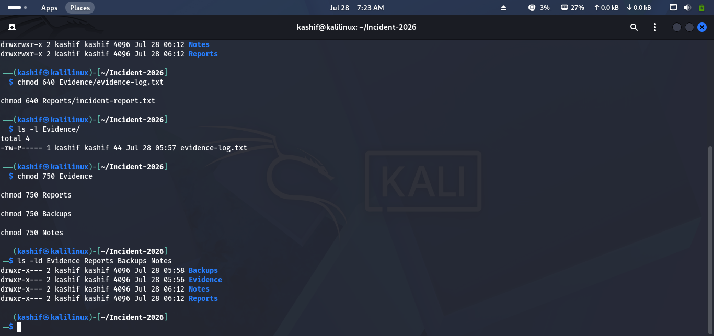
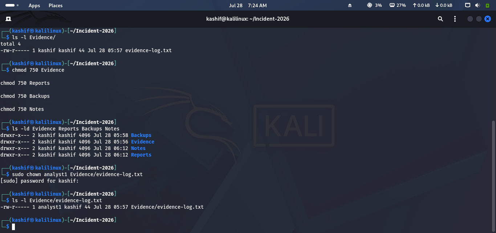
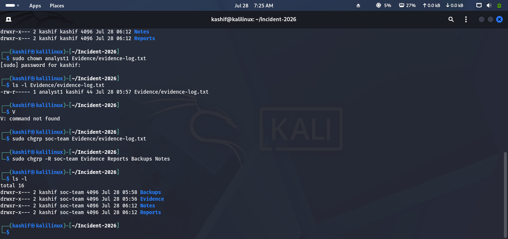
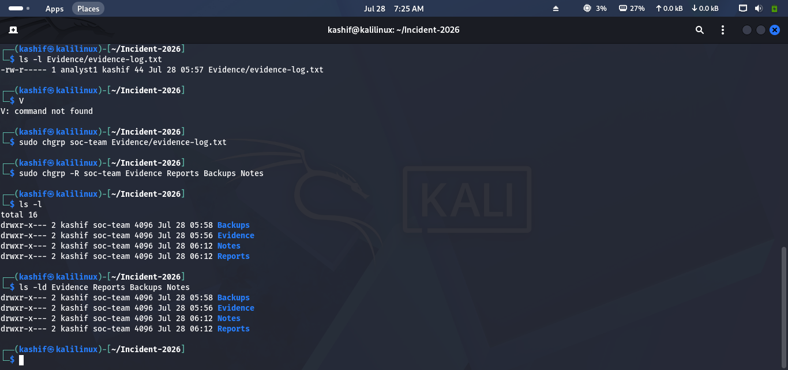

# Lab 07 Solution – File Permissions & Ownership

## Overview

This solution demonstrates one possible approach to completing **Lab 07 – File Permissions & Ownership**.

> **Note:** Most permission and ownership commands require **sudo** privileges.

---

# Task 1 – Inspect Existing Permissions

### Approach

Review the current permissions, owner, and group of your investigation files.

### Commands

```bash
cd ~/Incident-2026

ls -l

ls -ld Evidence Reports Backups Notes
```

### Expected Result

You should see:

- File owner
- Group owner
- Permission string (e.g., `-rw-r--r--`)

### Screenshot

```md

```

---

# Task 2 – Secure Investigation Files

### Approach

Limit access so only the owner has full permissions, while the security team can read the files.

### Commands

```bash
chmod 640 Evidence/evidence-log.txt

chmod 640 Reports/incident-report.txt
```

Verify:

```bash
ls -l Evidence Reports
```

### Screenshot

```md

```

---

# Task 3 – Protect Investigation Directories

### Approach

Restrict directory access to authorized users only.

### Commands

```bash
chmod 750 Evidence

chmod 750 Reports

chmod 750 Backups

chmod 750 Notes
```

Verify:

```bash
ls -ld Evidence Reports Backups Notes
```

### Screenshot

```md

```

---

# Task 4 – Change File Ownership

### Approach

Transfer ownership of an investigation file to another authorized analyst.

### Command

```bash
sudo chown analyst1 Evidence/evidence-log.txt
```

Verify:

```bash
ls -l Evidence/evidence-log.txt
```

### Screenshot

```md

```

---

# Task 5 – Update Group Ownership

### Approach

Assign the investigation files to the **soc-team** group.

### Commands

```bash
sudo chgrp soc-team Evidence/evidence-log.txt

sudo chgrp -R soc-team Evidence Reports Backups Notes
```

Verify:

```bash
ls -l
```

### Screenshot

```md

```

---

# Task 6 – Test User Access

### Approach

Switch to another analyst account and verify the applied permissions.

### Commands

```bash
su - analyst1
```

Try viewing the evidence:

```bash
cat ~/Incident-2026/Evidence/evidence-log.txt
```

Return to the administrator account:

```bash
exit
```
---

# Task 7 – Review Final Permissions

### Approach

Review the final ownership and permission settings to ensure they meet security requirements.

### Commands

```bash
ls -l

ls -ld Evidence Reports Backups Notes
```

Expected secure configuration:

| Item | Example |
|------|---------|
| File Permission | `-rw-r-----` (640) |
| Directory Permission | `drwxr-x---` (750) |
| Owner | `analyst1` |
| Group | `soc-team` |

### Screenshot

```md

```

---

# Challenge Answers

| Challenge | Solution |
|-----------|----------|
| Owner full access | `chmod 640 filename` |
| Team read access | Group permission `r--` |
| Remove access for others | Others permission `---` |
| Change owner | `sudo chown analyst1 filename` |
| Change group | `sudo chgrp soc-team filename` |
| Verify permissions | `ls -l` |

---

## 🎉 Lab Complete!

Congratulations! You have successfully completed **Lab 07 – File Permissions & Ownership**.

You should now be able to:

- View Linux file permissions.
- Modify file and directory permissions.
- Change file ownership.
- Change group ownership.
- Verify access restrictions.
- Apply the Principle of Least Privilege to protect investigation data.

Continue to **Lab 08 – Processes & Services**.