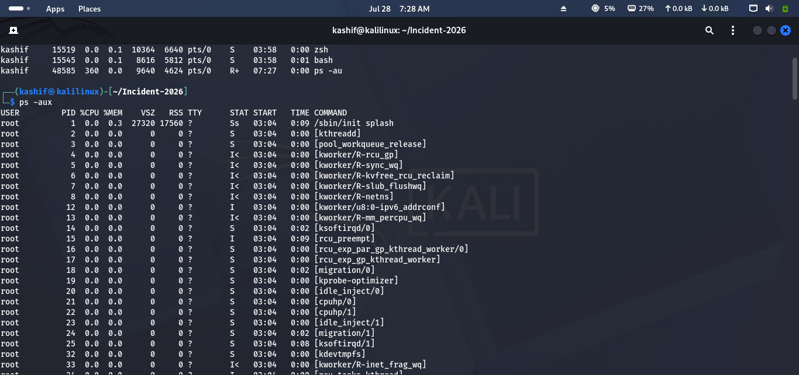
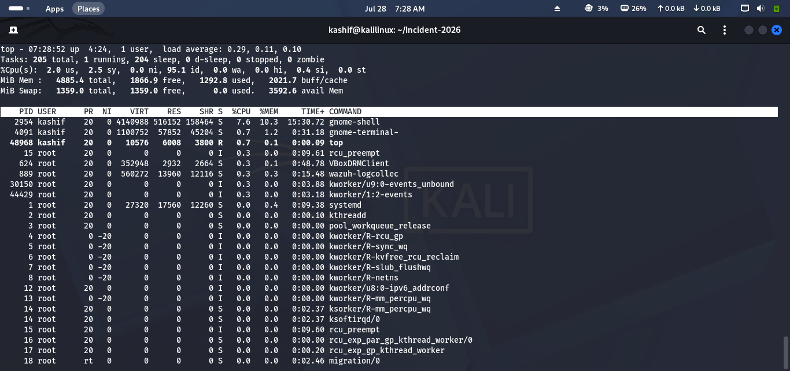
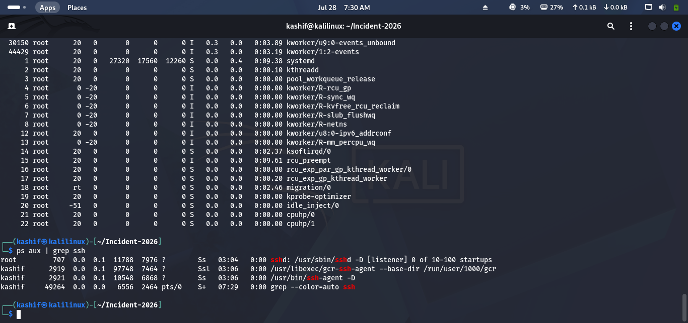
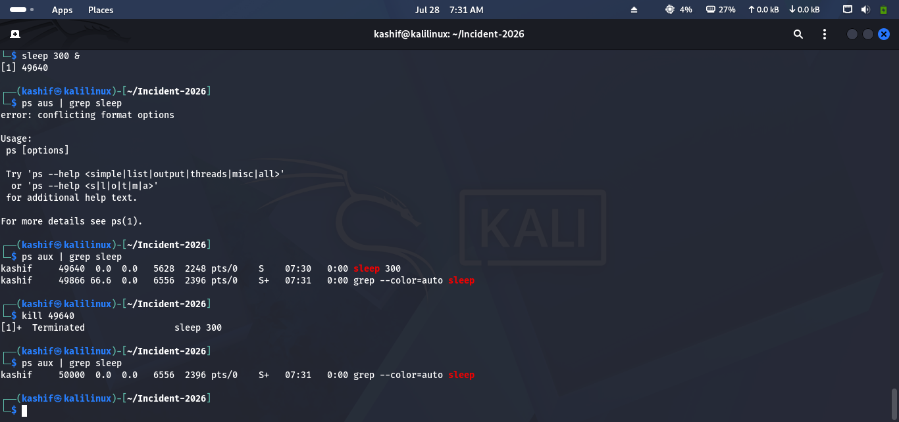
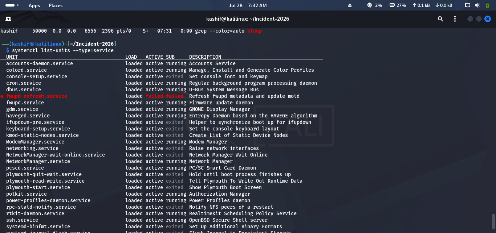
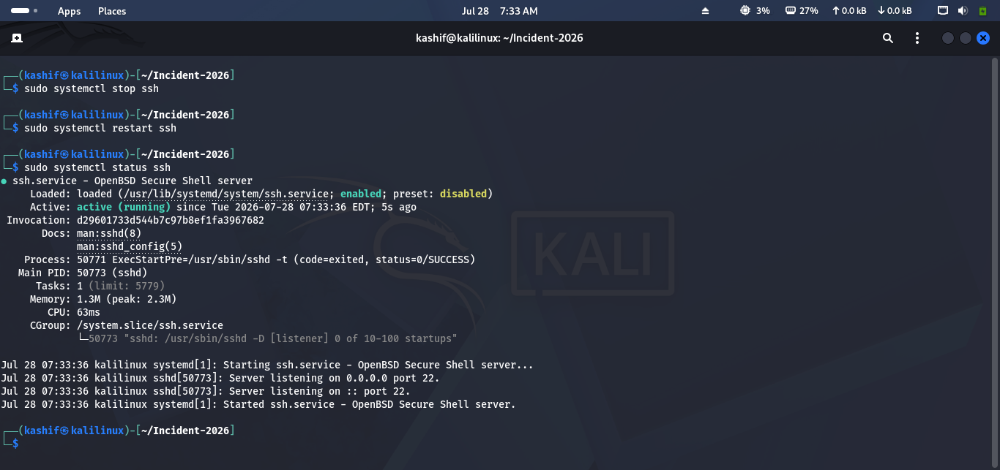
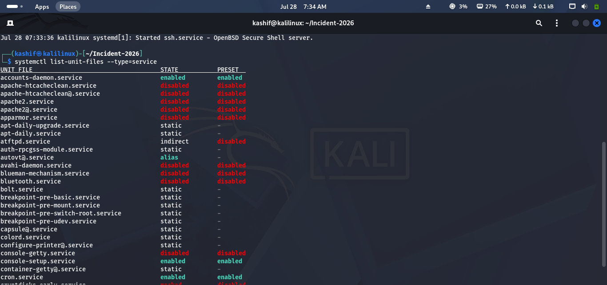

# Lab 08 Solution – Processes & Services

## Overview

This solution demonstrates one possible approach to completing **Lab 08 – Processes & Services**.

> **Note:** Some commands require **sudo** privileges. Outputs may vary depending on your Linux distribution.

---

# Task 1 – Inspect Running Processes

### Approach

View the processes currently running on your system and identify their basic information.

### Commands

```bash
ps aux
```

Or use a more detailed format:

```bash
ps -ef
```

### Expected Result

You should be able to identify:

- Process Name
- Process ID (PID)
- User
- CPU Usage
- Memory Usage

### Screenshot



---

# Task 2 – Monitor System Performance

### Approach

Monitor system resources in real time and identify processes consuming the most CPU or memory.

### Commands

```bash
top
```

If installed:

```bash
htop
```

> Press **q** to exit.

### Screenshot



---

# Task 3 – Investigate a Process

### Approach

Select a running process and review its details.

### Commands

Find the PID:

```bash
ps aux | grep ssh
```

Replace **ssh** with another running process if needed.

View detailed information:

```bash
ps -fp <PID>
```

Example:

```bash
ps -fp 1234
```

### Screenshot



---

# Task 4 – Manage a Process

### Approach

Create a harmless background process, locate its PID, and terminate it.

### Commands

Start a background process:

```bash
sleep 300 &
```

Find its PID:

```bash
ps aux | grep sleep
```

Terminate it:

```bash
kill <PID>
```

Verify:

```bash
ps aux | grep sleep
```

### Screenshot



---

# Task 5 – Examine System Services

### Approach

Review the services running on your Linux system.

### Commands

View all services:

```bash
systemctl list-units --type=service
```

View service status:

```bash
systemctl --type=service
```

Identify:

- Active
- Inactive
- Failed

services.

### Screenshot



---

# Task 6 – Control a Service

### Approach

Check the status of a non-critical service, then stop and restart it.

### Commands

Example using SSH:

```bash
sudo systemctl status ssh
```

Stop:

```bash
sudo systemctl stop ssh
```

Start:

```bash
sudo systemctl start ssh
```

Verify:

```bash
sudo systemctl status ssh
```

> **Note:** If SSH is required for your environment, choose another non-critical service.

### Screenshot



---

# Task 7 – Investigate Startup Services

### Approach

Review services configured to start automatically during system boot.

### Command

```bash
systemctl list-unit-files --type=service
```

Look for services marked as:

- enabled
- disabled
- static

Identify any services that may not be necessary in your lab environment.

### Screenshot



---

# Challenge Answers

| Challenge | Solution |
|-----------|----------|
| Top five CPU processes | `ps aux --sort=-%cpu \| head` |
| Find a PID | `ps aux` or `pgrep process_name` |
| Start background process | `sleep 300 &` |
| Stop process | `kill PID` |
| Check SSH status | `systemctl status ssh` |
| Startup services | `systemctl list-unit-files --type=service` |

---

## 🎉 Lab Complete!

Congratulations! You have successfully completed **Lab 08 – Processes & Services**.

You should now be able to:

- View and investigate running processes.
- Monitor CPU and memory usage.
- Identify high-resource processes.
- Start and terminate processes safely.
- Manage Linux services.
- Review services configured to start at boot.

Continue to **Lab 09 – Linux Networking**.