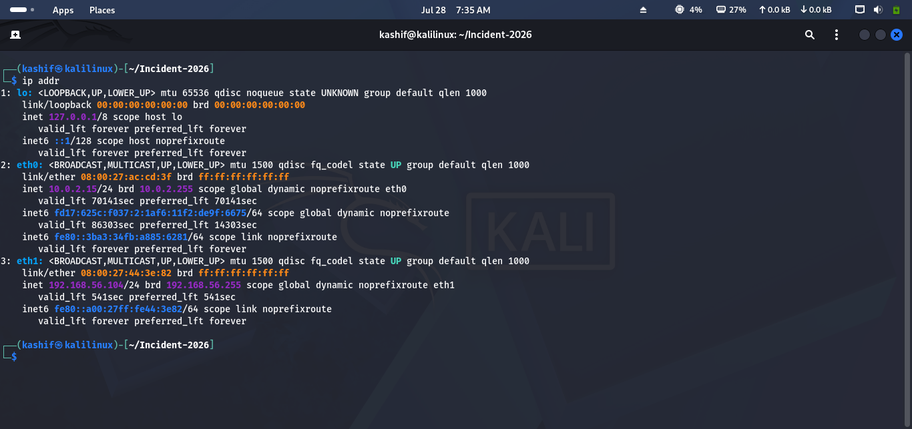
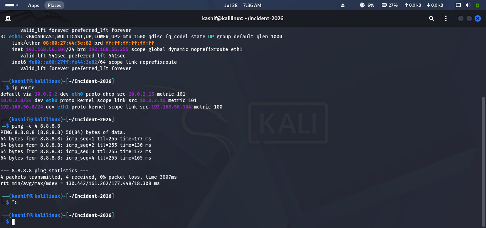
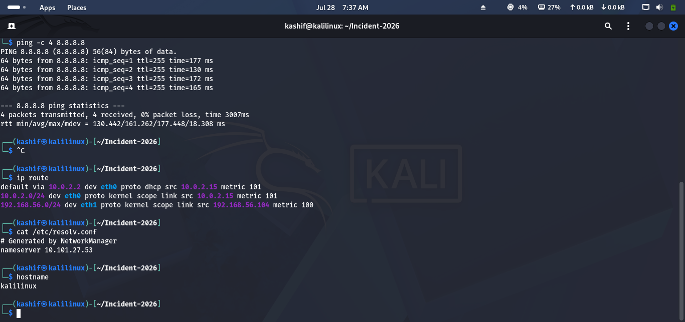
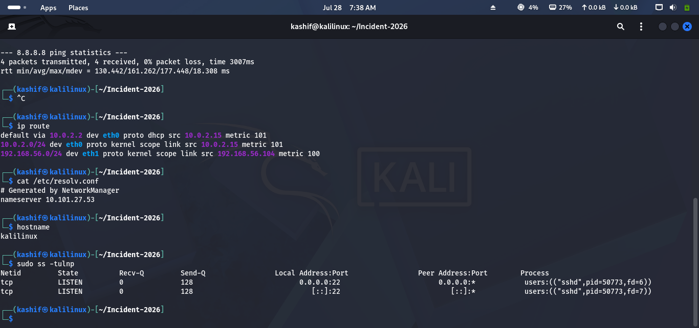
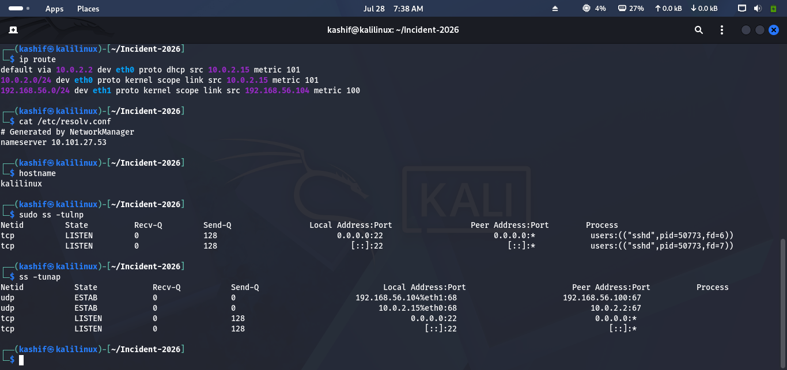
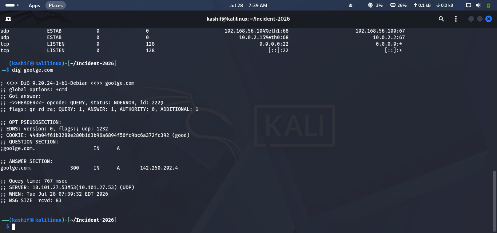
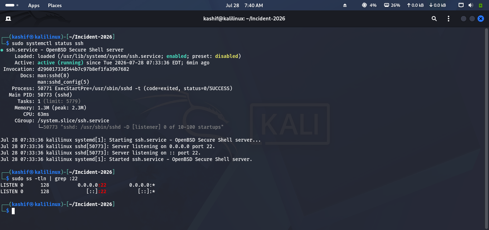

# Lab 09 Solution – Linux Networking

## Overview

This solution demonstrates one possible approach to completing **Lab 09 – Linux Networking**.

> **Note:** Some commands require **sudo** privileges. Your IP addresses, interface names, and routing information may differ from the examples below.

---

# Task 1 – Identify Network Interfaces

### Approach

Inspect your system's network interfaces and record their configuration.

### Commands

```bash
ip addr show
```

Or

```bash
ip a
```

### Expected Result

Record:

- Interface name (e.g., `eth0`, `ens33`)
- IPv4 address
- IPv6 address (if assigned)
- MAC address
- Interface status (UP/DOWN)

### Screenshot

```md

```

---

# Task 2 – Verify Network Connectivity

### Approach

Test communication with your gateway and the Internet.

### Commands

Find your gateway:

```bash
ip route
```

Ping the gateway:

```bash
ping -c 4 <gateway-ip>
```

Test Internet connectivity:

```bash
ping -c 4 8.8.8.8
```

Test DNS connectivity:

```bash
ping -c 4 google.com
```

### Screenshot

```md

```

---

# Task 3 – Investigate Network Configuration

### Approach

Review the system's IP configuration, routing information, and DNS settings.

### Commands

View routing table:

```bash
ip route
```

View DNS configuration:

```bash
cat /etc/resolv.conf
```

Display hostname:

```bash
hostname
```

### Screenshot

```md

```

---

# Task 4 – Inspect Listening Ports

### Approach

Identify services currently listening for network connections.

### Commands

```bash
sudo ss -tulnp
```

Or (if available):

```bash
sudo netstat -tulnp
```

Record:

- Port number
- Protocol
- Process
- PID

### Screenshot

```md

```

---

# Task 5 – Review Active Network Connections

### Approach

Inspect active network sessions and identify remote systems communicating with your server.

### Commands

```bash
ss -tunap
```

Or

```bash
netstat -antp
```

Observe:

- Local Address
- Remote Address
- Connection State
- Process

### Screenshot

```md

```

---

# Task 6 – Perform DNS Investigation

### Approach

Resolve a domain name and verify DNS functionality.

### Commands

Using **dig**:

```bash
dig google.com
```

Or using **nslookup**:

```bash
nslookup google.com
```

Verify:

- DNS server
- Resolved IP address
- Successful name resolution

### Screenshot

```md

```

---

# Task 7 – Verify SSH Connectivity

### Approach

Check whether the SSH service is installed, running, and listening for connections.

### Commands

Check service status:

```bash
sudo systemctl status ssh
```

Verify the listening port:

```bash
sudo ss -tln | grep :22
```

Or

```bash
sudo netstat -tln | grep :22
```

### Screenshot

```md

```

---

# Challenge Answers

| Challenge | Solution |
|-----------|----------|
| View IP address | `ip addr show` |
| Default gateway | `ip route` |
| List listening ports | `sudo ss -tulnp` |
| Identify process | `sudo ss -tulnp` |
| Resolve domain | `dig google.com` or `nslookup google.com` |
| Test Internet | `ping 8.8.8.8` |
| DNS test | `ping google.com` |

---

## 🎉 Lab Complete!

Congratulations! You have successfully completed **Lab 09 – Linux Networking**.

You should now be able to:

- Identify network interfaces and IP addresses.
- Verify network connectivity.
- Review routing and DNS configuration.
- Inspect listening ports.
- Monitor active network connections.
- Verify SSH availability.
- Perform basic network investigations from a Blue Team perspective.

Continue to **Lab 10 – Logging & Monitoring**.