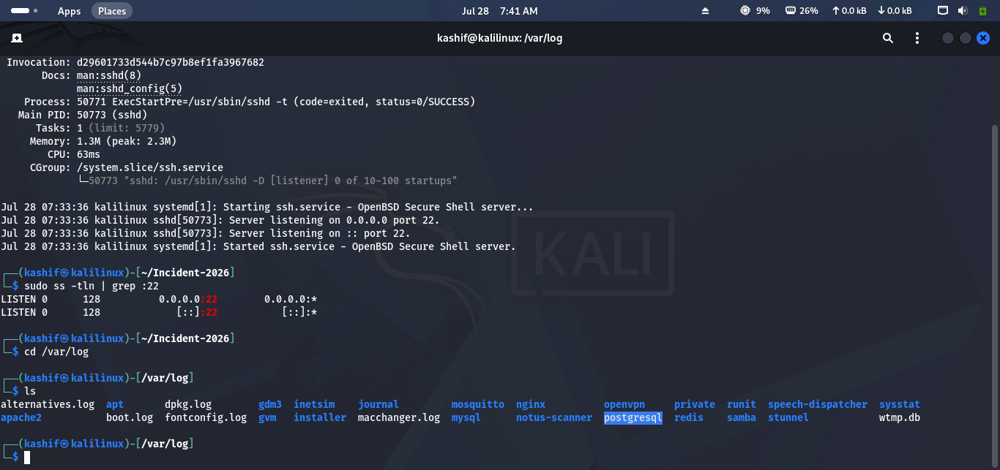
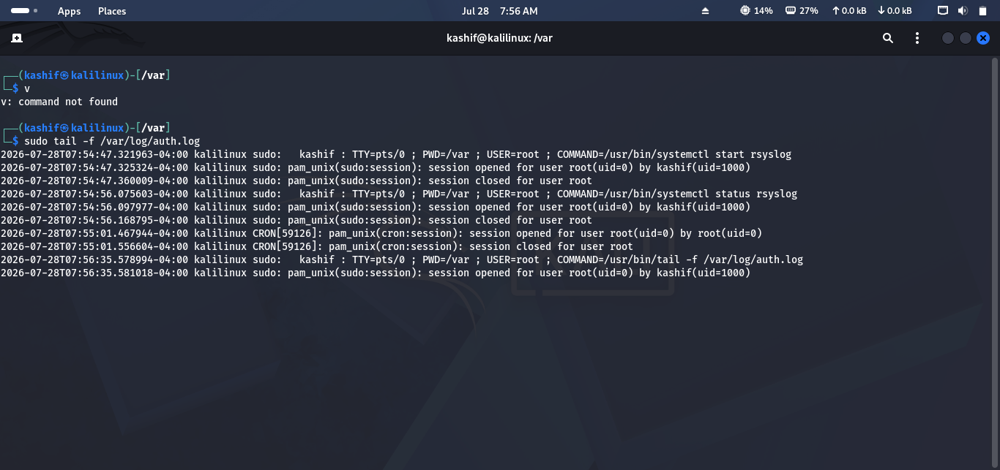
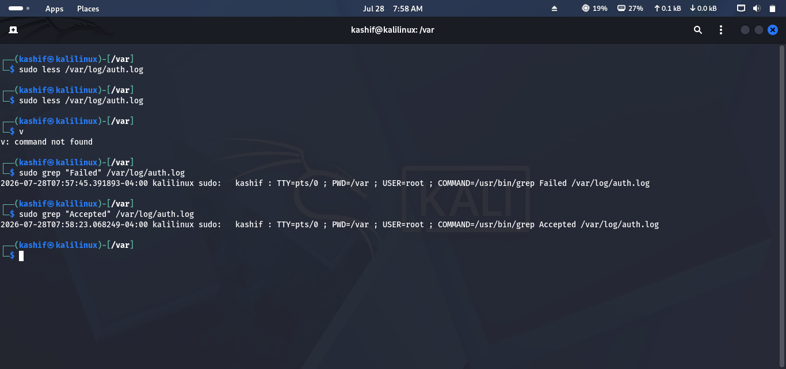
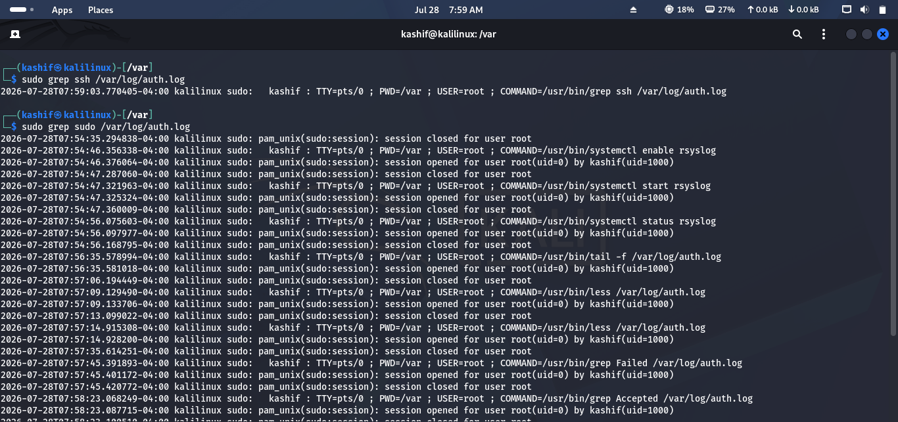
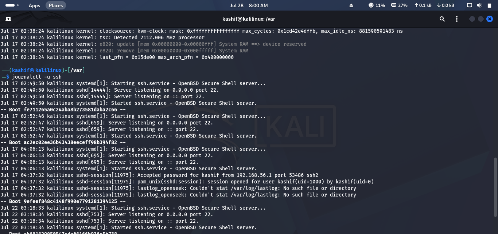
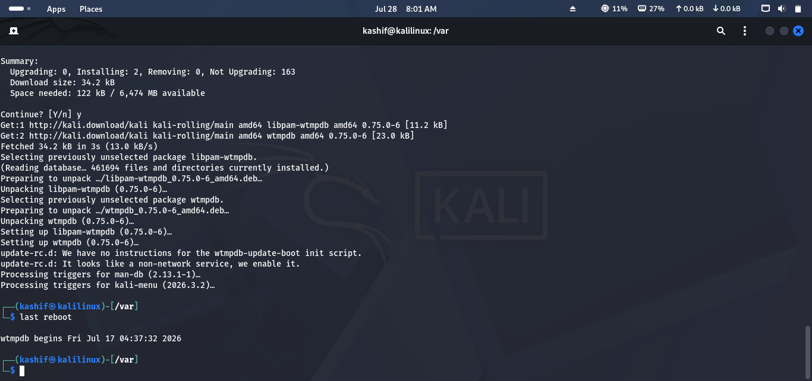

# Lab 10 Solution – Logging & Monitoring

## Overview

This solution demonstrates one possible approach to completing **Lab 10 – Logging & Monitoring**.

> **Note:** Some log locations vary between Linux distributions. Most commands require **sudo** privileges.

---

# Task 1 – Locate System Logs

### Approach

Navigate to the system log directory and identify important log files used during investigations.

### Commands

```bash
cd /var/log

ls
```

Common log files:

| Log File | Purpose |
|----------|---------|
| `auth.log` | Authentication events |
| `syslog` | General system activity |
| `kern.log` | Kernel messages |
| `dpkg.log` | Package installation history |
| `journal/` | Systemd journal logs |

### Screenshot

```md

```

---

# Task 2 – Monitor Logs in Real Time

### Approach

Watch log entries as new events occur.

### Command

```bash
sudo tail -f /var/log/auth.log
```

Generate activity (for example, open a new terminal and run `sudo ls`) to see new log entries appear.

Press **Ctrl + C** to stop monitoring.

### Screenshot

```md

```

---

# Task 3 – Investigate Login Activity

### Approach

Review authentication logs for successful and failed login attempts.

### Commands

View recent authentication events:

```bash
sudo less /var/log/auth.log
```

Search for failed logins:

```bash
sudo grep "Failed" /var/log/auth.log
```

Search for successful logins:

```bash
sudo grep "Accepted" /var/log/auth.log
```

Record:

- Username
- Timestamp
- Source IP (if available)

### Screenshot

```md

```

---

# Task 4 – Search for Security Events

### Approach

Search logs for common security-related events.

### Commands

SSH activity:

```bash
sudo grep ssh /var/log/auth.log
```

Sudo activity:

```bash
sudo grep sudo /var/log/auth.log
```

User account changes:

```bash
sudo grep user /var/log/auth.log
```

### Screenshot

```md

```

---

# Task 5 – Review System Service Logs

### Approach

Inspect logs generated by system services using the systemd journal.

### Commands

View recent journal entries:

```bash
journalctl
```

View SSH service logs:

```bash
journalctl -u ssh
```

View recent errors:

```bash
journalctl -p err
```

### Screenshot

```md

```

---

# Task 6 – Monitor System Events

### Approach

Review recent system events such as boots, service restarts, and warnings.

### Commands

Recent boot events:

```bash
journalctl -b
```

System reboot history:

```bash
last reboot
```

Recent warnings:

```bash
journalctl -p warning
```

### Screenshot

```md

```

---

# Task 7 – Create an Investigation Timeline

### Approach

Summarize the important events collected during the investigation.

| Time | Event | User | Description |
|------|-------|------|-------------|
| 09:15 | Failed Login | analyst1 | Incorrect password entered |
| 09:18 | SSH Login | analyst1 | Successful authentication |
| 09:20 | Sudo Command | analyst1 | Administrative command executed |
| 09:30 | SSH Service Restart | root | Service restarted |

Save the timeline as a Markdown or text file.
---

# Challenge Answers

| Challenge | Solution |
|-----------|----------|
| Authentication log | `/var/log/auth.log` |
| Monitor logs | `sudo tail -f /var/log/auth.log` |
| Search SSH events | `sudo grep ssh /var/log/auth.log` |
| Search failed logins | `sudo grep "Failed" /var/log/auth.log` |
| Recent reboot | `last reboot` |
| View journal | `journalctl` |

---

```md

```

---

## 🎉 Lab Complete!

Congratulations! You have successfully completed **Lab 10 – Logging & Monitoring**.

You should now be able to:

- Locate important Linux log files.
- Monitor logs in real time.
- Search logs for authentication and security events.
- Investigate service activity with `journalctl`.
- Review system boot and reboot history.
- Build an investigation timeline to support incident response.

Continue to **Lab 11 – Package Management**.