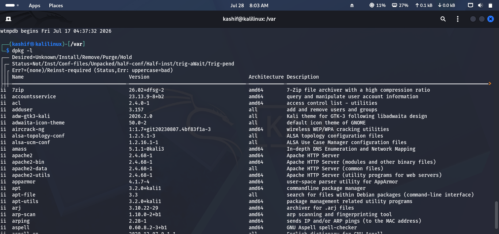
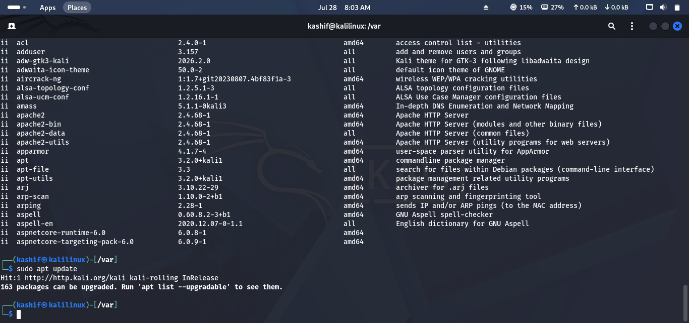
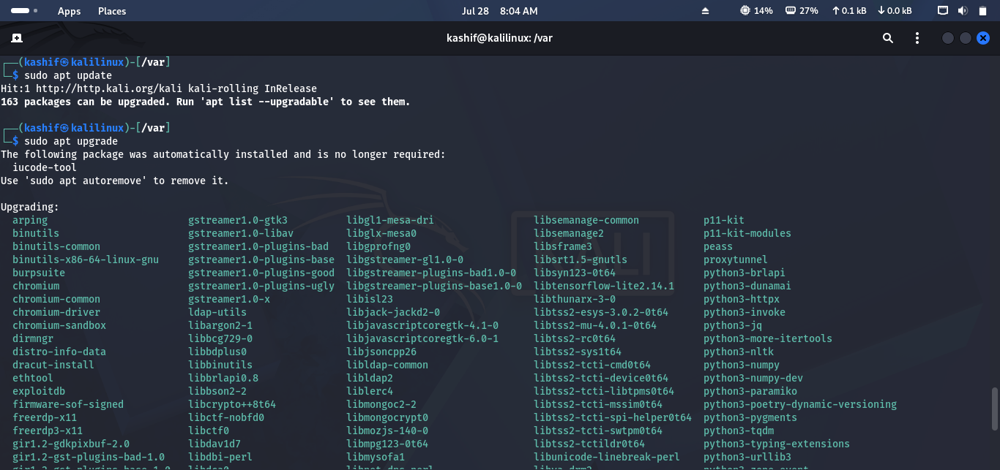
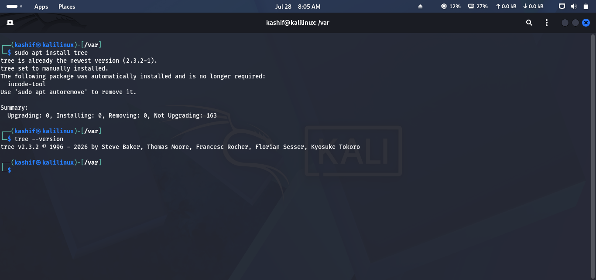
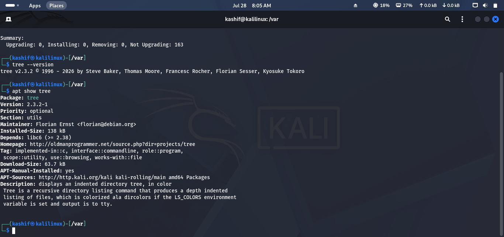
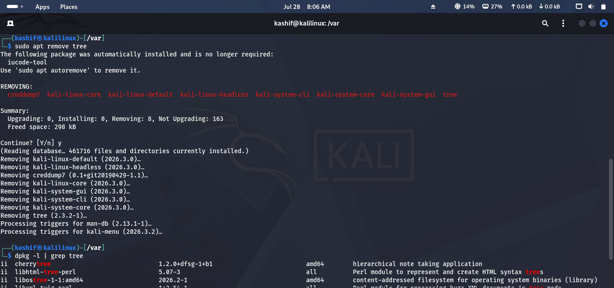
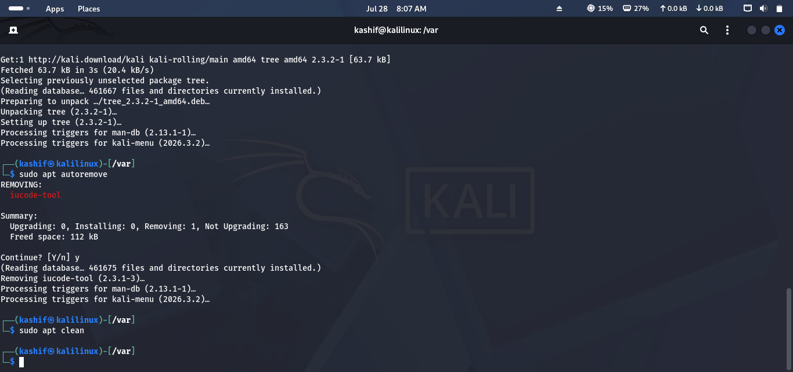

# Lab 11 Solution – Package Management

## Overview

This solution demonstrates one possible approach to completing **Lab 11 – Package Management**.

> **Note:** Most package management commands require **sudo** privileges. The number of available updates and installed packages will vary depending on your system.

---

# Task 1 – Inspect Installed Packages

### Approach

Review the software installed on your system and identify security-related or recently installed packages.

### Commands

List installed packages:

```bash
dpkg -l
```

Search for a specific package:

```bash
dpkg -l | grep ssh
```

### Screenshot



---

# Task 2 – Update Package Repositories

### Approach

Refresh the package repository information to ensure your system knows about the latest available software versions.

### Command

```bash
sudo apt update
```

Verify that the update completes successfully without errors.

### Screenshot



---

# Task 3 – Upgrade Installed Software

### Approach

Install the latest available updates for all installed packages.

### Commands

Upgrade installed packages:

```bash
sudo apt upgrade
```

(Optional) Perform a full system upgrade:

```bash
sudo apt full-upgrade
```

Record the number of upgraded packages displayed by APT.

### Screenshot



---

# Task 4 – Install a New Package

### Approach

Install a useful networking or security utility.

Example: **tree**

### Commands

Install the package:

```bash
sudo apt install tree
```

Verify installation:

```bash
tree --version
```

### Screenshot



---

# Task 5 – Verify Package Information

### Approach

View detailed information about an installed package.

### Commands

Display package details:

```bash
apt show tree
```

Check installation status:

```bash
dpkg -s tree
```

Record:

- Version
- Description
- Installation status
- Dependencies

### Screenshot



---

# Task 6 – Remove Unnecessary Software

### Approach

Remove a non-essential package from the system.

### Commands

Remove the package:

```bash
sudo apt remove tree
```

Verify removal:

```bash
dpkg -l | grep tree
```

### Screenshot



---

# Task 7 – Clean the System

### Approach

Remove unnecessary packages and cached installation files.

### Commands

Remove unused dependencies:

```bash
sudo apt autoremove
```

Clean the package cache:

```bash
sudo apt clean
```

### Screenshot



---

# Challenge Answers

| Challenge | Solution |
|-----------|----------|
| Update repositories | `sudo apt update` |
| Upgrade packages | `sudo apt upgrade` |
| Install package | `sudo apt install tree` |
| Verify package | `apt show tree` |
| Remove package | `sudo apt remove tree` |
| Clean system | `sudo apt autoremove` and `sudo apt clean` |

---

## 🎉 Lab Complete!

Congratulations! You have successfully completed **Lab 11 – Package Management**.

You should now be able to:

- Update package repositories.
- Upgrade installed software.
- Install and remove packages.
- Verify package information.
- Clean unused packages and cache.
- Maintain a secure and up-to-date Linux system.

Continue to **Lab 12 – Bash Scripting**.