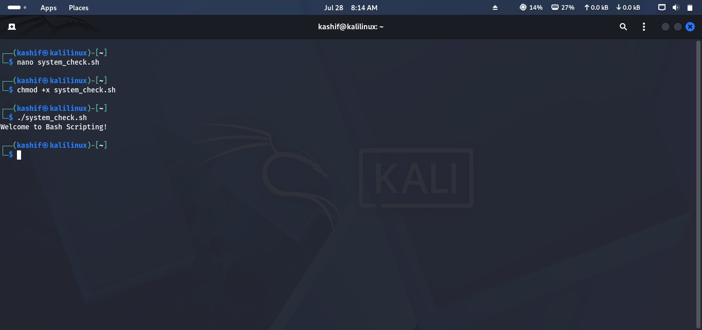
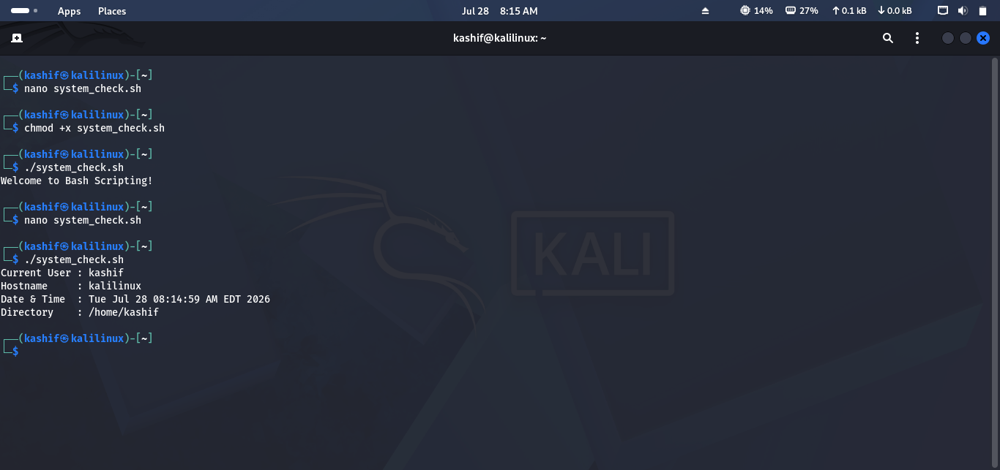
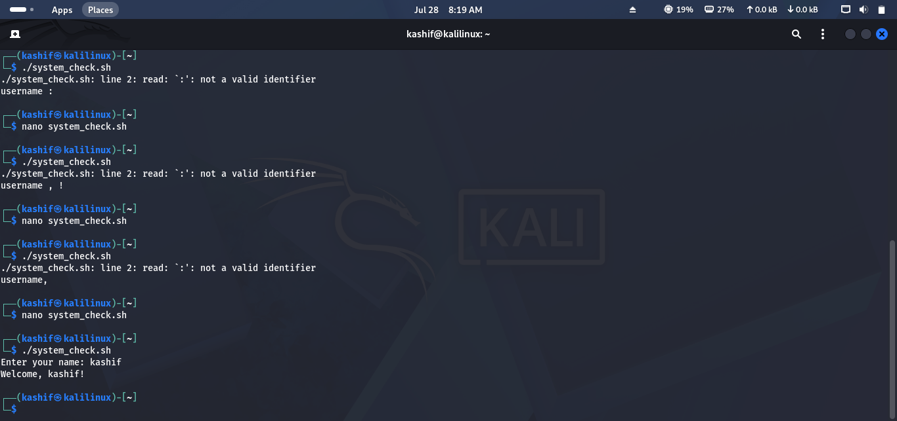
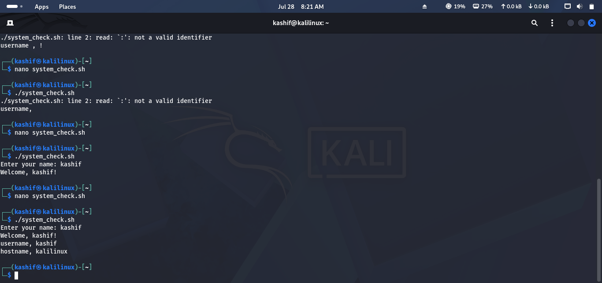
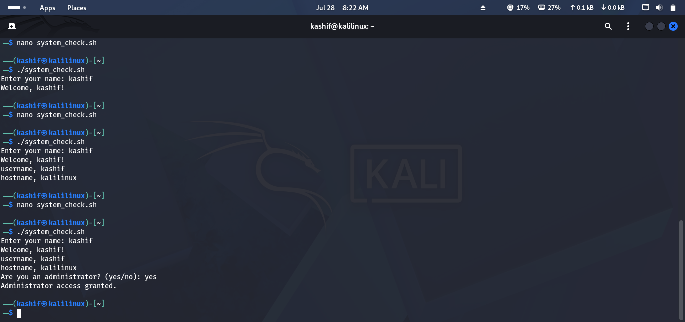
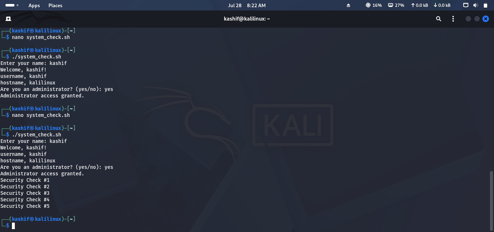
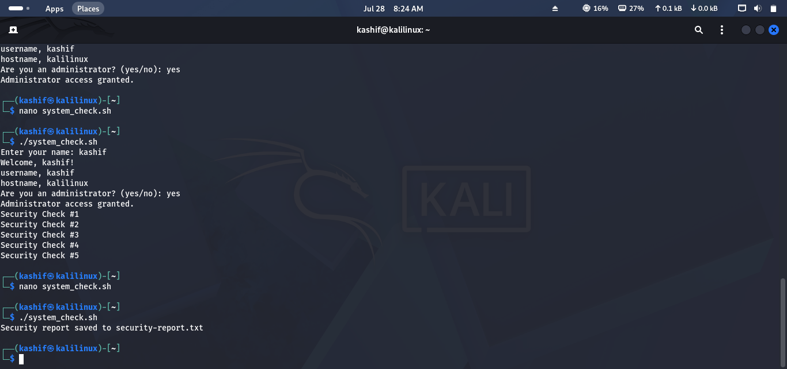
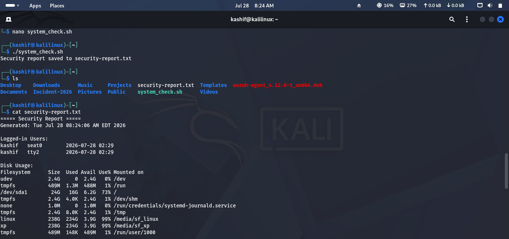

# Lab 12 Solution – Bash Scripting

## Overview

This solution demonstrates one possible approach to completing **Lab 12 – Bash Scripting**.

> **Note:** Ensure the script has execute permission before running it.

---

# Task 1 – Create Your First Script

### Approach

Create a simple Bash script with the correct shebang and make it executable.

### Commands

Create the script:

```bash
nano system_check.sh
```

Add the following:

```bash
#!/bin/bash

echo "Welcome to Bash Scripting!"
```

Save the file, then make it executable:

```bash
chmod +x system_check.sh
```

Run the script:

```bash
./system_check.sh
```

### Screenshot



---

# Task 2 – Display System Information

### Approach

Display basic information about the current Linux system.

### Script

```bash
#!/bin/bash

echo "Current User : $(whoami)"
echo "Hostname     : $(hostname)"
echo "Date & Time  : $(date)"
echo "Directory    : $(pwd)"
```

Run the script:

```bash
./system_check.sh
```

### Screenshot



---

# Task 3 – Accept User Input

### Approach

Prompt the user for input and display the entered value.

### Script

```bash
read -p "Enter your name: " name

echo "Welcome, $name!"
```

### Screenshot



---

# Task 4 – Work with Variables

### Approach

Store values in variables and reuse them throughout the script.

### Script

```bash
user=$(whoami)
host=$(hostname)

echo "User: $user"
echo "Host: $host"
```

### Screenshot



---

# Task 5 – Make Decisions

### Approach

Use a conditional statement to perform different actions based on user input.

### Script

```bash
read -p "Are you an administrator? (yes/no): " role

if [ "$role" = "yes" ]; then
    echo "Administrator access granted."
else
    echo "Standard user access."
fi
```

### Screenshot



---

# Task 6 – Automate Repetitive Tasks

### Approach

Use a loop to repeat an action automatically.

### Script

```bash
for i in {1..5}
do
    echo "Security Check #$i"
done
```

### Screenshot



---

# Task 7 – Create a Basic Security Script

### Approach

Generate a simple security report containing useful system information.

### Script

```bash
#!/bin/bash

REPORT="security-report.txt"

echo "===== Security Report =====" > $REPORT
echo "Generated: $(date)" >> $REPORT
echo "" >> $REPORT

echo "Logged-in Users:" >> $REPORT
who >> $REPORT

echo "" >> $REPORT
echo "Disk Usage:" >> $REPORT
df -h >> $REPORT

echo "" >> $REPORT
echo "Running Processes:" >> $REPORT
ps aux | head >> $REPORT

echo "" >> $REPORT
echo "System Uptime:" >> $REPORT
uptime >> $REPORT

echo "" >> $REPORT
echo "Network Information:" >> $REPORT
ip addr >> $REPORT

echo "Security report saved to $REPORT"
```

Execute:

```bash
chmod +x system_check.sh
./system_check.sh
```

View the report:

```bash
cat security-report.txt
```

### Screenshot





---

# Challenge Answers

| Challenge | Solution |
|-----------|----------|
| Create executable script | `chmod +x system_check.sh` |
| Display system information | `whoami`, `hostname`, `date`, `pwd` |
| Accept user input | `read` |
| Store values | Variables (`name`, `user`, etc.) |
| Conditional statement | `if...else` |
| Loop | `for` |
| Generate report | Redirect output to `security-report.txt` |


---

## 🎉 Lab Complete!

Congratulations! You have successfully completed **Lab 12 – Bash Scripting**.

You should now be able to:

- Create executable Bash scripts.
- Use variables and user input.
- Apply conditional statements.
- Automate repetitive tasks with loops.
- Generate simple security reports.
- Build basic automation for Linux administration and Blue Team operations.

Continue to **Lab 13 – Linux Security & Hardening**.