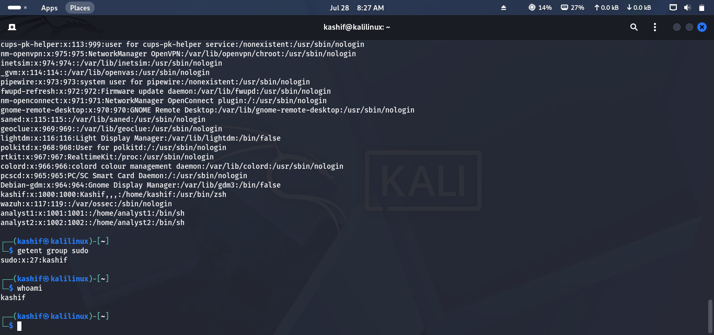
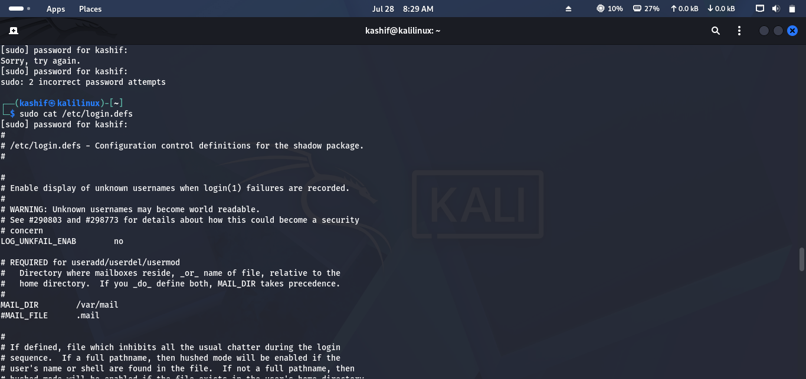
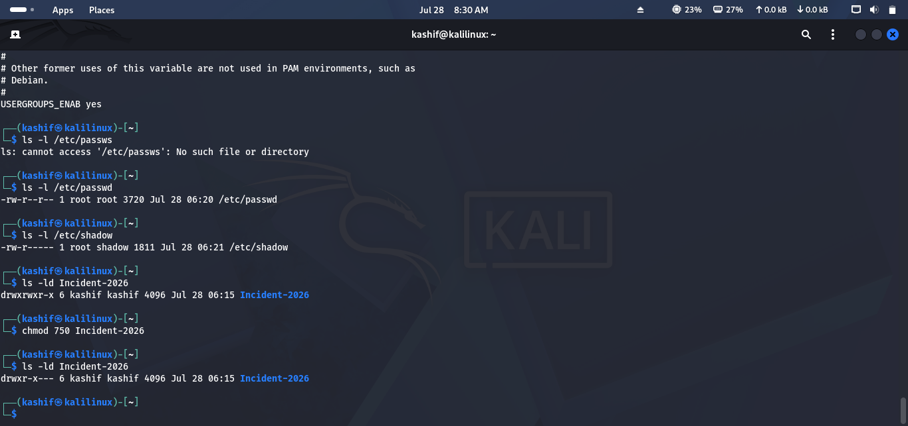
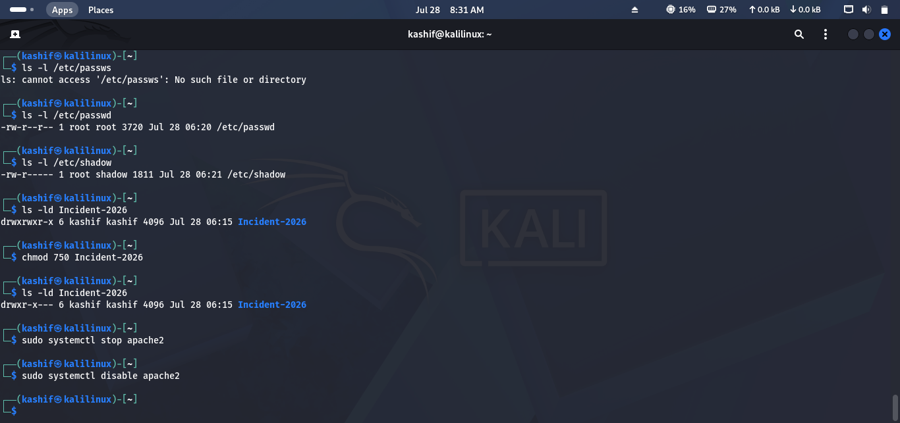
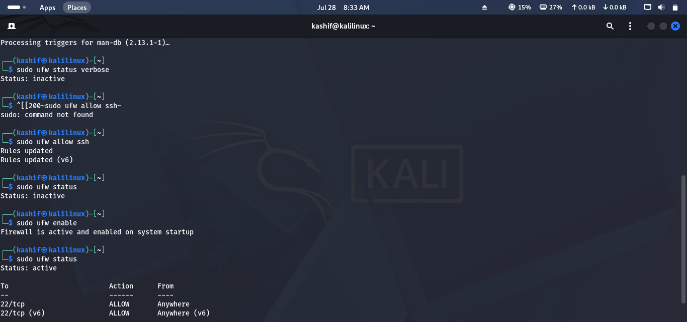
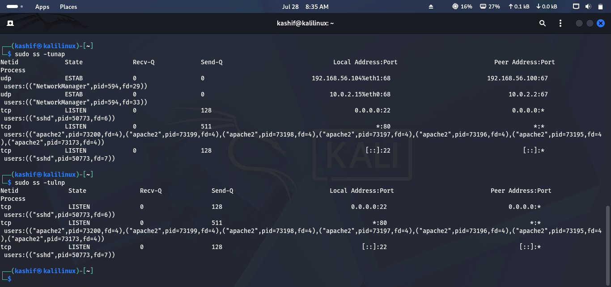

# Lab 13 Solution – Linux Security & Hardening

## Overview

This solution demonstrates one possible approach to completing **Lab 13 – Linux Security & Hardening**.

> **Note:** Most commands require **sudo** privileges. Changes made during this lab may affect your system configuration. Always review commands before applying them on production systems.

---

# Task 1 – Review User Accounts

### Approach

Review local user accounts and identify administrative or unnecessary accounts.

### Commands

View local users:

```bash
cat /etc/passwd
```

List users with sudo privileges:

```bash
getent group sudo
```

Check the current user:

```bash
whoami
```

### Screenshot

```md

```

---

# Task 2 – Review Password Security

### Approach

Verify password aging policies and account settings.

### Commands

Check password policy for a user:

```bash
sudo chage -l analyst1
```

Review password configuration:

```bash
sudo cat /etc/login.defs
```

> Ensure users have strong passwords and appropriate password expiration settings.

### Screenshot

```md

```

---

# Task 3 – Audit File Permissions

### Approach

Inspect sensitive files and verify that permissions are appropriately restricted.

### Commands

Check permissions:

```bash
ls -l /etc/passwd
```

```bash
ls -l /etc/shadow
```

Review evidence directory created in previous labs:

```bash
ls -ld Incident-2026
```

Correct permissions if needed:

```bash
chmod 750 Incident-2026
```

### Screenshot

```md

```

---

# Task 4 – Secure Running Services

### Approach

Review active services and disable unnecessary ones.

### Commands

View running services:

```bash
systemctl list-units --type=service
```

Stop an unnecessary service:

```bash
sudo systemctl stop apache2
```

Disable it from starting automatically:

```bash
sudo systemctl disable apache2
```

> Replace **apache2** with another non-essential service available on your system.

### Screenshot

```md

```

---

# Task 5 – Configure the Firewall

### Approach

Review firewall rules and allow only required services.

### Commands

Check firewall status:

```bash
sudo ufw status verbose
```

Allow SSH:

```bash
sudo ufw allow ssh
```

Enable the firewall:

```bash
sudo ufw enable
```

Verify configuration:

```bash
sudo ufw status
```

### Screenshot

```md

```

---

# Task 6 – Verify System Updates

### Approach

Ensure the operating system and installed packages are fully updated.

### Commands

Refresh repositories:

```bash
sudo apt update
```

Install updates:

```bash
sudo apt upgrade
```

Review pending updates:

```bash
apt list --upgradable
```

---

# Task 7 – Perform a Basic Security Audit

### Approach

Review the system's security posture using the tools learned throughout previous labs.

### Commands

Open ports:

```bash
sudo ss -tulnp
```

Running services:

```bash
systemctl --type=service
```

Firewall status:

```bash
sudo ufw status
```

Recent login activity:

```bash
last
```

### Screenshot

```md

```

---

# Challenge Answers

| Challenge | Solution |
|-----------|----------|
| Administrative users | `getent group sudo` |
| Disable service | `sudo systemctl disable <service>` |
| Review permissions | `ls -l /etc/shadow` |
| Firewall status | `sudo ufw status verbose` |
| Verify updates | `apt list --upgradable` |
| Security checklist | Review users, services, firewall, updates, permissions |

---

## 🎉 Lab Complete!

Congratulations! You have successfully completed **Lab 13 – Linux Security & Hardening**.

You should now be able to:

- Review user accounts and administrative access.
- Verify password security policies.
- Audit and correct file permissions.
- Manage and disable unnecessary services.
- Configure and verify the Linux firewall.
- Confirm system updates.
- Perform a basic Linux security assessment.

Continue to **Lab 14 – Blue Team Linux Challenge**.