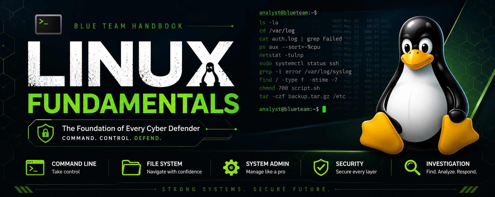

# 🐧 Linux Fundamentals

Welcome to the **Linux Fundamentals** section of the **Blue Team Handbook**.

This guide is designed for beginners, IT students, system administrators, and aspiring SOC Analysts who want to build a strong Linux foundation before moving into defensive cybersecurity.

---

# 📖 About

Linux powers most servers, cloud environments, cybersecurity platforms, and enterprise infrastructure.

Understanding Linux is an essential skill for:

- SOC Analysts
- Blue Team Engineers
- Incident Responders
- Threat Hunters
- System Administrators
- DevOps Engineers
- Cloud Engineers
- Security Researchers

This handbook combines theory with practical commands and Blue Team insights.

---

# 📚 Chapters

| Chapter | Topic |
|---------|-------|
| 01 | Introduction to Linux |
| 02 | Installing Linux |
| 03 | Linux File System |
| 04 | Shell & Terminal Basics |
| 05 | Navigation Commands |
| 06 | File & Directory Management |
| 07 | Users & Groups |
| 08 | Permissions & Ownership |
| 09 | Processes & Services |
| 10 | Networking Basics |
| 11 | Logging & Monitoring |
| 12 | Package Management |
| 13 | Bash Scripting Basics |
| 14 | Linux Security Fundamentals |

---

# 📂 Repository Structure

```
Linux/
│
├── README.md
├── Fundamentals/
├── Labs/
├── Cheat-Sheets/
├── Screenshots/
├── Resources/
```

---

# 📸 Screenshots

Screenshots used throughout the handbook are stored in the **Screenshots** directory.

Example:

```
Screenshots/
│
├── Chapter-01/
├── Chapter-02/
├── Chapter-03/
└── ...
```

---

# 🧪 Labs

Hands-on practice is available in the **Labs** folder.

Each lab reinforces the concepts taught in the corresponding chapter.

---

# 📋 Cheat Sheets

Quick-reference guides are available in the **Cheat-Sheets** folder.

These summarize frequently used Linux commands and concepts.

---

# 📚 Resources

Additional learning resources, official documentation, books, and practice platforms are available in the **Resources** folder.

---

# 🎯 Learning Outcomes

After completing this section, you will be able to:

- Navigate Linux confidently
- Manage users and permissions
- Work with processes and services
- Troubleshoot networking issues
- Analyze Linux logs
- Write Bash scripts
- Secure Linux systems
- Prepare for Blue Team and SOC roles

---

# 🤝 Contributing

Contributions are welcome.

You can help by:

- Fixing errors
- Improving explanations
- Adding screenshots
- Creating new labs
- Updating commands
- Reporting issues

---

# ⭐ Support

If you found this project helpful, please consider giving the repository a ⭐ on GitHub.

Happy Learning!