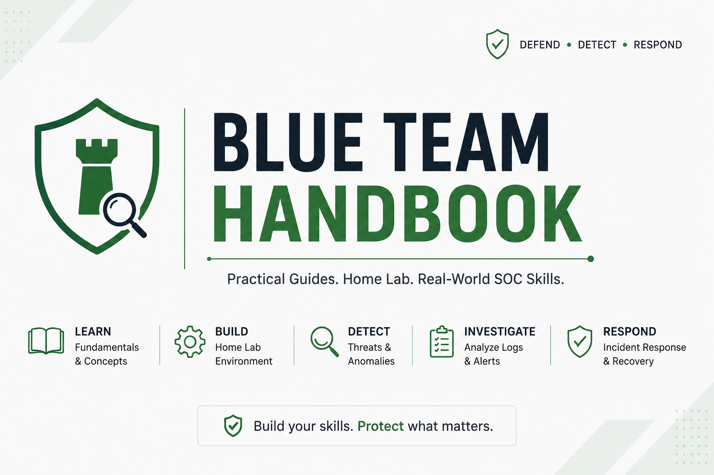

  

---

# 🗺️ Blue Team Handbook Roadmap

Welcome to the development roadmap for the **Blue Team Handbook**.

This document outlines the current progress of the project, upcoming guides, future improvements, and the long-term vision for building a comprehensive Blue Team learning resource.

> **Note:** This roadmap is subject to change as the project evolves.

---

# 🎯 Project Vision

The goal of the Blue Team Handbook is to become a free, open-source learning resource that helps beginners and aspiring SOC analysts build practical Blue Team skills through hands-on documentation and home lab projects.

The repository focuses on:

- Beginner-friendly explanations
- Step-by-step deployment guides
- Practical home lab environments
- Security monitoring
- Detection engineering
- Threat hunting
- Incident response

---

# 📊 Project Progress

| Category | Status |
|----------|--------|
| Repository Structure | ✅ Complete |
| Ubuntu Server Guide | ✅ Complete |
| Windows 11 Guide | ✅ Complete |
| Kali Linux Guide | ✅ Complete |
| Wazuh Guide | ✅ Complete | 
| Documentation Assets | 🚧 In Progress |

---

# 🚀 Phase 1 — Foundation

Build the core operating systems required for a Blue Team home lab.

## Guides

- [x] Ubuntu Server Guide
- [x] Windows 11 Guide
- [x] Kali Linux Guide
- [x] Wazuh Guide 

### Learning Outcomes

- Install virtual machines
- Configure networking
- Understand Linux fundamentals
- Understand Windows administration
- Build a functional cybersecurity home lab
- Deploy a SIEM platform

---

# 🛡️ Phase 2 — Endpoint Monitoring

Focus on endpoint visibility and security monitoring.

## Planned Guides

- [ ] Sysmon Installation
- [ ] Windows Event Logging
- [ ] Sigma Rules
- [ ] YARA
- [ ] File Integrity Monitoring

### Learning Outcomes

- Improve endpoint visibility
- Detect malicious behavior
- Create detection rules
- Understand Windows event logs
- Monitor system activity

---

# 🔍 Phase 3 — Threat Hunting

Learn proactive detection techniques.

## Planned Guides

- [ ] Threat Hunting Fundamentals
- [ ] MITRE ATT&CK
- [ ] IOC Hunting
- [ ] Log Analysis
- [ ] Detection Engineering

### Learning Outcomes

- Search for suspicious activity
- Understand attacker behavior
- Build detection logic
- Investigate security events

---

# 🚨 Phase 4 — Incident Response

Learn how to respond to security incidents.

## Planned Guides

- [ ] Incident Response Lifecycle
- [ ] Malware Investigation
- [ ] Digital Forensics
- [ ] Memory Analysis
- [ ] Evidence Collection

### Learning Outcomes

- Investigate incidents
- Preserve evidence
- Analyze compromised systems
- Document findings

---

# 📈 Phase 5 — Enterprise SIEM Platforms

Expand beyond Wazuh into enterprise technologies.

## Planned Guides

- [ ] Splunk Enterprise
- [ ] Microsoft Sentinel
- [ ] Elastic Stack
- [ ] Security Onion

### Learning Outcomes

- Deploy enterprise SIEM platforms
- Collect and analyze logs
- Build dashboards
- Create detection rules
- Investigate alerts

---

# 🔐 Future Topics

Additional guides planned for future releases include:

- Active Directory
- Microsoft Defender for Endpoint
- Velociraptor
- Zeek
- Suricata
- Osquery
- TheHive
- Cortex
- OpenCTI
- Docker for Security Labs
- Kubernetes Security
- Cloud Security Monitoring

---

# 📅 Current Priority

The current development focus is:

1. Complete Wazuh Guide
2. Sysmon Guide
3. Sigma Rules Guide
4. Threat Hunting Guide
5. Splunk Guide

---

# 💡 Long-Term Goals

The long-term vision for this project is to:

- Build a complete Blue Team learning path
- Create practical home lab documentation
- Help beginners transition into SOC Analyst roles
- Provide free and accessible cybersecurity education
- Maintain high-quality, community-driven documentation

---

# 🤝 Contributing

Contributions are welcome.

If you would like to improve an existing guide or suggest a new topic, please open an Issue or submit a Pull Request.

For contribution guidelines, see:

- **CONTRIBUTING.md**

---

# ⭐ Support the Project

If you find this project useful:

- ⭐ Star the repository
- 🍴 Fork the repository
- 📝 Suggest improvements
- 📢 Share it with the community

Every contribution helps make this project better for future learners.