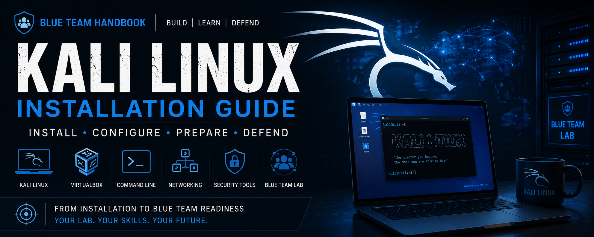

# Kali Linux Installation Guide

A comprehensive, beginner-friendly guide to installing, configuring, and preparing **Kali Linux** for cybersecurity learning and Blue Team home labs.

This guide is part of the **Blue Team Handbook**, an open-source project focused on helping students and aspiring cybersecurity professionals build practical skills through structured documentation and hands-on labs.

---

## About

Kali Linux is one of the most widely used Linux distributions in cybersecurity. This guide walks you through the complete setup process—from downloading the ISO to preparing a fully configured virtual machine ready for security testing and Blue Team exercises.

The guide is written for:

- Cybersecurity Students
- Linux Beginners
- SOC Analyst Aspirants
- Blue Team Enthusiasts
- Home Lab Builders
- IT Professionals

---

## Guide Contents

| Chapter | Topic |
|----------|------|
| Chapter 1 | Introduction to Kali Linux |
| Chapter 2 | System Requirements & Download |
| Chapter 3 | Creating the Virtual Machine |
| Chapter 4 | Installing Kali Linux |
| Chapter 5 | Initial System Configuration |
| Chapter 6 | Network Configuration |
| Chapter 7 | Security Tools Overview |
| Chapter 8 | Package Management & Updates |

---

## Lab Environment

| Component | Specification |
|-----------|---------------|
| Operating System | Kali Linux Rolling |
| Virtualization | Oracle VirtualBox 7.x |
| RAM | 4 GB |
| CPU | 2 vCPUs |
| Storage | 80 GB Dynamic VDI |
| Network | NAT + Host-Only |

---

## Repository Structure

```text
Kali Linux Guide
│
├── README.md
├── Quick-Reference.md
├── Resources.md
├── Chapter 1 – Introduction
├── Chapter 2 – Requirements & Download
├── Chapter 3 – Virtual Machine
├── Chapter 4 – Installation
├── Chapter 5 – Initial Configuration
├── Chapter 6 – Network Configuration
├── Chapter 7 – Essential Kali Tools
├── Chapter 8 – Updating & Package Management
└── assests/
```

---

## Learning Outcomes

After completing this guide, you will be able to:

- Install Kali Linux in Oracle VirtualBox
- Configure networking for a home lab
- Install and update software using APT
- Configure SSH
- Understand the purpose of Kali Linux security tools
- Prepare Kali Linux for Blue Team and cybersecurity labs
- Troubleshoot common installation and networking issues

---

## Prerequisites

Before starting this guide, you should have:

- Oracle VirtualBox
- Kali Linux Installer ISO
- A computer with virtualization enabled
- Basic computer knowledge
- Internet connection

---

## Related Guides

This guide is part of the **Blue Team Handbook**.

- Ubuntu Server Guide
- Wazuh Installation Guide
- Linux Fundamentals *(Coming Soon)*
- Windows Agent Guide *(Coming Soon)*

---

## Contributing

Contributions, suggestions, and improvements are welcome.

If you discover an issue or have ideas to improve this guide, feel free to open an issue or submit a pull request.

---

## License

This project is licensed under the **MIT License**.

---

## Author

**Kashif Mashi**


GitHub: https://github.com/kashifkhanamv123-cmd

---

⭐ If this guide helped you, consider giving the repository a **Star**.