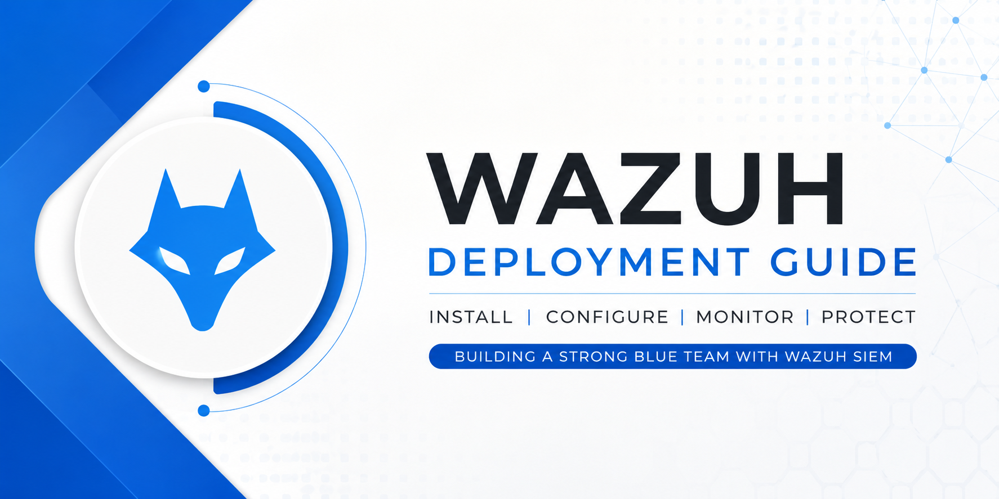
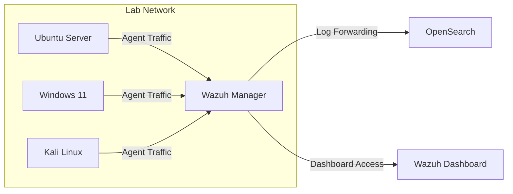
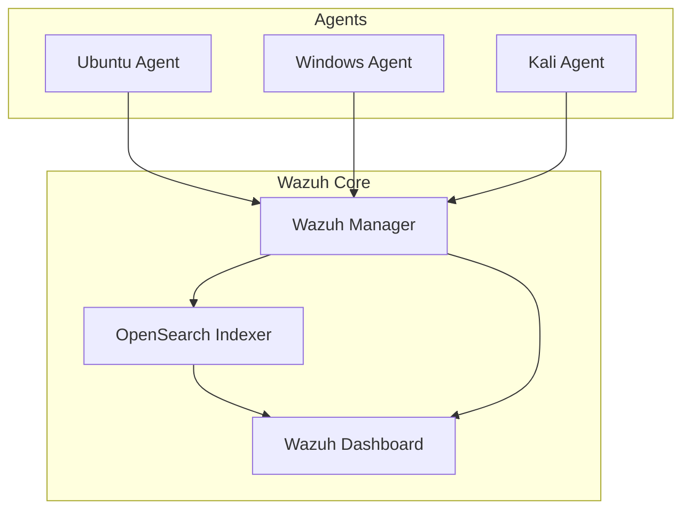
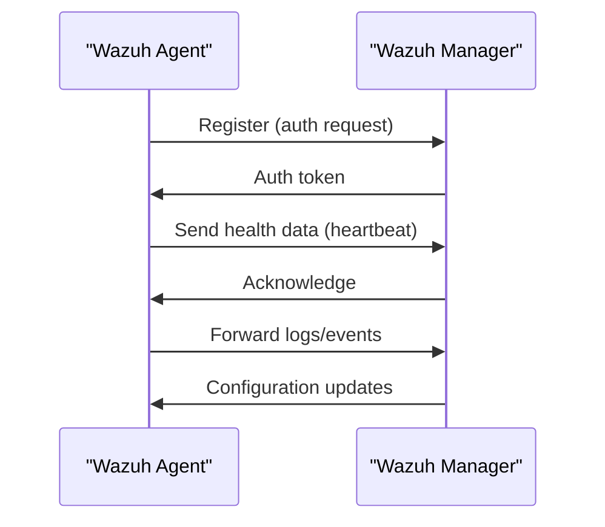
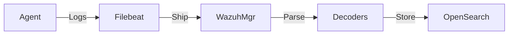
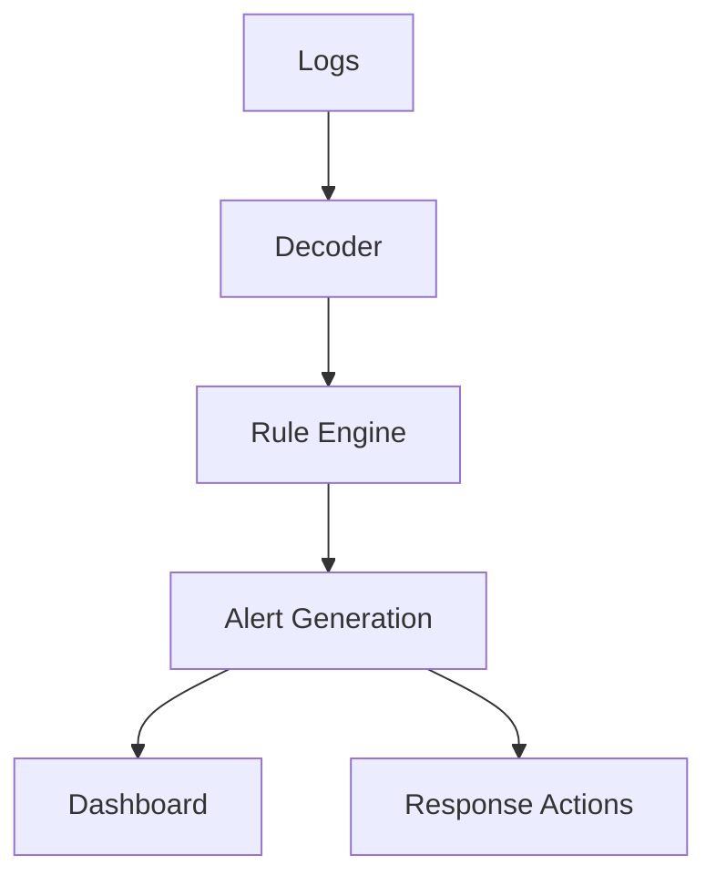
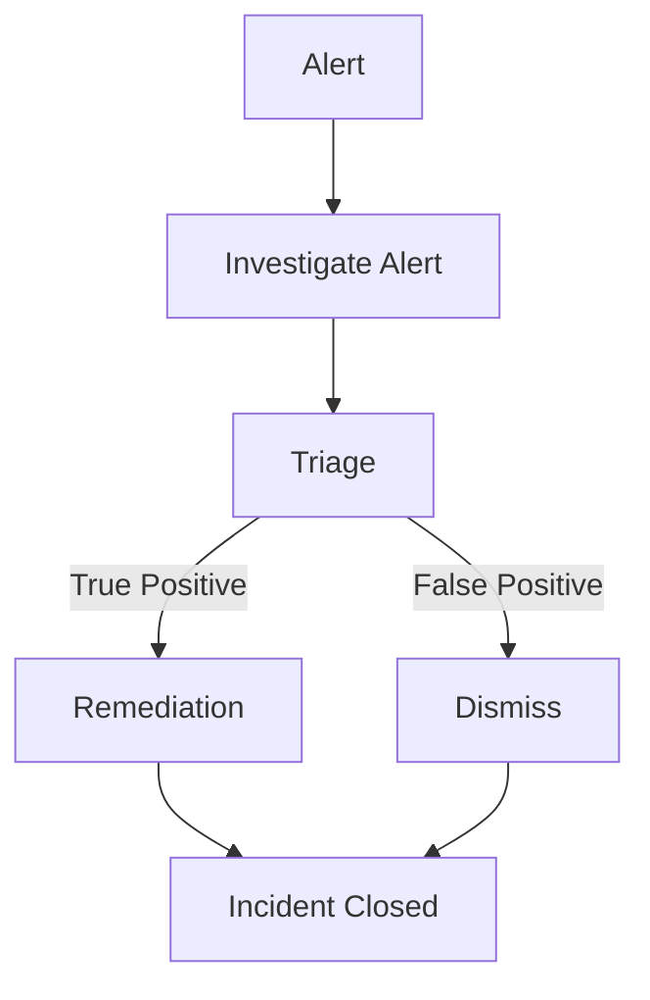

# Wazuh Installation & Deployment Guide

<!-- Badges -->


---
## What You'll Learn

- Install and configure a production‑ready **Wazuh SIEM & XDR** home lab.
- Deploy Wazuh on Ubuntu Server, Windows 11, and Kali Linux.
- Understand Wazuh architecture, including Manager, Indexer, and Dashboard.
- Connect agents, verify communication, and troubleshoot common issues.

---
## Prerequisites

- Completion of the **Ubuntu Server Guide**, **Windows 11 Installation & Configuration Guide**, and **Kali Linux Guide** located in the `Security-Operations` folder.
- Basic familiarity with virtualization (e.g., VirtualBox) and command‑line operations.

---
## Learning Objectives

- Build a fully functional Wazuh SIEM environment from scratch.
- Configure the Wazuh Dashboard for real‑time monitoring.
- Deploy and manage Windows and Linux agents.
- Perform end‑to‑end verification of endpoint data collection.
- Apply best practices for troubleshooting and maintenance.

---

## Estimated Reading Time

~15 minutes

## Difficulty Level

Beginner

## Required Software

- VirtualBox
- Ubuntu Server 22.04 LTS ISO
- Windows 11 ISO
- Kali Linux ISO

## Required Knowledge

- Basic Linux command‑line proficiency
- Understanding of virtualization concepts

## Key Concepts

- Wazuh core components (Manager, Indexer, Dashboard)
- Agent registration and secure communication
- Log collection, parsing, and alerting pipeline

## Hands‑on Practice

- Install Ubuntu Server VM and configure the Wazuh manager
- Deploy Wazuh agents on Windows 11 and Kali Linux VMs
- Verify agent logs appear in the Wazuh Dashboard

## Common Mistakes

- Forgetting to open required ports (1514/1515) for agent communication
- Mismatched system time zones causing authentication failures

## Troubleshooting

- Check `/var/ossec/logs/ossec.log` on the manager for error details
- Verify agent registration status via the REST API (`/agents` endpoint)

## Best Practices

- Secure the manager with TLS encryption
- Regularly update rule sets and OSSEC rules
- Isolate the lab network from production environments

## Security Notes

- Restrict network exposure of the Wazuh manager to the lab subnet only
- Use strong, unique credentials for dashboard access

## Knowledge Check Questions

1. What are the three main components of the Wazuh core architecture?
2. How does an agent authenticate with the Wazuh manager?
3. Which ports must be open for agent‑to‑manager communication?

## Quick Revision

- Review the architecture and agent communication diagrams
- Recall the log collection and detection pipeline steps

## Further Reading

- Official Wazuh documentation: https://documentation.wazuh.com
- OWASP Logging Cheat Sheet
- NIST SP 800‑92 – Guide to Computer Security Log Management

## About This Guide

This guide walks you through the complete process of building a **Wazuh Home Lab**. Each chapter is beginner‑friendly, explaining not only **what to do** but also **why** each step matters.

---
## Chapters

| Chapter | Topic | Status |
|--------|-------|--------|
| 1 | Introduction to Wazuh | ✅ Complete |
| 2 | Lab Requirements & Architecture | ✅ Complete |
| 3 | Installing Ubuntu Server | ✅ Complete |
| 4 | Installing Wazuh Server | ✅ Complete |
| 5 | Accessing the Wazuh Dashboard | ✅ Complete |
| 6 | Understanding Wazuh Configuration | ✅ Complete |
| 7 | Deploying Wazuh Agents (Windows & Linux) | ✅ Complete |

---
## Chapter Summary

By the end of this guide you will have a solid foundation for Security Operations (SOC) and Blue‑Team exercises, with a fully operational Wazuh deployment ready for further exploration.

---

## Diagrams

### Network Topology


### Architecture Diagram


### Installation Flow
```mermaid
flowchart TD
    A[Start] --> B[Prepare Virtual Machines]
    B --> C[Install Ubuntu Server]
    C --> D[Install Wazuh Manager]
    D --> E[Configure Indexer & Dashboard]
    E --> F[Deploy Agents (Win/Linux)]
    F --> G[Verify Connectivity]
    G --> H[Complete]
```

### Agent Communication


### Log Collection Flow


### Detection Pipeline


### Incident Response Flow


### File Structure Diagram

```mermaid
graph TD
    root["Wazuh Deployment Guide"] --> README["README.md"]
    root --> Chapter1["Chapter 1 - Introduction to Wazuh.pdf"]
    root --> Chapter2["Chapter 2 - Lab Requirements & Architecture.pdf"]
    root --> Chapter3["Chapter 3 - Installing Ubuntu Server.pdf"]
    root --> Chapter4["Chapter 4 - Installing Wazuh Server.pdf"]
    root --> Chapter5["Chapter 5 - Accessing the Wazuh Dashboard.pdf"]
    root --> Chapter6["Chapter 6 - Understanding Wazuh Configuration.pdf"]
    root --> Chapter7["Chapter 7 - Deploying Wazuh Agents.pdf"]
    root --> Cheat["Cheat-Sheet.md"]
    root --> Quick["Quick-Reference.md"]
    root --> Resources["Resources.md"]
    root --> assets["assets/"]
```

## Next Chapter

Proceed to the **[Kali Linux Guide](../Kali%20Linux%20Guide/README.md)** to set up the Linux attack platform used in this lab.

---
## Notes, Tips, Warnings

> [!NOTE]
> All screenshots are taken from a fresh installation; variations may occur based on host OS.
>
> > [!TIP]
> > Keep your virtual machines powered off when not in use to conserve resources.
>
> > [!WARNING]
> > Ensure network adapters are configured in **Host‑Only** mode to avoid exposing the lab to external networks.

---
## Repository Structure

```
Wazuh Deployment Guide/
├─ README.md
├─ Chapter 1 - Introduction to Wazuh.pdf
├─ Chapter 2 - Lab Requirements & Architecture.pdf
├─ Chapter 3 - Installing Ubuntu Server.pdf
├─ Chapter 4 - Installing Wazuh Server.pdf
├─ Chapter 5 - Accessing the Wazuh Dashboard.pdf
├─ Chapter 6 - Understanding Wazuh Configuration.pdf
├─ Chapter 7 - Deploying Wazuh Agents.pdf
├─ Cheat‑Sheet.md
├─ Quick‑Reference.md
├─ Resources.md
└─ assets/
```

---
## Screenshots

The guide includes screenshots for every major step, such as Ubuntu Server installation, Wazuh installation, dashboard login, manager status, and agent deployment.

---
## Who Is This Guide For?

- Beginners in Cybersecurity
- SOC analyst aspirants
- Blue‑Team learners
- Students and IT professionals
- Home‑lab enthusiasts

_No prior experience with Wazuh is required._

---
## Contributing

Contributions are welcome! Please review the repository's **[CONTRIBUTING.md](../../CONTRIBUTING.md)** before opening issues or pull requests.

---
## License

This project is licensed under the **MIT License**.

---
