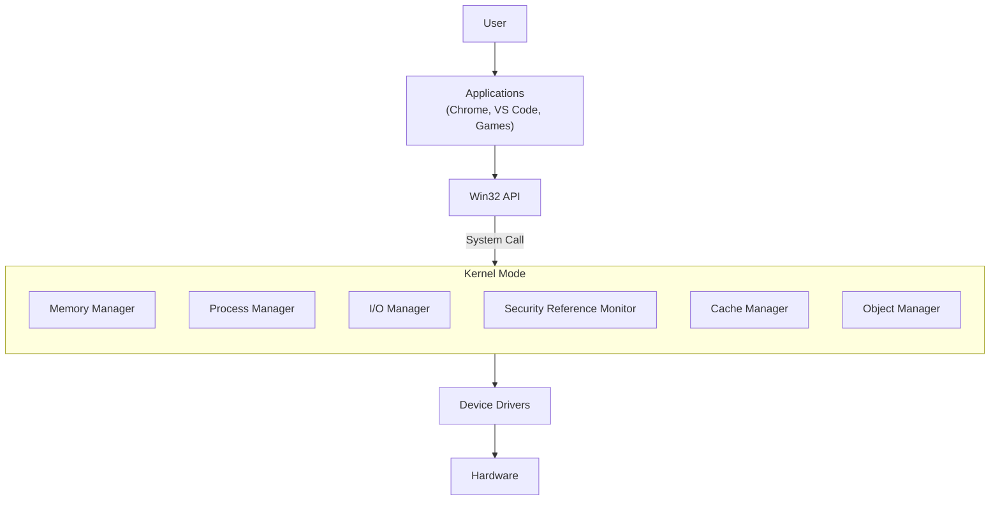

# Chapter 01 — Introduction to Windows Operating System

---

# 📖 Overview

Microsoft Windows is one of the most widely used operating systems in the world. It provides an interface between users, applications, and computer hardware, allowing software to run efficiently while managing system resources.

This chapter introduces the fundamentals of Windows, explains why an operating system is necessary, explores the Windows boot process, discusses Windows architecture, and compares 32-bit and 64-bit systems.

---

# 🎯 Learning Objectives

After completing this chapter, you will be able to:

- Understand what Windows is.
- Explain the purpose of an operating system.
- Understand why an operating system is required.
- Describe the Windows boot process.
- Identify the responsibilities of Windows.
- Understand Windows editions.
- Explain Windows architecture.
- Differentiate between User Mode and Kernel Mode.
- Understand the role of device drivers.
- Compare 32-bit and 64-bit Windows.

---

# What is Windows?

Windows is an **Operating System (OS)** developed by Microsoft.

An Operating System is **System Software** that manages computer hardware resources, provides services for software applications, and establishes communication between the **User, Software, and Hardware**.

Simply put,

> Windows acts as the manager of the computer by coordinating hardware and software resources.

---

# Why Do We Need an Operating System?

Although the CPU is extremely powerful, it understands only **Machine Language (Binary)**.

Example:

```text
10101010
11001100
10010010
```

The CPU does not understand concepts such as:

- Google Chrome
- VS Code
- Games
- Files
- Folders
- Mouse
- Keyboard

It only executes binary instructions.

Windows converts user and application requests into machine instructions that the CPU can process.

---

# What Happens Without Windows?

Even if a computer contains:

- CPU
- RAM
- SSD
- GPU

it cannot reach the desktop or login screen without an operating system.

The CPU requires an operating system to initialize hardware, manage resources, and execute applications.

---

# Windows Boot Process

When the computer starts, Windows is loaded through several stages.

```text
Power Button
      │
      ▼
Power Supply
      │
      ▼
CPU Starts
      │
      ▼
BIOS / UEFI
      │
      ▼
POST (Hardware Check)
      │
      ▼
Boot Device Search
      │
      ▼
Windows Boot Manager
      │
      ▼
Windows Kernel (ntoskrnl.exe)
      │
      ▼
Device Drivers
      │
      ▼
Windows Services
      │
      ▼
Login Screen
      │
      ▼
Desktop
```

---

## Step 1 — Power Button

The Power Supply provides electricity to the motherboard and hardware components.

---

## Step 2 — CPU Initialization

The CPU starts executing firmware instructions stored in the BIOS or UEFI.

---

## Step 3 — BIOS / UEFI

The firmware performs a **Power-On Self Test (POST)** to verify hardware.

It checks:

- CPU
- RAM
- Keyboard
- Mouse
- Storage Devices
- Graphics Card

If a critical component fails, the system stops the boot process.

---

## Step 4 — Boot Device Search

BIOS/UEFI searches for a bootable device based on the configured boot order.

Examples:

- SSD
- HDD
- USB
- DVD
- Network Boot

---

## Step 5 — Windows Boot Manager

Windows Boot Manager loads the Windows operating system.

---

## Step 6 — Windows Kernel

The Windows kernel (`ntoskrnl.exe`) loads into memory.

The kernel is the core component responsible for managing system resources.

---

## Step 7 — Drivers and Services

Windows loads essential device drivers, including:

- Keyboard Driver
- Mouse Driver
- Display Driver
- Storage Driver
- Network Driver

---

## Step 8 — Login Screen

System services start, the login screen appears, and after successful authentication, the Windows desktop is loaded.

---

# Responsibilities of Windows

Windows performs several important tasks behind the scenes.

## Process Management

Manages running applications and allocates CPU time.

Examples:

- Chrome
- VS Code
- Spotify
- Discord

---

## Memory Management

Allocates and manages RAM for running processes.

---

## File System Management

Manages files and folders.

Responsible for:

- File storage
- Access permissions
- File deletion

---

## Device Management

Controls hardware through device drivers.

Example:

Connecting a USB device automatically loads the required driver.

---

## Security Management

Provides built-in security features including:

- Windows Defender
- Firewall
- BitLocker
- User Account Control (UAC)
- User Permissions

---

## Network Management

Manages network communication including:

- DNS Resolution
- IP Addressing
- TCP Connections
- Internet Access

---

# Windows Editions

Microsoft provides multiple Windows editions to meet different user requirements.

| Edition | Purpose |
|----------|---------|
| Windows Home | Home users, students, gaming, internet browsing |
| Windows Pro | Developers, IT professionals, security features, Hyper-V, BitLocker |
| Windows Enterprise | Large organizations with advanced management and security |
| Windows Education | Schools and universities |
| Windows Server | Server operating system for enterprise services such as Active Directory, DNS, DHCP, File Server, and Web Server |

---

# Windows Architecture

Windows follows a layered architecture.

Applications never communicate directly with hardware.

Every request passes through the Windows API, system calls, kernel, and device drivers.



---

# User Mode

User Mode is where normal applications execute.

Examples:

- Chrome
- VS Code
- Steam
- Spotify

If an application crashes, Windows continues running.

---

# Kernel Mode

Kernel Mode contains the core components of Windows.

Major components include:

- Process Manager
- Memory Manager
- I/O Manager
- Security Reference Monitor
- Cache Manager
- Object Manager

If the kernel crashes, Windows may display a **Blue Screen of Death (BSOD).**

---

# Device Drivers

A device driver acts as a translator between Windows and hardware.

Example:

A printer driver converts Windows print requests into commands that the printer understands.

---

# 32-bit vs 64-bit

The architecture determines how much data the CPU can process and how much memory it can address.

| 32-bit | 64-bit |
|---------|---------|
| Supports approximately 4 GB RAM | Supports significantly larger amounts of RAM |
| Cannot run 64-bit applications | Can run both 64-bit and many 32-bit applications |
| Older architecture | Modern architecture with improved performance |

---

# Program Files

64-bit Windows contains two application folders.

**64-bit Applications**

```text
C:\Program Files
```

**32-bit Applications**

```text
C:\Program Files (x86)
```

Windows uses **WOW64 (Windows-on-Windows 64)** to run many 32-bit applications on a 64-bit operating system.

---

# Key Takeaways

- Windows is a System Software (Operating System).
- The CPU understands only machine language (binary).
- BIOS/UEFI performs the POST during startup.
- Windows Boot Manager loads the operating system.
- `ntoskrnl.exe` is the Windows kernel.
- Device drivers enable communication between Windows and hardware.
- Applications run in User Mode, while the operating system core runs in Kernel Mode.
- Modern computers use 64-bit Windows for improved performance and memory support.

---


---

# Next Chapter

➡ **[Chapter 02 — Windows Installation & Initial Configuration](./Chapter%2002%20%E2%80%94%20Windows%20Installation%20%26%20Initial%20Configuration.md)**
