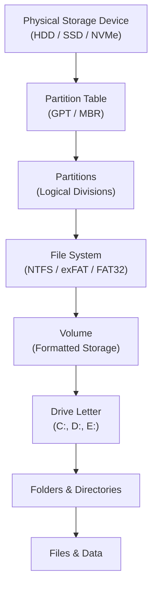
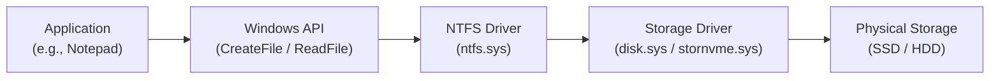
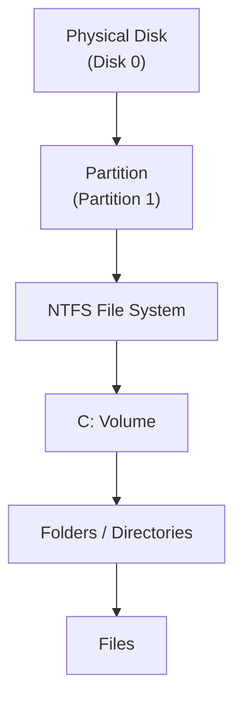
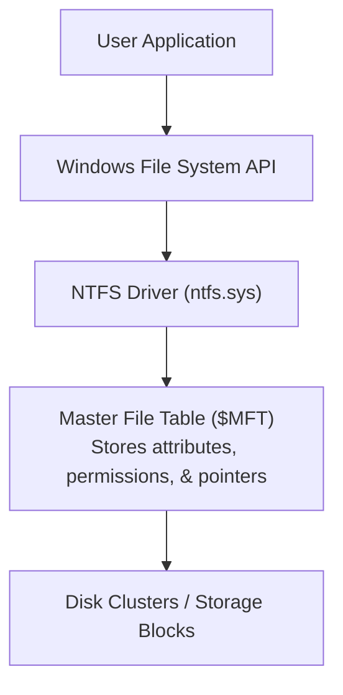
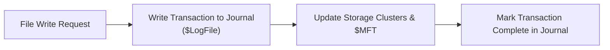
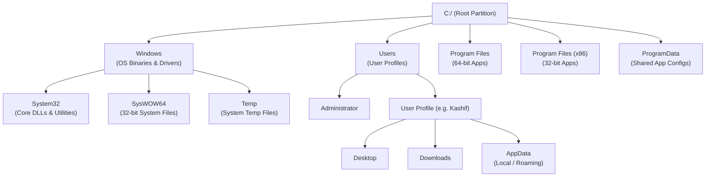
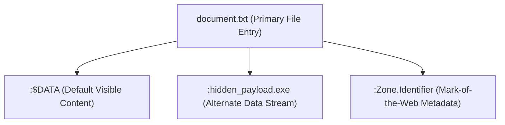
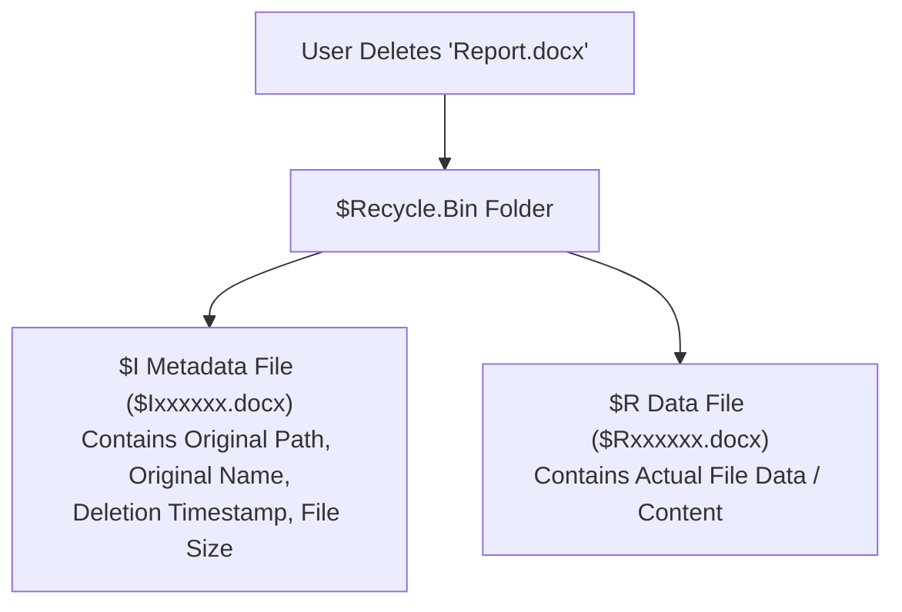

# Chapter 03 — Windows File System & File Explorer

---

# 📖 Overview

A file system is one of the most important components of an operating system. Every document, image, application, log file, and configuration file stored on your computer is managed through the file system.

Windows uses the **New Technology File System (NTFS)** as its default file system. NTFS provides advanced features such as access control, encryption, compression, journaling, metadata management, and alternate data streams, making it suitable for both personal and enterprise environments.

Understanding how Windows stores, manages, and organizes data is essential for system administrators, SOC Analysts, incident responders, and digital forensic investigators.

In this chapter, you will learn how Windows organizes storage devices, how NTFS works internally, how File Explorer interacts with the operating system, how special NTFS structures like the Master File Table ($MFT), Alternate Data Streams (ADS), and Recycle Bin function, and why file system knowledge is critical for Blue Team operations.

---

# 🎯 Learning Objectives

After completing this chapter, you will be able to:

- Explain the purpose and core responsibilities of a file system.
- Differentiate between physical disks, partitions, volumes, and drive letters.
- Understand the architecture and key features of NTFS.
- Compare FAT32, exFAT, NTFS, and ReFS file systems.
- Navigate and inspect Windows using File Explorer (`explorer.exe`).
- Understand the Windows directory structure and critical system folders.
- Work with absolute vs. relative file paths, extensions, and file associations.
- Explain the internal operation of the Recycle Bin (`$Recycle.Bin`) and its forensic artifacts (`$I` and `$R` files).
- Understand Alternate Data Streams (ADS), including `Zone.Identifier`, attacker evasion techniques, and detection methods.
- Recognize the importance of Windows File System artifacts in digital forensics and incident response (DFIR).

---

# Windows Storage Architecture

Before Windows can store files, a physical storage device must be organized into logical components.



Each layer has a specific responsibility that allows Windows to locate, store, and retrieve data efficiently across physical hardware.

---

# Windows File System

## What is a File System?

A **File System** is the logical structure that organizes, stores, retrieves, and manages data on a storage device.

Instead of saving files as raw unformatted binary blocks across the disk, Windows uses the file system to determine:

- Where a file's content is physically stored on disk clusters.
- The file's name and extension.
- Its size and allocated space.
- Who owns the file (Ownership).
- Which users and groups can access it (Permissions / Access Control Lists).
- When it was created, modified, accessed, or changed (File Timestamps / MACB).

Without a file system, an operating system would have no organized method of reading, writing, or locating data.

---

## Responsibilities of a File System

The Windows File System performs several essential duties:

| Responsibility | Description |
|---|---|
| **File Creation & Allocation** | Allocates storage clusters and records new file entries. |
| **File Deletion & Free Space Management** | Marks file clusters as available for overwrite when files are deleted. |
| **File Management** | Supports copy, move, rename, directory listing, and search operations. |
| **Permission Management** | Controls user access using Access Control Lists (ACLs) on NTFS. |
| **Metadata Storage** | Maintains information such as timestamps, file attributes, and ownership. |
| **Compression** | Reduces file size transparently to save disk space. |
| **Encryption** | Protects sensitive files on disk using features like Encrypting File System (EFS). |
| **Integrity & Recovery** | Logs file operations (Journaling) to recover from crashes without corruption. |

---

## Internal Working

Whenever an application opens or writes to a file, the request passes through multiple operating system layers before reaching the physical storage hardware.



This layered architecture allows Windows to enforce security permissions, maintain system stability, and remain compatible with a wide variety of storage controllers.

---

> 💙 **Blue Team Note**
>
> Every file created, modified, or accessed on a Windows system leaves digital artifacts behind in the file system metadata. During incident response, Blue Teams analyze file system metadata (such as NTFS MFT records, Timestamps, and Journal logs) to reconstruct attacker activity and build a forensic timeline.

---

# Storage Components

Windows divides physical hardware into distinct logical layers. Understanding the difference between disks, partitions, volumes, and drive letters is fundamental for storage management and security monitoring.

---

## Physical Disk

A **Disk** (or Physical Disk) is the actual physical hardware device connected to the computer.

Examples include:

- Hard Disk Drive (HDD)
- Solid State Drive (SSD)
- NVMe M.2 SSD
- USB Flash Drive
- External Storage Array (SAN / NAS)

---

## Partition

A **Partition** is a contiguous, logical division of a physical storage disk.

For example, a single 1 TB physical SSD can be partitioned into separate sections:

- Partition 1: Operating System & Applications
- Partition 2: User Data & Projects
- Partition 3: System Recovery

Disks use a partition table format to define partition boundaries:
- **MBR (Master Boot Record)**: Legacy standard, supports up to 4 primary partitions and 2 TB maximum disk size.
- **GPT (GUID Partition Table)**: Modern standard used with UEFI, supports up to 128 partitions and vast storage capacities (up to 9.4 ZB).

---

## Volume

A **Volume** is created when a partition is formatted with a specific file system (such as NTFS or FAT32).

$$\text{Partition} + \text{File System} = \text{Volume}$$

Example:

```text
100 GB Disk Partition  +  NTFS Formatting  =  C: Volume
```

Volumes can exist on a single partition or span across multiple physical disks (Dynamic Disks / Storage Spaces).

---

## Drive Letter

Windows assigns a **Drive Letter** (followed by a colon) to represent each mounted volume in the user interface.

Common conventions include:

| Drive Letter | Typical Purpose |
|---|---|
| **C:** | Primary System Volume (Windows OS, Program Files, Users) |
| **D:** | Secondary Storage (Data partition, optical drive, or secondary disk) |
| **E: / F:** | Removable Storage (USB flash drives, external SSDs) |
| **A: / B:** | Legacy floppy disk drives (rarely used today) |

---

## Windows Storage Hierarchy



---

## Default GPT Partition Structure

A standard modern Windows installation on a GPT disk creates four default partitions:

| Partition Name | Typical Size | File System | Purpose |
|---|---|---|---|
| **EFI System Partition (ESP)** | ~100–500 MB | FAT32 | Contains boot loaders (`bootmgr.efi`) and drivers required by UEFI. |
| **Microsoft Reserved (MSR)** | ~16 MB | None (Unformatted) | Reserved for Windows internal disk management tasks. |
| **Windows OS Partition** | Majority of Disk | NTFS | Contains the Windows operating system, applications, and user data (**C:**). |
| **Recovery Partition (WinRE)** | ~500–1000 MB | NTFS | Holds the Windows Recovery Environment tools for system repair. |

---

# NTFS File System

## What is NTFS?

**NTFS (New Technology File System)** is the default and primary file system used by modern Windows operating systems (Windows NT through Windows 11 and Windows Server 2025).

NTFS was engineered to replace the older FAT file system, offering enterprise-grade reliability, security, and scalability.

---

## Key Features of NTFS

| Feature | Description |
|---|---|
| **Access Control Lists (ACLs)** | Enables fine-grained file and folder permissions for users and groups. |
| **Encrypting File System (EFS)** | Provides file-level encryption using public-key cryptography. |
| **File Compression** | Allows individual files or folders to be compressed transparently to save disk space. |
| **Journaling ($LogFile & $UsnJrnl)** | Tracks file system changes in a log before executing them to prevent corruption during unexpected power loss. |
| **Large Storage Support** | Supports individual files and volume sizes up to 8 PB (Petabytes). |
| **Disk Quotas** | Allows administrators to limit the amount of disk space a user can consume. |
| **Alternate Data Streams (ADS)** | Allows multiple data streams to be attached to a single file entry. |
| **Symbolic & Hard Links** | Supports shortcuts, directory junctions, and hard links pointing to files. |
| **Volume Shadow Copy (VSS)** | Enables creation of historical backup snapshots of files and volumes. |

---

## Master File Table ($MFT)

The **Master File Table ($MFT)** is the central database and most critical structure inside an NTFS volume.

Every single file and folder on an NTFS volume—including the $MFT itself—has at least one 1024-byte record inside the MFT.

Each MFT record stores attributes such as:

- **$STANDARD_INFORMATION**: Contains file timestamps (Created, Modified, MFT Altered, Accessed), file attributes, and security IDs.
- **$FILE_NAME**: Contains the file name, parent folder record number, and duplicate timestamps.
- **$DATA**: Contains the actual content of the file (or a pointer to external disk clusters if the file is large).
- **$SECURITY_DESCRIPTOR**: Stores access control lists (ACLs) governing file access permissions.



---

## NTFS Journaling ($LogFile and $UsnJrnl)

To guarantee file system integrity, NTFS operates as a **journaling file system**.

Before writing changes to disk, NTFS records the intended metadata changes into a special hidden file called `$LogFile`.



If the system suddenly loses power or crashes during a write operation:
1. Upon reboot, NTFS reads `$LogFile`.
2. It undoes incomplete transactions and re-applies finished transactions.
3. This prevents file system corruption without requiring a lengthy disk scan (`chkdsk`).

In addition to `$LogFile`, NTFS maintains the **USN Change Journal (`$UsnJrnl`)**, which logs high-level file modification events.

---

> 💙 **Blue Team Note**
>
> Forensic analysts extract and parse the `$MFT`, `$LogFile`, and `$UsnJrnl` during malware analysis and incident investigations. Even if an attacker deletes a file, the `$MFT` record and `$UsnJrnl` entries frequently retain historical evidence of the file's existence, original path, and timestamps.

---

# Comparing Windows File Systems

Windows supports multiple file systems for different hardware devices and operational roles.

| Feature | FAT32 | exFAT | NTFS | ReFS |
|---|---|---|---|---|
| **Max File Size** | 4 GB | 16 EB | 8 PB | 35 PB |
| **Max Volume Size** | 2 TB (8 TB in Win11) | 128 PB | 8 PB | 35 PB |
| **File Permissions (ACLs)** | ❌ No | ❌ No | ✅ Yes | ✅ Yes |
| **Encryption (EFS)** | ❌ No | ❌ No | ✅ Yes | ❌ No |
| **Compression** | ❌ No | ❌ No | ✅ Yes | ❌ No |
| **Journaling** | ❌ No | ❌ No | ✅ Yes | ✅ Yes (Resiliency) |
| **Bootable OS Drive** | ❌ No | ❌ No | ✅ Yes | ❌ No |
| **Primary Use Case** | Legacy USB drives, EFI Boot | Flash drives, SD Cards, cross-OS sharing | Windows OS, Servers, Enterprise drives | Enterprise Data Servers, Resilient Storage |

---

## FAT32 (File Allocation Table 32)

- Introduced with Windows 95 OSR2.
- Supported by virtually all operating systems (Windows, macOS, Linux, Android, Smart TVs).
- **Limitations**: Max file size is strictly **4 GB**. Lacks security permissions, journaling, and encryption.

---

## exFAT (Extended File Allocation Table)

- Designed specifically for flash memory, USB drives, and external memory cards (SD cards).
- Overcomes FAT32's 4 GB file size limit while maintaining cross-platform compatibility with macOS and Linux.
- **Limitations**: Does not support NTFS file permissions, encryption, or native OS boot capabilities.

---

## NTFS (New Technology File System)

- Standard file system for all modern Windows installations.
- Highly secure, reliable, scalable, and feature-packed.
- **Best For**: Operating system drives, internal storage, active directory environments, and enterprise servers.

---

> 💙 **Blue Team Note**
>
> Removable USB drives formatted with FAT32 or exFAT do **not** enforce NTFS permissions. If sensitive files are copied to a FAT32/exFAT drive, their security permissions are stripped, allowing anyone with physical access to read the files.

---

# Windows File Explorer

## What is File Explorer?

**File Explorer** (formerly known as Windows Explorer) is the graphical file management interface in Windows.

It provides visual access to drives, folders, and files, enabling users to copy, move, rename, search, delete, and manage permissions on files.

---

## Explorer.exe Process

The user interface of File Explorer is powered by the system binary:

```text
C:\Windows\explorer.exe
```

`explorer.exe` is a critical core process that manages:
- The Desktop workspace
- The Taskbar and Start Menu
- File Explorer windows and file dialogs
- System tray icons

If `explorer.exe` crashes or is terminated in Task Manager, the desktop background, taskbar, and file windows will disappear until `explorer.exe` is restarted.

---

## How File Explorer Interacts with Windows


File Explorer is simply a graphical front-end; all actual storage operations are executed via Windows system calls and file system drivers.

---

## Key Components of the File Explorer Interface

| Interface Element | Description |
|---|---|
| **Navigation Pane** | Left-side panel showing Quick Access, This PC, Network locations, and directory trees. |
| **Address Bar** | Displays the current file path; allows path entry or navigation breadcrumbs. |
| **Search Box** | Searches files and folders in the active directory using Windows Search Indexing. |
| **Command Bar / Ribbon** | Provides options for creating folders, copying, cutting, pasting, and viewing properties. |
| **Main Content View** | Shows files and subdirectories with customizable icons, lists, or details. |
| **Details / Preview Pane** | Right-side panel showing file metadata, properties, or document previews. |
| **Status Bar** | Displays item counts and selection details at the bottom of the window. |

---

# Files, Folders & Directory Structure

## Files & Folders

- **File**: A container of structured binary or text data stored on a disk (e.g., code, executable, document, image).
- **Folder (Directory)**: A specialized file system structure used to group and organize files and subfolders into a logical hierarchy.

---

## Windows Directory Tree Structure



---

## Important Windows System Directories

| Directory Path | Purpose & Security Importance |
|---|---|
| `C:\Windows` | Contains core operating system files, system drivers, and built-in binaries. |
| `C:\Windows\System32` | Contains 64-bit critical system DLLs, EXEs (e.g., `cmd.exe`, `powershell.exe`, `ntoskrnl.exe`), and drivers. |
| `C:\Windows\SysWOW64` | Contains 32-bit system DLLs and EXEs for compatibility on 64-bit Windows. |
| `C:\Users` | Stores user profiles, personal folders (Desktop, Documents), and account settings. |
| `C:\Users\<Username>\AppData` | Hidden folder storing user-specific application data, configurations, and browser caches. |
| `C:\Program Files` | Default installation path for 64-bit applications. |
| `C:\Program Files (x86)` | Default installation path for 32-bit applications on 64-bit Windows. |
| `C:\ProgramData` | Hidden folder containing application configuration data shared across all users. |
| `C:\Windows\Temp` & `C:\Users\<User>\AppData\Local\Temp` | Temporary storage directories used by OS and applications. |

---

> 💙 **Blue Team Note**
>
> Malicious software frequently drops payloads into user-writable directories that do not require administrative privileges, such as:
> - `C:\Users\<Username>\AppData\Local\Temp`
> - `C:\Users\Public`
> - `C:\ProgramData`
> 
> Security analysts monitor file creation events in these directories for unexpected `.exe`, `.dll`, `.bat`, or `.ps1` files.

---

# File Paths

A **File Path** defines the unique location of a file or directory within the file system structure.

---

## Absolute vs. Relative Paths

### Absolute Path
Specifies the complete, unambiguous location starting from the drive letter root (`C:\`).

Example:

```text
C:\Users\Kashif\Documents\Reports\Quarterly.pdf
```

An absolute path always points to the exact same file regardless of the current working directory.

### Relative Path
Specifies a file location relative to the current working directory.

Example (if current directory is `C:\Users\Kashif`):

```text
Documents\Reports\Quarterly.pdf
```

Relative path navigation shortcuts:
- `.` (Single dot): Represents the current directory.
- `..` (Double dot): Represents the parent directory.

---

## Anatomy of a Windows File Path


---

# File Extensions & File Associations

## File Extensions

A **File Extension** is the suffix at the end of a filename (separated by a dot) that indicates the format and content type of the file.

Common extensions include:

| Extension | File Category | Example Application |
|---|---|---|
| `.txt`, `.log` | Plain Text | Notepad, VS Code |
| `.docx`, `.pdf` | Documents | Microsoft Word, Adobe Reader |
| `.jpg`, `.png` | Images | Photos, Paint |
| `.zip`, `.7z`, `.tar` | Archives | Compressed Folder, 7-Zip |
| `.exe`, `.msi` | Executables | Windows Installer |
| `.ps1`, `.bat`, `.vbs` | Scripts | PowerShell, Command Prompt |

---

## File Associations & HKCR

Windows uses **File Associations** to determine which application automatically opens when a user double-clicks a specific file extension.

These associations are mapped in the Windows Registry under `HKEY_CLASSES_ROOT` (HKCR).

Example:

```text
.pdf  -->  Acrobat.Document.DC  -->  C:\Program Files\Adobe\Acrobat DC\Acrobat.exe
```

---

## Dangerous Executable Extensions

Attackers often disguise malicious files or send dangerous file formats via email attachments. Notable dangerous extensions include:

- Executables: `.exe`, `.com`, `.scr`, `.pif`
- Scripts: `.bat`, `.cmd`, `.ps1`, `.vbs`, `.js`, `.wsf`, `.hta`
- Office Macros: `.docm`, `.xlsm`, `.pptm`
- Installers: `.msi`, `.cab`

---

> 💙 **Blue Team Note**
>
> By default, Windows File Explorer **hides file extensions** for known file types. Attackers exploit this by naming malware `invoice.pdf.exe`. Because `.exe` is hidden by default, the user only sees `invoice.pdf` with an icon mimicking a PDF document.
> 
> **Security Recommendation**: Always enable **"File name extensions"** in File Explorer settings!

---

# Hidden Files, System Files & Attributes

## Hidden Files & System Files

To prevent accidental modification or deletion of crucial operating system components, Windows marks certain files and folders with special attributes.

- **Hidden Files**: Files hidden from normal directory view (e.g., `Desktop.ini`, `thumbs.db`).
- **System Files**: Protected operating system files vital for booting and stability (e.g., `bootmgr`, `pagefile.sys`, `hiberfil.sys`, `ntoskrnl.exe`).

---

## File Attributes

NTFS assigns flags (attributes) to files and folders to govern how the OS and applications interact with them.

| Attribute Flag | Name | Meaning |
|---|---|---|
| **R** | Read-Only | Prevents applications from modifying or deleting the file. |
| **H** | Hidden | Hides the file from standard file listings. |
| **S** | System | Marks the file as an essential operating system file. |
| **A** | Archive | Indicates the file has been modified since the last backup. |
| **C** | Compressed | File content is compressed via NTFS compression. |
| **E** | Encrypted | File content is encrypted using NTFS EFS. |

---

## Inspecting and Modifying Attributes via Command Line

Using **Command Prompt (`attrib`)**:

```cmd
:: View file attributes in current directory
attrib

:: Hide a file and set system attribute
attrib +h +s malicious.exe

:: Unhide a file
attrib -h -s file.txt
```

Using **PowerShell (`Get-Item` / `Get-ChildItem`)**:

```powershell
Get-ChildItem -Force | Select-Object Name, Attributes
```

---

# Alternate Data Streams (ADS)

## What is an Alternate Data Stream?

**Alternate Data Streams (ADS)** is an NTFS feature that allows a file to store multiple independent streams of data under a single file record.

Every standard file on NTFS has a default unnamed data stream (`:$DATA`). An Alternate Data Stream allows additional hidden named streams to be attached to that file without altering its primary file size or content.



---

## Syntax & Creating an ADS

An ADS is referenced using a colon (`:`) after the filename:

$$\text{filename.txt}:\text{streamname}$$

### Creating an ADS Example:

```cmd
:: Create normal file
echo "Normal file content" > normal.txt

:: Attach hidden text stream to normal.txt
echo "Secret hidden message" > normal.txt:hidden.txt

:: Attach executable file into an ADS
type payload.exe > normal.txt:payload.exe
```

When viewing `normal.txt` in Notepad or checking its file size in File Explorer, only the primary stream is displayed. The hidden stream content remains completely invisible to standard file viewing tools!

---

## Zone.Identifier (Mark-of-the-Web / MOTW)

Windows natively uses Alternate Data Streams for security through the **Zone.Identifier** stream, also known as **Mark-of-the-Web (MOTW)**.

When a file is downloaded from the Internet via a web browser (Edge, Chrome, Firefox), Windows automatically attaches an ADS named `:Zone.Identifier` to the downloaded file.

Example content of `:Zone.Identifier`:

```ini
[ZoneTransfer]
ZoneId=3
ReferrerUrl=https://example.com/download
HostUrl=https://example.com/files/document.pdf
```

- `ZoneId=3` indicates the **Internet Zone**.
- Windows Defender and Microsoft Office read this stream to trigger **Protected View** or prompt security warnings when opening files originating from untrusted networks.

---

## Threat Actor Evasion & Detection

Attackers use ADS to hide malicious scripts, web shells, or secondary executables inside legitimate files (or even directories) to bypass basic file inspection.

### Detecting ADS:

Using **Command Prompt**:

```cmd
:: View files including alternate data streams (/R flag)
dir /R
```

Using **PowerShell**:

```powershell
:: Inspect streams attached to a file
Get-Item -Path .\normal.txt -Stream *

:: View content of a specific stream
Get-Content -Path .\normal.txt -Stream hidden.txt
```

---

# Windows Recycle Bin Artifacts ($Recycle.Bin)

## How the Recycle Bin Works

When a user deletes a file in File Explorer, Windows does **not** immediately erase the file from the disk. Instead, the file is moved to a hidden system directory called `$Recycle.Bin`.

Each user account on the system has a dedicated subfolder inside `$Recycle.Bin` named after their **Security Identifier (SID)**:

```text
C:\$Recycle.Bin\S-1-5-21-3456789012-3456789012-3456789012-1001\
```

---

## Forensics: $I and $R Files

When a file (e.g., `Report.docx`) is moved to the Recycle Bin, Windows renames the file and creates two distinct files:



1. **`$I` File (`$Ixxxxxx.ext`)**:
   - Contains forensic metadata: original file name, original file path, date & time of deletion, and original file size.
2. **`$R` File (`$Rxxxxxx.ext`)**:
   - Contains the actual raw file contents.

---

> 💙 **Blue Team & DFIR Note**
>
> If an attacker deletes evidence or tools into the Recycle Bin, forensic analysts analyze the `$I` files to determine exactly when the tool was deleted and where it originally resided on the system!

---

# Summary

In this chapter, you learned:

- The fundamentals of the Windows File System and its role in managing disk clusters, permissions, and file metadata.
- Storage hierarchy: Disks $\rightarrow$ Partitions $\rightarrow$ Volumes $\rightarrow$ Drive Letters.
- The default GPT partition layout (EFI System, MSR, OS Partition, Recovery Partition).
- NTFS features, including Access Control Lists (ACLs), EFS encryption, journaling, and the Master File Table ($MFT$).
- Differences between FAT32, exFAT, NTFS, and ReFS file systems.
- How `explorer.exe` serves as the GUI file manager interacting with Windows system drivers.
- Windows directory structures, system folders (`System32`, `AppData`, `ProgramData`), and their security relevance.
- Absolute vs. relative file paths and dangerous file extension masking.
- File attributes (Read-Only, Hidden, System, Archive) and inspecting them via `attrib` and PowerShell.
- Alternate Data Streams (ADS), Mark-of-the-Web (`Zone.Identifier`), and detection using `dir /R` or `Get-Item -Stream *`.
- Recycle Bin internals (`$Recycle.Bin`), SID folders, and `$I` / `$R` forensic metadata analysis.

---

# Key Takeaways

- **NTFS is the foundation of Windows security**: Its support for ACLs, journaling ($LogFile/$UsnJrnl), and metadata logging is vital for OS integrity and investigation.
- **$MFT contains all file knowledge**: Every file on an NTFS volume is tracked in the $MFT. Parsing $MFT records provides critical forensic evidence.
- **Always unhide file extensions**: Attackers rely on default Windows settings hiding extension names to execute malicious code disguised as documents.
- **Watch user-writable directories**: Folders like `AppData\Local\Temp`, `C:\Users\Public`, and `ProgramData` are prime locations for malware staging.
- **Alternate Data Streams can hide payloads**: Check for hidden streams using `dir /R` or PowerShell `Get-Item -Stream *`.
- **Recycle Bin retains deletion evidence**: `$I` metadata files store original paths and timestamps even after a file is moved to `$Recycle.Bin`.

---

# Next Chapter

➡ **Chapter 04 — Command Prompt (CMD)**