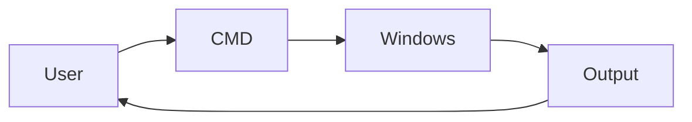
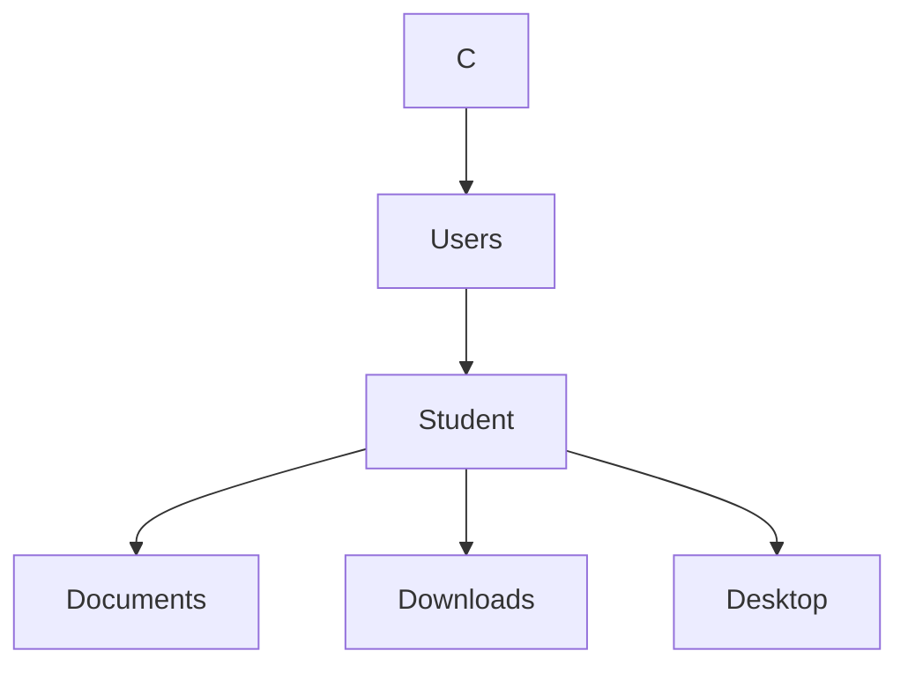

# Chapter 04 – Command Prompt (CMD)

## Overview

The Command Prompt (CMD) is a text-based interface that allows users to interact with Windows by typing commands instead of using the graphical interface (GUI). Although Windows provides many graphical tools, CMD is still widely used by system administrators, IT support professionals, and Blue Team analysts to troubleshoot systems, gather information, and perform administrative tasks quickly.

Learning CMD is an important first step because many cybersecurity tools and scripts rely on command-line knowledge.

---

## Learning Objectives

After completing this chapter, you will be able to:

- Understand what Command Prompt is
- Open CMD using different methods
- Navigate between folders
- Create, rename, copy, move, and delete files and folders
- Display basic system information
- Use common troubleshooting commands
- Recognize why CMD is useful in Blue Team investigations

---

# What is Command Prompt?

Command Prompt, commonly called **CMD**, is the default command-line interpreter in Windows.

Instead of clicking buttons, users type commands to perform tasks.

For example:

```cmd
dir
```

shows the contents of the current folder.

---

## Why Learn CMD?

CMD is useful because it allows you to:

- Manage files and folders
- View system information
- Troubleshoot Windows problems
- Run administrative commands
- Execute scripts
- Perform tasks faster than using the GUI

Many cybersecurity tools also launch CMD automatically while performing investigations.

---

## CMD Workflow



---

# Opening Command Prompt

You can open CMD in several ways.

### Method 1

Press

```
Windows + R
```

Type

```
cmd
```

Press **Enter**.

---

### Method 2

Open the **Start Menu**

Search for

```
Command Prompt
```

Click the application.

---

### Method 3

Open Windows Terminal

Choose

```
Command Prompt
```

---

> **Tip**
>
> Right-click **Command Prompt** and select **Run as administrator** when administrative privileges are required.

---

# Understanding the CMD Window

A typical prompt looks like this:

```cmd
C:\Users\Student>
```

This is called the **Command Prompt**.

It shows your current working directory.

---

# Navigating Folders

CMD uses commands to move between directories.

## Display Current Folder

```cmd
cd
```

---

## List Files and Folders

```cmd
dir
```

Example output:

```text
Documents
Downloads
Pictures
Desktop
```

---

## Change Directory

```cmd
cd Documents
```

---

## Go Back One Folder

```cmd
cd ..
```

---

## Change Drive

```cmd
D:
```

---

## Navigation Diagram



---

# File Management

CMD allows basic file management.

## Create Folder

```cmd
mkdir Reports
```

---

## Remove Empty Folder

```cmd
rmdir Reports
```

---

## Create File

```cmd
type nul > notes.txt
```

---

## Copy File

```cmd
copy notes.txt Backup\
```

---

## Move File

```cmd
move notes.txt Documents\
```

---

## Rename File

```cmd
ren notes.txt report.txt
```

---

## Delete File

```cmd
del report.txt
```

---

> **Warning**
>
> Files deleted using `del` do **not** go to the Recycle Bin.

---

# Viewing System Information

CMD can quickly display useful information.

## Current User

```cmd
whoami
```

---

## Computer Information

```cmd
systeminfo
```

Displays:

- Windows version
- Computer name
- RAM
- Processor
- Installation date

---

## Hostname

```cmd
hostname
```

Displays the computer name.

---

## IP Address

```cmd
ipconfig
```

Displays network configuration.

---

## Active Network Connections

```cmd
netstat
```

Shows current network connections.

---

# Essential CMD Commands

| Command | Purpose |
|----------|---------|
| dir | List files |
| cd | Change directory |
| mkdir | Create folder |
| rmdir | Remove folder |
| copy | Copy files |
| move | Move files |
| ren | Rename files |
| del | Delete files |
| cls | Clear screen |
| whoami | Show current user |
| hostname | Display computer name |
| systeminfo | Display system information |
| ipconfig | Display IP configuration |
| netstat | View network connections |
| help | Show available commands |

---

# Blue Team Perspective

Blue Team analysts frequently use CMD during investigations.

Some examples include:

- Checking the logged-in user with `whoami`
- Viewing system information using `systeminfo`
- Checking network settings with `ipconfig`
- Viewing active network connections with `netstat`
- Navigating folders to locate suspicious files

Although many advanced investigations use PowerShell and EDR tools, CMD remains an important skill because it is available on every Windows computer.

---

# Key Points

- CMD is Windows' built-in command-line interface.
- Commands are typed instead of using the mouse.
- `cd` changes directories.
- `dir` lists files and folders.
- File management commands help organize files.
- System information commands provide useful troubleshooting details.
- Blue Team analysts often use CMD during investigations.

---

# Summary

In this chapter you learned:

- What CMD is
- How to open Command Prompt
- Basic navigation
- Managing files and folders
- Viewing system information
- Essential beginner commands
- How CMD supports Blue Team investigations

The next chapter introduces **PowerShell**, a more powerful command-line environment used by administrators and security professionals.

# Further Reading

- [Microsoft Learn: Command Prompt Overview](https://learn.microsoft.com/en-us/windows-server/administration/windows-commands/windows-commands)
- [Microsoft Documentation: Windows Commands Reference](https://learn.microsoft.com/en-us/windows-server/administration/windows-commands/cmd)
- [Sysinternals Utilities - Microsoft Learn](https://learn.microsoft.com/en-us/sysinternals/)
- [MITRE ATT&CK: Command and Scripting Interpreter: Windows Command Shell (T1059.003)](https://attack.mitre.org/techniques/T1059/003/)

---

# Next Chapter

➡ **[Chapter 05 — PowerShell Fundamentals](./Chapter%2005%20%E2%80%94%20PowerShell%20Fundamentals.md)**
