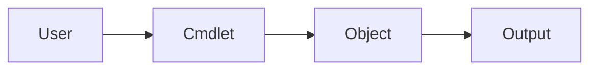

# Chapter 05 — PowerShell Fundamentals

---

# 📖 Overview

**PowerShell** is an advanced task automation and configuration management framework created by Microsoft. It consists of a powerful command-line shell, a scripting language, and a robust object-oriented management framework built on top of the Microsoft .NET Common Language Runtime (CLR).

PowerShell is ubiquitous in modern Windows enterprises. It is used to manage local hosts, Active Directory environments, cloud infrastructures (Azure/AWS), and automated deployments. Consequently, it has also become a primary vector for adversaries conducting living-off-the-land attacks, fileless malware execution, and post-exploitation activity.

---

## Learning Objectives

After completing this chapter, you will be able to:

- Understand what PowerShell is
- Open and use PowerShell
- Understand cmdlets
- Learn how PowerShell uses objects
- Create and use simple variables
- Understand the PowerShell pipeline
- Use the built-in Help system
- Recognize how Blue Teams use PowerShell

---

# What is PowerShell?

PowerShell is a command-line shell developed by Microsoft that combines a powerful command-line interface with a scripting language.

Unlike CMD, PowerShell works with **objects** instead of plain text, making it more powerful and flexible.

PowerShell is installed by default on modern Windows systems.

---

## CMD vs PowerShell

| Command Prompt (CMD) | PowerShell |
|----------------------|------------|
| Older command-line tool | Modern command-line shell |
| Works with text output | Works with objects |
| Basic administration | Advanced administration and automation |
| Limited functionality | Powerful scripting capabilities |

---

## Opening PowerShell

You can open PowerShell in several ways:

### Method 1
- Open the **Start Menu**
- Search for **PowerShell**
- Press **Enter**

### Method 2
- Press **Windows + X**
- Select **Windows PowerShell** or **Terminal**

### Method 3
- Open **Windows Terminal**
- Choose the **PowerShell** tab

---

## PowerShell Workflow



---

# Cmdlets

PowerShell commands are called **cmdlets**.

Most cmdlets follow the **Verb-Noun** naming convention.

Examples:

| Cmdlet | Purpose |
|---------|---------|
| Get-Process | View running processes |
| Get-Service | View Windows services |
| Get-ChildItem | List files and folders |
| Get-Help | Display help |
| Get-Command | List available commands |

Example:

```powershell
Get-Process
```

---

# Objects

One of PowerShell's biggest advantages is that it works with **objects** instead of plain text.

An object contains multiple pieces of information, such as a process name, ID, memory usage, and status.

Example:

```powershell
Get-Process
```

This command returns detailed information about each running process.

---

# Variables

Variables are used to store information.

In PowerShell, variables begin with the **$** symbol.

Example:

```powershell
$name = "John"
```

Display the value:

```powershell
$name
```

Variables make commands easier to reuse and are useful when writing scripts.

---

# Pipeline

The PowerShell pipeline (`|`) passes the output of one command to another command.

Example:

```powershell
Get-Process | Sort-Object CPU
```

In this example:

- `Get-Process` retrieves running processes.
- `Sort-Object CPU` sorts them by CPU usage.

---

## Pipeline Diagram

```mermaid
flowchart LR
A[Get-Process] --> B[Pipeline |]
B --> C[Sort-Object CPU]
C --> D[Output]
```

---

# Help System

PowerShell includes a built-in help system.

Useful commands include:

### Display Help

```powershell
Get-Help Get-Process
```

### List Available Commands

```powershell
Get-Command
```

### View Object Properties

```powershell
Get-Process | Get-Member
```

Using the Help system is one of the best ways to learn PowerShell.

---

# Essential PowerShell Commands

| Cmdlet | Purpose |
|---------|---------|
| Get-Help | Display help information |
| Get-Command | List available commands |
| Get-Process | View running processes |
| Get-Service | View services |
| Get-ChildItem | List files and folders |
| Get-Location | Display current location |
| Set-Location | Change directory |
| Get-Date | Display current date and time |
| Clear-Host | Clear the screen |

---

# Blue Team Perspective

PowerShell is one of the most important tools used by Blue Team professionals.

Security analysts use it to:

- View running processes
- Check Windows services
- Collect system information
- Investigate suspicious activity
- Automate repetitive administrative tasks

PowerShell is also commonly abused by attackers to execute malicious commands. Because of this, security analysts should understand how PowerShell works and know how to recognize unusual PowerShell activity during investigations.

---

# Key Points

- PowerShell is Microsoft's modern command-line shell.
- PowerShell uses **cmdlets** instead of traditional commands.
- Cmdlets follow the **Verb-Noun** naming convention.
- PowerShell works with **objects**, making it more powerful than CMD.
- Variables store information for later use.
- The pipeline (`|`) connects multiple commands together.
- The Help system makes learning PowerShell easier.
- PowerShell is widely used by both system administrators and Blue Team professionals.

---

# Summary

In this chapter, you learned:

- What PowerShell is
- How it differs from CMD
- How to open PowerShell
- What cmdlets are
- How PowerShell uses objects
- How to create simple variables
- How the pipeline works
- How to use the Help system
- Why PowerShell is important for Blue Team operations

In the next chapter, you will learn about **Windows Users & Groups**, including user accounts, groups, and account management.

 ### Further Reading

- [Microsoft Learn: PowerShell Documentation](https://learn.microsoft.com/en-us/powershell/)
- [Microsoft Learn: About Execution Policies](https://learn.microsoft.com/en-us/powershell/module/microsoft.powershell.core/about/about_execution_policies)
- [Greater Visibility Through PowerShell Logging - Mandiant](https://www.mandiant.com/resources/blog/greater-visibility-through-powershell-logging)
- [MITRE ATT&CK: Command and Scripting Interpreter: PowerShell (T1059.001)](https://attack.mitre.org/techniques/T1059/001/)


---

# Next Chapter

➡ **[Chapter 06 — Windows Users & Groups](./Chapter%2006%20%E2%80%94%20Windows%20Users%20%26%20Groups.md)**
