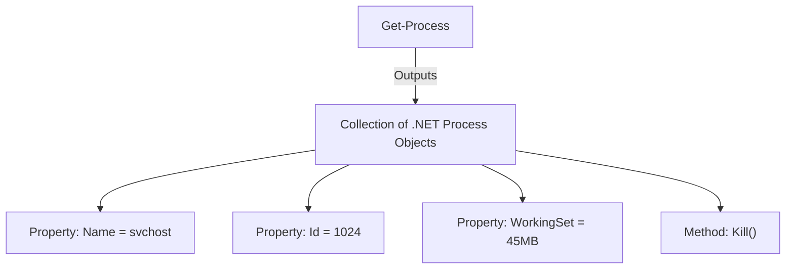
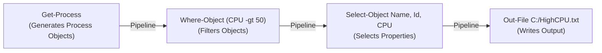
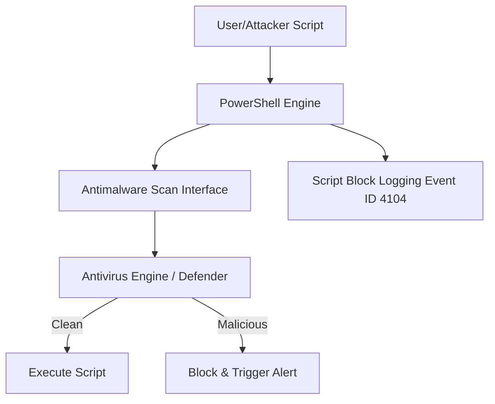

# Chapter 05 — PowerShell Fundamentals

## Introduction

**PowerShell** is an advanced task automation and configuration management framework created by Microsoft. It consists of a powerful command-line shell, a scripting language, and a robust object-oriented management framework built on top of the Microsoft .NET Common Language Runtime (CLR).

Unlike legacy command shells like `cmd.exe` or Linux `bash` that process commands using plain unstructured text, PowerShell works directly with **.NET Objects**. This architectural distinction allows administrators and security engineers to filter, manipulate, and pass structured data seamlessly across the pipeline without writing complex text parsing scripts.

PowerShell is ubiquitous in modern Windows enterprises. It is used to manage local hosts, Active Directory environments, cloud infrastructures (Azure/AWS), and automated deployments. Consequently, it has also become a primary vector for adversaries conducting living-off-the-land attacks, fileless malware execution, and post-exploitation activity.

---

## Learning Objectives

Students should be able to:

- Explain the architecture of PowerShell and contrast object-based shells with text-based shells.
- Utilize the Verb-Noun naming convention to discover and execute cmdlets.
- Leverage the built-in PowerShell Help System (`Get-Help`) to learn cmdlet parameters and syntax.
- Construct PowerShell pipelines (`|`) using `Where-Object`, `Select-Object`, and `ForEach-Object`.
- Declare and manipulate variables, arrays, hash tables, logical operators, conditional branches, and loops.
- Explain PowerShell Execution Policies and clarify security misconceptions regarding script execution rules.
- Identify core PowerShell security mechanisms (AMSI, Constrained Language Mode, Script Block Logging).
- Analyze PowerShell log events (Event ID 4104, 4103) for incident response and threat hunting.

---

## Why Blue Teams Care

PowerShell is both a critical administrative tool and a high-priority threat hunting domain:

1. **Fileless & Memory-Only Malware Execution**: Attackers use PowerShell to download and execute payloads directly in memory (e.g., `Invoke-Expression (New-Object Net.WebClient).DownloadString(...)`), leaving zero executable footprints on disk.
2. **Obfuscation Techniques**: PowerShell supports base64 encoding (`-EncodedCommand`), variable substitution, string concatenation, and backtick insertion to evade signature-based antivirus detection.
3. **Automated Incident Response Triage**: Security teams rely heavily on PowerShell scripts (e.g., KAPE, KAPE-like modules, PowerForensics) to harvest volatile artifacts, memory dumps, event logs, and forensic indicators across enterprise endpoints.
4. **Deep Event Visibility**: Windows provides granular logging capabilities for PowerShell (Script Block Logging Event ID 4104), allowing analysts to inspect executed code blocks even when heavily obfuscated.

---

## Core Concepts

### 1. Objects vs. Text

In traditional text-based shells (`cmd.exe`), running a process listing command outputs lines of string characters. Extracting a specific Process ID requires manual parsing (e.g., regex or string splitting).

In PowerShell, `Get-Process` returns a collection of `System.Diagnostics.Process` **Objects**. Each object contains **Properties** (attributes like `Id`, `ProcessName`, `CPU`, `WorkingSet`) and **Methods** (actions like `Kill()`, `Refresh()`).



### 2. Cmdlets (Command-lets)

Cmdlets are small, lightweight built-in commands written in .NET. They follow a mandatory **Verb-Noun** naming structure:
- **Verb**: Defines the action performed (e.g., `Get`, `Set`, `New`, `Remove`, `Start`, `Stop`, `Invoke`).
- **Noun**: Specifies the target object (e.g., `Process`, `Service`, `LocalUser`, `Content`, `EventLog`).

Examples:
- `Get-Service`: Retrieves system services.
- `Stop-Process`: Terminates a running process.
- `New-Item`: Creates a file or directory.

### 3. The Help System

PowerShell provides comprehensive self-documenting features:

```powershell
# Update local help files from Microsoft servers
Update-Help -Force

# Search for cmdlets related to event logs
Get-Command *EventLog*

# View detailed help for a specific cmdlet
Get-Help Get-WinEvent -Detailed

# View full documentation with practical examples
Get-Help Get-Process -Examples
```

---

## Architecture & Pipeline Workflow

PowerShell pipelines pass complete objects from one cmdlet to another.



---

## Practical Examples

### Pipeline Filtering & Property Selection

```powershell
# Get all running processes, filter where CPU usage exceeds 10 seconds, select specific properties
Get-Process | Where-Object { $_.CPU -gt 10 } | Select-Object ProcessName, Id, CPU | Sort-Object CPU -Descending

# Inspect object structure and available properties/methods
Get-Process | Get-Member
```

#### Output Example: `Get-Process | Select-Object -First 3`
```text
Handles  NPM(K)    PM(K)      WS(K)     CPU(s)     Id  SI ProcessName
-------  ------    -----      -----     ------     --  -- -----------
    215      14     3124      12400       0.15   1024   0 lsass
    450      28    15400      42100       2.45   2140   1 explorer
    180      11     2100       8900       0.05   3200   1 notepad
```

---

### Variables, Data Types, & Hash Tables

```powershell
# String and Integer variables
$TargetHost = "192.168.1.100"
$MaxAttempts = 5

# System environment variables
Write-Host "Current User Temp Path: $env:TEMP"

# Arrays
$ServicesToWatch = @("WinDefend", "wuauserv", "EventLog")
Write-Host "Monitoring Service: $($ServicesToWatch[0])"

# Hash Tables (Key-Value pairs)
$IncidentData = @{
    HostName = "WORKSTATION-01"
    User = "JSmith"
    AlertSeverity = "High"
}
Write-Host "Alert Severity: $($IncidentData.AlertSeverity)"
```

---

### Operators, Conditions, & Loops

#### Comparison Operators
PowerShell uses explicit comparison operators instead of symbols:
- `-eq` (Equal), `-ne` (Not Equal)
- `-gt` (Greater Than), `-lt` (Less Than)
- `-like` (Wildcard match, e.g. `*malware*`)
- `-match` (Regex match)

#### Conditional Statements & Loops
```powershell
# Conditional logic
$Service = Get-Service -Name "WinDefend"
if ($Service.Status -eq "Running") {
    Write-Host "[+] Defender is active." -ForegroundColor Green
} else {
    Write-Host "[!] ALERT: Defender service stopped!" -ForegroundColor Red
}

# Foreach loop over array objects
$Processes = Get-Process -Name "cmd", "powershell"
foreach ($proc in $Processes) {
    Write-Host "Process ID: $($proc.Id) - Name: $($proc.ProcessName)"
}
```

---

### Functions & Modules

```powershell
# Custom Function for Host Reconnaissance
function Get-HostTriage {
    param (
        [string]$OutputPath = "$env:TEMP\triage.txt"
    )
    
    $SystemInfo = [PSCustomObject]@{
        ComputerName = $env:COMPUTERNAME
        CurrentUser  = $env:USERNAME
        OSVersion    = (Get-CimInstance Win32_OperatingSystem).Caption
        Time         = (Get-Date)
    }
    
    $SystemInfo | Out-File -FilePath $OutputPath
    Write-Host "[+] Triage written to $OutputPath" -ForegroundColor Cyan
}

# Run function
Get-HostTriage
```

---

## PowerShell Execution Policy & Security Features

### Execution Policy (Myth vs Reality)

> **Important**
> 
> The PowerShell **Execution Policy is NOT a security boundary**. It is a safety rail designed to prevent users from accidentally executing untrusted scripts.
> Attackers easily bypass Execution Policies using command line switches: `powershell.exe -ExecutionPolicy Bypass -File script.ps1`.

| Policy | Behavior |
|---|---|
| `Restricted` | Default on client OS. Blocks script execution; interactive commands only. |
| `AllSigned` | Requires scripts to be signed by a trusted digital publisher. |
| `RemoteSigned` | Local scripts run unsigned; scripts downloaded from internet require digital signature. |
| `Unrestricted` | Runs all scripts; prompts warning for downloaded files. |
| `Bypass` | Nothing is blocked; no warnings or prompts. |

---

### Core Defensive Controls

1. **AMSI (Antimalware Scan Interface)**: An interface allowing applications (like PowerShell) to integrate with the installed antivirus (e.g. Defender). AMSI inspects script buffers in memory before execution.
2. **Constrained Language Mode (CLM)**: Restricts PowerShell features (blocks direct .NET class calls, COM objects, and unmanaged API invokers). Often paired with AppLocker/WDAC.
3. **Script Block Logging (Event ID 4104)**: Captures the full content of code blocks as they are executed by the PowerShell engine, enabling forensic analysis of deobfuscated payloads.



---

## Blue Team Investigation Notes

> **Blue Team Insight: Investigating PowerShell Event Logs**
> 
> When conducting host forensics, analyze the following Event Logs under `Applications and Services Logs -> Microsoft -> Windows -> PowerShell -> Operational`:
> 
> - **Event ID 4104 (Script Block Logging)**: Contains the exact code executed. Look for suspicious keywords: `Net.WebClient`, `DownloadString`, `Invoke-Expression`, `IEX`, `Bypass`, `EncodedCommand`, `VirtualAlloc`.
> - **Event ID 4103 (Module Logging)**: Records pipeline execution details and variable assignments.
> - **Event ID 400 (Engine State)**: Records when PowerShell engine starts and stops, including host details.

---

## Common Mistakes

| Mistake | Consequence | How to Avoid |
|---|---|---|
| Relying on Execution Policy for Security | Believing blocking `.ps1` files stops attackers. | Enforce AppLocker/WDAC and Script Block Logging instead. |
| Using string parsing instead of properties | Using `findstr` on PowerShell objects breaks pipeline versatility. | Access object properties directly (e.g., `$proc.Id`). |
| Forgetting standard comparison operators | Using `==` or `>` in PowerShell syntax causes syntax errors. | Use PowerShell operators (`-eq`, `-gt`, `-like`, `-match`). |
| Modifying `$Profile` blindly | Unvalidated profile scripts can execute unwanted code every shell launch. | Audit `$HOME\Documents\WindowsPowerShell\profile.ps1`. |

---

## Best Practices

1. **Enable Script Block Logging (Event ID 4104)** across all domain endpoints via Group Policy.
2. **Enforce PowerShell Transcription Logging**: Automatically record all input/output console sessions to a secure central SMB share.
3. **Deploy AppLocker or Windows Defender Application Control (WDAC)** to automatically force non-administrative users into Constrained Language Mode (CLM).

---

## Summary

- PowerShell is an object-oriented shell built on Microsoft .NET.
- Cmdlets follow a strict Verb-Noun convention (`Get-Process`, `Set-ExecutionPolicy`).
- Objects flow through the pipeline (`|`) and can be filtered with `Where-Object` and structured with `Select-Object`.
- Execution Policies are administrative guardrails, NOT security boundaries.
- Key defensive controls include AMSI, CLM, and Script Block Logging (Event ID 4104).

---

## Key Commands

| Cmdlet | Purpose | Example |
|---|---|---|
| `Get-Command` | Finds available cmdlets and functions | `Get-Command *service*` |
| `Get-Help` | Retrieves documentation and examples | `Get-Help Get-Service -Examples` |
| `Get-Member` | Displays properties and methods of an object | `Get-Process \| Get-Member` |
| `Where-Object` | Filters objects based on script block condition | `Get-Service \| Where-Object {$_.Status -eq "Running"}` |
| `Select-Object` | Selects specific properties of an object | `Get-Process \| Select-Object Name, Id` |
| `Get-WinEvent` | Queries Windows Event Logs | `Get-WinEvent -LogName Security -MaxEvents 10` |
| `Get-ExecutionPolicy` | Shows current execution policy | `Get-ExecutionPolicy` |
| `Get-CimInstance` | Queries WMI/CIM system information | `Get-CimInstance Win32_OperatingSystem` |

---

## Quick Quiz

1. **What primary architectural feature distinguishes PowerShell from CMD?**
   - A) PowerShell only runs on Windows Server
   - B) PowerShell processes .NET Objects rather than plain text strings
   - C) PowerShell does not support command piping
   - D) PowerShell does not write to system logs

2. **What naming pattern do standard PowerShell cmdlets follow?**
   - A) Noun-Verb
   - B) Verb-Noun
   - C) Action-Target
   - D) Script-Function

3. **Which cmdlet is used to inspect the properties and methods of an object?**
   - A) `Get-Object`
   - B) `Get-Member`
   - C) `Get-Help`
   - D) `Show-Structure`

4. **What is the true purpose of the PowerShell Execution Policy?**
   - A) An unbypassable security boundary against malware
   - B) A user safety feature to prevent accidental script execution
   - C) A tool to encrypt PowerShell scripts
   - D) A network firewall enforcement protocol

5. **Which PowerShell command line switch is commonly used by adversaries to ignore local execution policies?**
   - A) `-NoProfile`
   - B) `-ExecutionPolicy Bypass`
   - C) `-WindowStyle Hidden`
   - D) `-Command Block`

6. **Which comparison operator tests for equality in PowerShell?**
   - A) `==`
   - B) `=`
   - C) `-eq`
   - D) `-equals`

7. **Which Windows Event ID logs full PowerShell Script Block content?**
   - A) Event ID 4624
   - B) Event ID 4688
   - C) Event ID 4104
   - D) Event ID 7045

8. **Which component scans in-memory PowerShell code buffers for malware before execution?**
   - A) UAC
   - B) AMSI
   - C) BitLocker
   - D) LSASS

9. **What does the automatic variable `$_` represent in a PowerShell pipeline?**
   - A) The last error message
   - B) The current object in the pipeline
   - C) The environment variables table
   - D) The script execution status

10. **Which cmdlet filters objects passing through the pipeline based on criteria?**
    - A) `Select-Object`
    - B) `Sort-Object`
    - C) `Where-Object`
    - D) `Group-Object`

---

### Quiz Answers

1. **B** (PowerShell processes .NET Objects rather than plain text strings)
2. **B** (Verb-Noun)
3. **B** (`Get-Member`)
4. **B** (A user safety feature to prevent accidental script execution)
5. **B** (`-ExecutionPolicy Bypass`)
6. **C** (`-eq`)
7. **C** (Event ID 4104)
8. **B** (AMSI)
9. **B** (The current object in the pipeline)
10. **C** (`Where-Object`)

---

## Further Reading

- [Microsoft Learn: PowerShell Documentation](https://learn.microsoft.com/en-us/powershell/)
- [Microsoft Learn: About Execution Policies](https://learn.microsoft.com/en-us/powershell/module/microsoft.powershell.core/about/about_execution_policies)
- [Greater Visibility Through PowerShell Logging - Mandiant](https://www.mandiant.com/resources/blog/greater-visibility-through-powershell-logging)
- [MITRE ATT&CK: Command and Scripting Interpreter: PowerShell (T1059.001)](https://attack.mitre.org/techniques/T1059/001/)


---

# Next Chapter

➡ **[Chapter 06 — Windows Users & Groups](./Chapter%2006%20%E2%80%94%20Windows%20Users%20%26%20Groups.md)**
