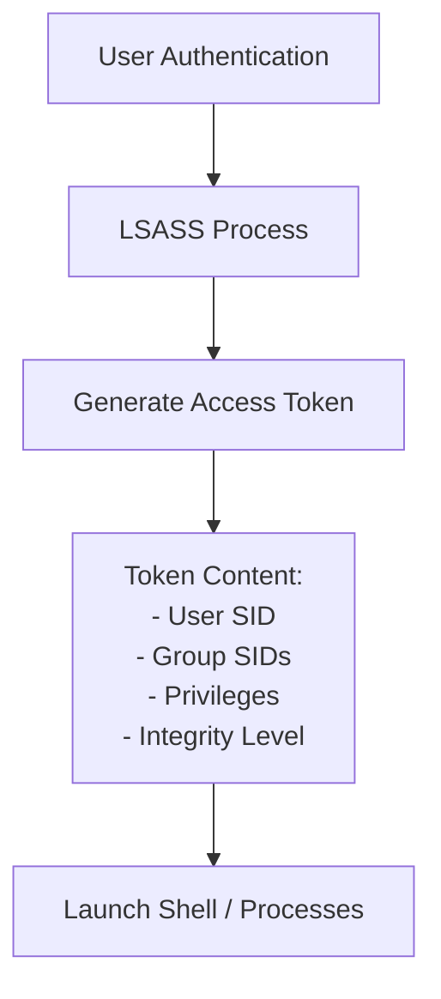

# Chapter 06 — Windows Users & Groups

---

# 📖 Overview

The Windows operating system relies on user accounts and security groups to manage identity, authenticate users, and enforce access controls. Every action performed on a Windows machine—whether opening a text file, starting a background service, or connecting over a network—occurs within the security context of a specific user identity.

Understanding Windows identity management is fundamental for security operations. Blue Teams must understand how accounts are created, how privileges are granted through groups, how authentication tokens are structured, and how attackers manipulate these identities to achieve privilege escalation and persistence.

In this chapter, you will learn about local user accounts, built-in system identities, security groups, Security Identifiers (SIDs), access tokens, User Account Control (UAC), and the security event logs used to detect unauthorized access management.

---

# 🎯 Learning Objectives

After completing this chapter, you will be able to:

- Differentiate between local user accounts, domain accounts, and built-in system identities.
- Identify standard Windows built-in users (Administrator, Guest, DefaultAccount) and service accounts (SYSTEM, Local Service, Network Service).
- Explain the role of Windows Security Groups (Administrators, Users, Remote Desktop Users).
- Manage user accounts and group memberships using both CMD (`net user`) and PowerShell (`Get-LocalUser`).
- Understand password policies, account lockout mechanisms, and security settings.
- Explain the architecture of Windows Authentication, LSASS, and the SAM database.
- Parse and interpret Security Identifiers (SIDs) and Relative Identifiers (RIDs).
- Describe Access Tokens, Integrity Levels (UAC), and security privileges.
- Analyze security event logs (Event IDs 4720, 4722, 4728, 4732) to investigate user and group manipulation.

---

# Why Blue Teams Care

Identity management is one of the most targeted attack surfaces in Windows security:

1. **Persistence via Backdoor Accounts**: Attackers frequently create hidden local administrator accounts (e.g. `net user backdoor P@ssword123! /add`) or reactivate the disabled built-in `Administrator` account to preserve long-term access.
2. **Privilege Escalation**: Compromising a standard user account is often the first step. Adversaries attempt to elevate privileges by adding their account to the local `Administrators` group or abusing token privileges (e.g. `SeImpersonatePrivilege`).
3. **Credential Dumping**: The Local Security Authority Subsystem Service (`lsass.exe`) maintains encrypted user credentials and NTLM hashes in memory. Attackers dump LSASS memory to steal credentials.
4. **Audit Logging & Incident Response**: Unauthorized user creation or group membership modification triggers critical Windows Audit events. SOC analysts monitor these event logs to stop unauthorized privilege changes.

---

# Core Concepts

## 1. Account Types in Windows

- **Local User Accounts**: Stored on the specific host in the Security Account Manager (SAM) database (`C:\Windows\System32\config\SAM`). Used for standalone host login.
- **Domain User Accounts**: Stored centrally in Active Directory Domain Services (AD DS). Enables Single Sign-On (SSO) across enterprise endpoints.
- **Built-in System Accounts**:
  - `SYSTEM` (`NT AUTHORITY\SYSTEM`): The highest privilege context on Windows. Used by OS services. Has complete control over local resources.
  - `LOCAL SERVICE` (`NT AUTHORITY\LocalService`): Restricted account used to run non-critical background services with minimal privileges.
  - `NETWORK SERVICE` (`NT AUTHORITY\NetworkService`): Run services that require network access without administrative privileges.

## 2. Built-in Local Users

- **Administrator (RID 500)**: Built-in local administrator account. Disabled by default in client Windows versions for security.
- **Guest (RID 501)**: Built-in guest account for temporary access. Disabled by default.
- **DefaultAccount (RID 503)**: System-managed account used by system apps.

---

## 3. Security Identifiers (SIDs)

Every user and group in Windows is uniquely identified by a **Security Identifier (SID)**. SIDs do not change even if the account is renamed.

```text
S-1-5-21-3623811015-3361044348-30300820-1001
| | |  |                                 |
| | |  +-- Sub-authority (Domain/Host)   +-- RID (Relative ID)
| | +----- Revision Level (5)
| +------- Identifier Authority (NT Authority)
+--------- SID Prefix (S)
```

### Well-Known SIDs & RIDs
- **S-1-5-18**: Local System (`NT AUTHORITY\SYSTEM`)
- **RID 500**: Built-in Administrator Account (`...-500`)
- **RID 501**: Built-in Guest Account (`...-501`)
- **RID 512**: Domain Admins Group (`...-512`)
- **RID 513**: Domain Users Group (`...-513`)

---

## 4. Access Tokens & Integrity Levels

When a user logs in, Windows creates an **Access Token** containing:
- User SID
- Group SIDs
- Assigned User Privileges (e.g., `SeDebugPrivilege`, `SeShutdownPrivilege`)
- **Integrity Level**



### User Account Control (UAC) & Integrity Levels
Windows uses **User Account Control (UAC)** to prevent unauthorized system modifications:

| Integrity Level | Typical Executables / Context |
|---|---|
| **Low** | Restricted processes (Sandboxed browser tabs) |
| **Medium** | Standard User applications & non-elevated Admin applications |
| **High** | Elevated Administrator applications (Run as Administrator) |
| **System** | Core Windows Kernel and OS Services (`SYSTEM`) |

---

# Practical Examples

## User Enumeration & Management

```cmd
:: CMD: List local user accounts
net user

:: CMD: View specific user details
net user Administrator

:: CMD: Create new user account
net user IncidentAnalyst SecurePass123! /add

:: CMD: Disable user account
net user IncidentAnalyst /active:no
```

```powershell
# PowerShell: Get all local users
Get-LocalUser

# PowerShell: Create a local user
New-LocalUser -Name "DFIR_Tech" -Password (ConvertTo-SecureString "P@ssword2026!" -AsPlainText -Force) -Description "IR Account"

# PowerShell: Disable local user
Disable-LocalUser -Name "DFIR_Tech"
```

---

## Group Enumeration & Management

```cmd
:: CMD: List local groups
net localgroup

:: CMD: List members of Administrators group
net localgroup Administrators

:: CMD: Add user to local Administrators group
net localgroup Administrators IncidentAnalyst /add
```

```powershell
# PowerShell: Get local group members
Get-LocalGroupMember -Group "Administrators"

# PowerShell: Add user to group
Add-LocalGroupMember -Group "Remote Desktop Users" -Member "DFIR_Tech"
```

---

## Account Lockout & Password Policy Configuration

```cmd
:: View current password policy and account lockout parameters
net accounts
```

### Output Example: `net accounts`
```text
Force user logoff how long after time expires?:       Never
Minimum password age (days):                          0
Maximum password age (days):                          42
Minimum password length:                              8
Length of password history maintained:                5
Lockout threshold:                                    5
Lockout duration (minutes):                           30
Lockout observation window (minutes):                 30
Computer role:                                        WORKSTATION
```

---

# Blue Team Investigation Notes

> 💙 **Blue Team Note: Security Event Log Monitoring for Account Manipulation**
> 
> Security Operations Centers monitor the Windows `Security` Log for account tampering event IDs:
> 
> | Event ID | Event Description | Threat Significance |
> |---|---|---|
> | **4720** | A user account was created | Detects unauthorized user addition / persistence. |
> | **4722** | A user account was enabled | Detects reactivation of disabled accounts (e.g. Guest/Admin). |
> | **4724** | An attempt was made to reset an account's password | Detects password tampering or account takeover. |
> | **4728** | A member was added to a security-enabled global group | Detects privilege escalation in AD. |
> | **4732** | A member was added to a security-enabled local group | Detects local admin privilege escalation. |
> | **4756** | A member was added to a security-enabled universal group | Detects high-privilege group escalation. |

---

# Common Mistakes

| Mistake | Consequence | How to Avoid |
|---|---|---|
| Hardcoding Admin Passwords in Scripts | Cleartext credentials stored in scripts lead to credential exposure. | Use LAPS (Local Administrator Password Solution) or Secret Management. |
| Leaving Unused Accounts Enabled | Inactive accounts serve as easy targets for password spraying. | Perform routine user audits (`Get-LocalUser \| Where-Object Enabled -eq $false`). |
| Disabling UAC completely | Removes integrity level boundaries, allowing silent malware elevation. | Keep UAC enabled at default or "Always Notify" settings. |
| Misunderstanding SYSTEM vs Administrator | Admin can be restricted by UAC; SYSTEM bypasses UAC boundaries completely. | Audit service contexts and privileges carefully. |

---

# Best Practices

1. **Deploy LAPS (Windows Local Administrator Password Solution)**: Automatically randomize local Administrator passwords on every machine.
2. **Rename Built-in Administrator Account**: Reduces automated brute-force attacks targeting default names (RID 500 remains, but username changes).
3. **Apply Account Lockout Policies**: Set lockout threshold (e.g. 5 failed attempts) to prevent brute-force attacks.
4. **Audit Group Membership Changes**: Enable Windows Audit Policy for User Account Management and alert on Event IDs 4720 and 4732.

---

# 🔑 Key Takeaways

- Windows identifies identities using Security Identifiers (SIDs) ending in a Relative Identifier (RID).
- Accounts exist locally (SAM database) or centrally (Active Directory).
- Built-in system accounts (`SYSTEM`, `LOCAL SERVICE`, `NETWORK SERVICE`) power system processes.
- User Account Control (UAC) enforces Integrity Levels (Low, Medium, High, System) to restrict unauthorized administrative actions.
- SOC Analysts track Event IDs 4720 (User Created) and 4732 (Added to Local Group) to spot adversary persistence.

---

# Key Commands

| Command / Cmdlet | Purpose | Example |
|---|---|---|
| `net user` | Displays or modifies local users | `net user` |
| `net localgroup` | Displays or modifies local security groups | `net localgroup Administrators` |
| `net accounts` | Displays account lockout and password policies | `net accounts` |
| `Get-LocalUser` | Retrieves local user accounts | `Get-LocalUser` |
| `Get-LocalGroupMember` | Retrieves members of a local group | `Get-LocalGroupMember Administrators` |
| `New-LocalUser` | Creates a new local user account | `New-LocalUser -Name "Analyst"` |
| `Add-LocalGroupMember` | Adds user account to group | `Add-LocalGroupMember -Group "Users" -Member "Analyst"` |
| `whoami /all` | Displays current user SID, groups, and privileges | `whoami /all` |

---

# Further Reading

- [Microsoft Learn: Local Accounts Overview](https://learn.microsoft.com/en-us/windows/security/identity-protection/access-control/local-accounts)
- [Microsoft Documentation: Security Identifiers (SIDs)](https://learn.microsoft.com/en-us/windows/security/identity-protection/access-control/security-identifiers)
- [Microsoft Learn: User Account Control Overview](https://learn.microsoft.com/en-us/windows/security/application-security/application-control/user-account-control/)
- [MITRE ATT&CK: Create Account: Local Account (T1136.001)](https://attack.mitre.org/techniques/T1136/001/)


---

# Next Chapter

➡ **[Chapter 07 — NTFS Permissions & Access Control](./Chapter%2007%20%E2%80%94%20NTFS%20Permissions%20%26%20Access%20Control.md)**
