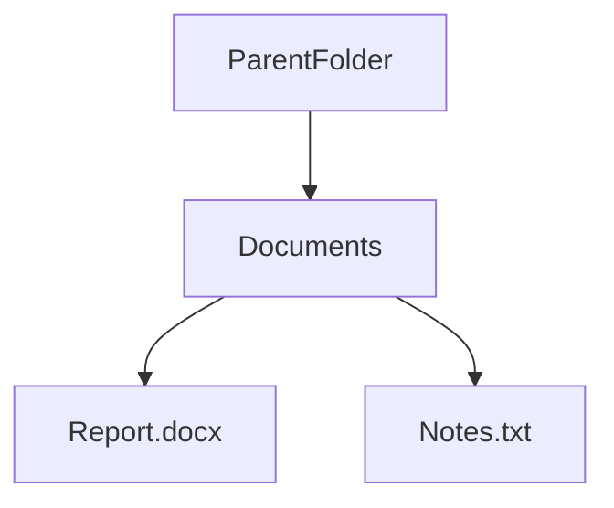

# Chapter 07 – NTFS Permissions & Access Control

## Overview

Windows uses the **New Technology File System (NTFS)** to store files and folders. One of the most important features of NTFS is **Permissions**, which determine who can access, modify, or delete files and folders.

Permissions help protect important data by ensuring that only authorized users can perform specific actions. Understanding NTFS permissions is an essential skill for Windows users, system administrators, and Blue Team professionals.

---

## Learning Objectives

After completing this chapter, you will be able to:

- Understand what NTFS permissions are
- Identify common NTFS permission types
- View and modify file permissions
- Understand file ownership
- Explain permission inheritance
- Use basic `icacls` commands
- Understand why permissions are important for Blue Teams

---

# What are NTFS Permissions?

NTFS permissions control **who can access files and folders** and **what actions they are allowed to perform**.

For example:

- One user may only be able to read a file.
- Another user may be allowed to edit it.
- An administrator may have full control over it.

Without permissions, anyone could access or modify important files.

---

## Why are Permissions Important?

Permissions help to:

- Protect sensitive data
- Prevent unauthorized access
- Reduce accidental file deletion
- Improve system security

Proper permissions are an important part of keeping a Windows system secure.

---

## How Permissions Work


When a user tries to open a file, Windows checks the file's permissions before allowing access.

---

# Common NTFS Permissions

Windows provides several standard permission levels.

| Permission | Description |
|------------|-------------|
| Read | View files and folders |
| Write | Create or modify files |
| Read & Execute | Open and run programs |
| Modify | Read, write, and delete files |
| Full Control | Complete access, including changing permissions |

---

# Viewing File Permissions

You can view permissions using File Explorer.

### Steps

1. Right-click a file or folder.
2. Select **Properties**.
3. Open the **Security** tab.
4. Select a user or group.
5. View the assigned permissions.

The Security tab displays which users and groups have access to the selected file or folder.

---

# File Ownership

Every file and folder has an **owner**.

The owner is usually:

- The user who created the file
- An Administrator

The owner has permission to manage the file's security settings.

---

# Permission Inheritance

By default, files and folders **inherit permissions** from their parent folder.

This means child folders and files automatically receive the same permissions unless inheritance is disabled.



Inheritance makes permission management easier because administrators do not need to configure every file individually.

---

# Using icacls

`icacls` is a Windows command used to view basic file and folder permissions.

### View Permissions

```cmd
icacls C:\Users
```

### View Permissions of a Folder

```cmd
icacls C:\Users\Student\Documents
```

The command displays the users or groups that have access to the selected folder.

---

# Essential Commands

| Command | Purpose |
|---------|---------|
| icacls C:\Users | View permissions |
| icacls C:\Folder | View folder permissions |
| whoami | Display the current user |
| whoami /groups | Display group memberships |

---

# Blue Team Perspective

Blue Team analysts often check file permissions during security investigations.

Incorrect permissions can:

- Allow attackers to modify important files
- Give unauthorized users access to sensitive information
- Increase the risk of malware spreading

Reviewing file permissions helps analysts identify security weaknesses and protect critical data.

---

# Key Points

- NTFS permissions control access to files and folders.
- Different users can have different permission levels.
- The Security tab allows you to view permissions.
- Every file has an owner.
- Files usually inherit permissions from their parent folder.
- The `icacls` command can display file and folder permissions.
- Proper permissions improve Windows security.

---

# Summary

In this chapter, you learned:

- What NTFS permissions are
- Why permissions are important
- The common permission types
- How to view permissions in File Explorer
- What file ownership means
- How permission inheritance works
- Basic `icacls` commands
- Why Blue Teams review file permissions during investigations

In the next chapter, you will learn about **Windows Processes & Services**, including how Windows manages running applications and background services.

---

# Further Reading

- [Microsoft Learn: Access Control Overview](https://learn.microsoft.com/en-us/windows/security/identity-protection/access-control/access-control)
- [Microsoft Documentation: icacls Reference](https://learn.microsoft.com/en-us/windows-server/administration/windows-commands/icacls)
- [Microsoft Learn: How Access Check Works](https://learn.microsoft.com/en-us/windows/win32/secauthz/how-dacls-control-access-to-an-object)
- [MITRE ATT&CK: File and Directory Permissions Modification (T1222.001)](https://attack.mitre.org/techniques/T1222/001/)


---

# Next Chapter

➡ **[Chapter 08 — Windows Processes & Services](./Chapter%2008%20%E2%80%94%20Windows%20Processes%20%26%20Services.md)**
