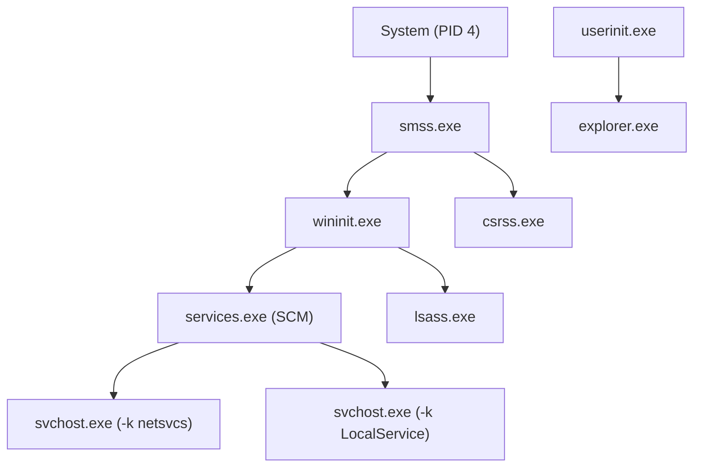

# Chapter 08 — Windows Processes & Services

---

# 📖 Overview

A **Process** is an active instance of a running application or operating system task in Microsoft Windows. Everything from system drivers to administrative tools and malware operates as one or more processes within the operating system memory.

A **Windows Service** is a specialized background process that runs independently of interactive user logon sessions. Services start automatically during system boot up, operate under high-privilege system contexts (such as `NT AUTHORITY\SYSTEM`), and handle critical operating system duties like network management, security auditing, and updates.

For Blue Teams, process and service analysis is at the heart of endpoint threat detection. Threat actors manipulate processes through techniques like DLL injection, process hollowing, and process masquerading, while leveraging malicious services to establish long-term persistence.

---

# 🎯 Learning Objectives

After completing this chapter, you will be able to:

- Explain the architecture of a Windows Process, virtual memory space, threads, and handles.
- Analyze Parent-Child process relationships (Process Lineage) and track Parent Process IDs (PPID).
- Identify core Windows critical system processes (`System`, `smss.exe`, `csrss.exe`, `wininit.exe`, `services.exe`, `lsass.exe`, `svchost.exe`, `explorer.exe`).
- Understand Windows Service Architecture, Service Control Manager (SCM), and service startup types.
- Inspect active processes and services using native utilities (`Task Manager`, `tasklist`, `wmic`, `sc.exe`, `Get-Process`, `Get-Service`).
- Utilize Sysinternals tools (`Process Explorer`, `Process Monitor`, `Autoruns`) for advanced process investigation.
- Recognize common adversary process evasion techniques (Process Hollowing, DLL Injection, Masquerading, Unquoted Service Paths).
- Audit process creation and service creation event logs (Event ID 4688, Sysmon Event ID 1, Event ID 7045).

---

# Why Blue Teams Care

Processes and services represent primary execution and persistence mechanisms:

1. **Detecting Anomalous Execution**: Malware frequently hides by spawning processes from unexpected locations (e.g., `cmd.exe` executing out of `C:\Users\Public` instead of `System32`) or exhibiting anomalous parent-child execution (e.g., `word.exe` spawning `powershell.exe`).
2. **Service-Based Persistence**: Attackers routinely create backdoor services (`sc create MalwareSvc binPath= ...`) to maintain access across host reboots.
3. **Privilege Escalation via Unquoted Service Paths**: Misconfigured services with unquoted binary paths containing spaces allow low-privilege users to execute arbitrary code with `SYSTEM` rights.
4. **Memory Forensic Analysis**: Security analysts inspect process memory dumps to extract encryption keys, C2 IP addresses, and injected shellcode.

---

# Core Concepts

## 1. Process Components & Lineage

A Windows process consists of:
- **Private Virtual Address Space**: Isolated memory assigned by the OS.
- **Executable Code & Modules**: Loaded `.exe` binaries and `.dll` dynamic libraries.
- **Handle Table**: References to system objects (files, registry keys, sockets).
- **Threads**: One or more execution units scheduled by the kernel.
- **Security Access Token**: Defines user identity and privilege level.

```mermaid
graph TD
    Parent["Parent Process<br>(e.g. explorer.exe - PID 2140)"] -->|Spawns via CreateProcess()| Child["Child Process<br>(e.g. cmd.exe - PID 4820)"]
    Child -->|Inherits / Gets| Token["Access Token<br>(User Context & Integrity Level)"]
    Child -->|Allocates| MemSpace["Virtual Address Space"]
    Child -->|Contains| Threads["Execution Threads"]
    Child -->|Maintains| Handles["Handle Table (Files, Sockets, Keys)"]
```

---

## 2. Critical Windows System Processes

To spot malicious activity, Blue Teams must know legitimate system process behaviors:

| Process Name | Expected Executable Path | Expected Parent | Description |
|---|---|---|---|
| **System (PID 4)** | N/A (Kernel mode) | None | Host process for kernel-mode threads. |
| **`smss.exe`** | `C:\Windows\System32\smss.exe` | System (PID 4) | Session Manager Subsystem. Initializes environment. |
| **`csrss.exe`** | `C:\Windows\System32\csrss.exe` | `smss.exe` | Client/Server Runtime Subsystem. Manages console windows. |
| **`wininit.exe`** | `C:\Windows\System32\wininit.exe` | `smss.exe` | Launches `services.exe`, `lsass.exe`, and `lsass`-related services. |
| **`services.exe`** | `C:\Windows\System32\services.exe` | `wininit.exe` | Service Control Manager (SCM). Starts/stops services. |
| **`lsass.exe`** | `C:\Windows\System32\lsass.exe` | `wininit.exe` | Local Security Authority. Manages authentication tokens & SAM. |
| **`svchost.exe`** | `C:\Windows\System32\svchost.exe` | `services.exe` | Generic host process for services running from DLLs. |
| **`explorer.exe`**| `C:\Windows\explorer.exe` | `userinit.exe` | Windows User Shell. Displays desktop and file browser. |



---

## 3. Windows Service Architecture

A Service runs in the background under the control of the Service Control Manager (`services.exe`).

### Service Startup Types:
- **Automatic**: Starts automatically during OS boot.
- **Automatic (Delayed Start)**: Starts shortly after boot to optimize boot times.
- **Manual**: Starts on-demand when called by a user or application.
- **Disabled**: Cannot be started by the operating system or users.

---

# Practical Examples

## Process Enumeration via CLI & PowerShell

```cmd
:: CMD: Display processes with PID and Memory usage
tasklist

:: CMD: Display process name mapped to Windows Service
tasklist /svc

:: CMD: Query process path and parent process ID via WMIC
wmic process get Name, ProcessId, ParentProcessId, ExecutablePath
```

```powershell
# PowerShell: Get processes using > 50MB RAM
Get-Process | Where-Object {$_.WorkingSet -gt 50MB} | Select-Object Id, ProcessName, Path

# PowerShell: Retrieve parent process details using CIM
Get-CimInstance Win32_Process | Select-Object ProcessId, ParentProcessId, Name, CommandLine
```

---

## Managing Services (`sc.exe` & `Get-Service`)

```cmd
:: View details of a specific service
sc query WinDefend

:: Create a test service pointing to an executable
sc create TestService binPath= "C:\Tools\agent.exe" start= auto

:: Start and Stop a service
net start TestService
net stop TestService

:: Delete a service
sc delete TestService
```

```powershell
# PowerShell: Query running services
Get-Service | Where-Object {$_.Status -eq "Running"}

# PowerShell: Modify service startup type
Set-Service -Name "TestService" -StartupType Disabled
```

---

## Sysinternals Tools for Deep Triage

- **Process Explorer (`procexp.exe`)**: Advanced Task Manager showing process trees, loaded DLLs, handle lists, VirusTotal signature checks, and thread stacks.
- **Process Monitor (`procmon.exe`)**: Captures real-time file system, registry, process, and thread activity.
- **Autoruns (`autoruns.exe`)**: Comprehensive autostart auditor identifying service persistence, registry run keys, and scheduled tasks.

---

# Blue Team Investigation Notes

> 💙 **Blue Team Note: Process Creation Auditing (Event ID 4688 & Sysmon Event ID 1)**
> 
> Security Operations Centers analyze process creation logs to identify malicious execution:
> - **Event ID 4688 (Security Log)**: Captures process creation. Enable "Include command line in process creation events" in GPO to record full arguments.
> - **Sysmon Event ID 1 (Process Creation)**: Captures command line, parent process name, parent command line, process hashes (SHA256), and integrity levels.
> - **System Log Event ID 7045**: Logged when a new service is installed on the host. Critical for detecting service persistence!

---

# Common Mistakes

| Mistake | Consequence | How to Avoid |
|---|---|---|
| Assuming `svchost.exe` is always legitimate | Attackers name malware `svchost.exe` in non-System32 folders. | Verify file path is `C:\Windows\System32\svchost.exe` and parent is `services.exe`. |
| Killing Processes Without Investigation | Terminating `lsass.exe` or `csrss.exe` triggers immediate BSOD reboot. | Inspect process path, command line, and digital signature before terminating. |
| Neglecting Parent Process Context | Missing that `cmd.exe` was spawned by `outlook.exe` or `powershell.exe`. | Always inspect Process Lineage (Parent Process ID). |

---

# Best Practices

1. **Enable Command Line Logging**: Ensure GPO Audit Policy logs full process command-line parameters in Event ID 4688.
2. **Deploy Sysmon Endpoint Agent**: Monitor parent-child relationships, process hashes, and service installations.
3. **Audit Unquoted Service Paths**: Run vulnerability scans to fix unquoted service paths under `C:\Program Files`.
4. **Enforce Least Privilege for Services**: Run custom services under restricted `LOCAL SERVICE` or `NETWORK SERVICE` accounts rather than `SYSTEM`.

---

# 🔑 Key Takeaways

- A Windows Process is an isolated execution environment with virtual memory, threads, handles, and security tokens.
- Critical processes follow a strict lineage starting from `System` -> `smss.exe` -> `wininit.exe` / `services.exe`.
- Services run in the background managed by `services.exe` and logged via Event ID 7045 upon installation.
- Process inspection tools include `tasklist`, `Get-Process`, Sysinternals `Process Explorer`, and `Autoruns`.
- Blue teams hunt for anomalous parent-child relationships, process masquerading, and unquoted service path vulnerabilities.

---

# Key Commands

| Command / Cmdlet | Purpose | Example |
|---|---|---|
| `tasklist /svc` | Displays processes mapped to hosted services | `tasklist /svc` |
| `sc query` | Queries state of a Windows service | `sc query wuauserv` |
| `sc create` | Creates a new background service | `sc create SvcName binPath= "..."` |
| `Get-Process` | Retrieves active process objects in PowerShell | `Get-Process \| Select-Object Id, Name` |
| `Get-CimInstance` | Queries WMI for parent process details | `Get-CimInstance Win32_Process` |
| `Get-Service` | Displays Windows services status | `Get-Service WinDefend` |

---

# Quick Quiz

1. **What is the Process ID (PID) assigned to the core Windows Kernel System process?**
   - A) 0
   - B) 4
   - C) 500
   - D) 1024

2. **Which critical system process acts as the Service Control Manager (SCM) responsible for starting background services?**
   - A) `csrss.exe`
   - B) `services.exe`
   - C) `lsass.exe`
   - D) `explorer.exe`

3. **What is the expected legitimate parent process for `svchost.exe`?**
   - A) `explorer.exe`
   - B) `services.exe`
   - C) `cmd.exe`
   - D) `smss.exe`

4. **Which Windows Event ID records when a new service is installed on the operating system?**
   - A) Event ID 4624
   - B) Event ID 4688
   - C) Event ID 7045
   - D) Event ID 1102

5. **What vulnerability occurs when a service binary path contains spaces and lacks surrounding quotation marks?**
   - A) Buffer Overflow
   - B) Unquoted Service Path Vulnerability
   - C) SQL Injection
   - D) Cross-Site Scripting

6. **Which Sysinternals tool provides an advanced real-time process tree view along with loaded DLLs and VirusTotal scores?**
   - A) Process Explorer (`procexp.exe`)
   - B) TCPView
   - C) AccessChk
   - D) ProcDump

7. **Which account provides the absolute highest execution privilege context for Windows services?**
   - A) `NT AUTHORITY\LocalService`
   - B) `NT AUTHORITY\NetworkService`
   - C) `NT AUTHORITY\SYSTEM`
   - D) `BUILTIN\Users`

8. **Which Sysmon Event ID logs process creation along with SHA256 hashes and full parent command lines?**
   - A) Event ID 1
   - B) Event ID 3
   - C) Event ID 7
   - D) Event ID 11

9. **What happens if a SOC Analyst accidentally terminates `csrss.exe` or `lsass.exe`?**
   - A) The computer speeds up
   - B) The operating system crashes and forces a system reboot (BSOD)
   - C) Only web browsers close
   - D) Security logs are cleared

10. **Which command-line tool is used to query, create, or delete Windows services?**
    - A) `netstat`
    - B) `sc.exe`
    - C) `icacls`
    - D) `ipconfig`

---

## Quiz Answers

1. **B** (4)
2. **B** (`services.exe`)
3. **B** (`services.exe`)
4. **C** (Event ID 7045)
5. **B** (Unquoted Service Path Vulnerability)
6. **A** (Process Explorer (`procexp.exe`))
7. **C** (`NT AUTHORITY\SYSTEM`)
8. **A** (Event ID 1)
9. **B** (The operating system crashes and forces a system reboot)
10. **B** (`sc.exe`)

---

# Further Reading

- [Microsoft Learn: Processes and Threads](https://learn.microsoft.com/en-us/windows/win32/procthread/processes-and-threads)
- [Microsoft Learn: Service Applications](https://learn.microsoft.com/en-us/windows/win32/services/services)
- [Sysinternals Utilities - Process Explorer](https://learn.microsoft.com/en-us/sysinternals/downloads/process-explorer)
- [MITRE ATT&CK: System Services: Service Execution (T1569.002)](https://attack.mitre.org/techniques/T1569/002/)


---

# Next Chapter

➡ **[Chapter 09 — Windows Networking Fundamentals](./Chapter%2009%20%E2%80%94%20Windows%20Networking%20Fundamentals.md)**
