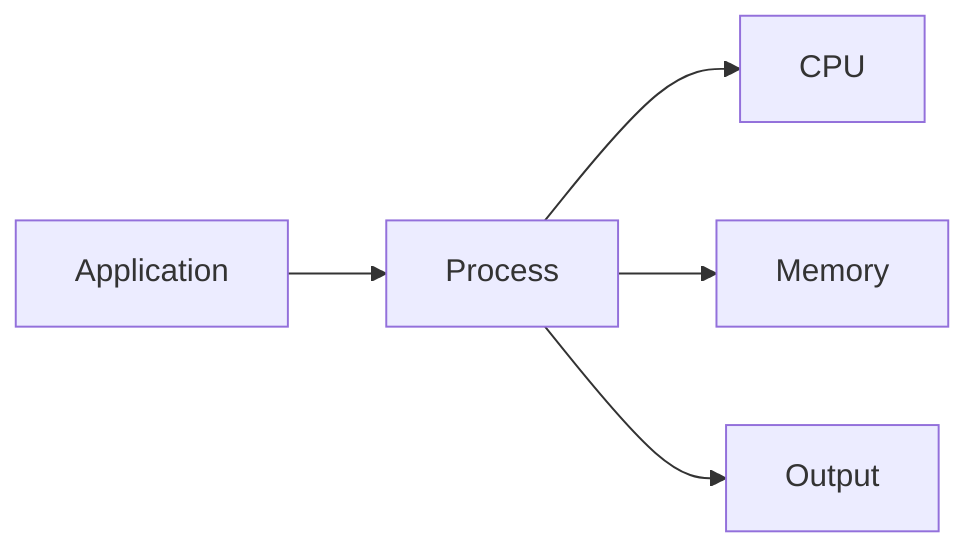
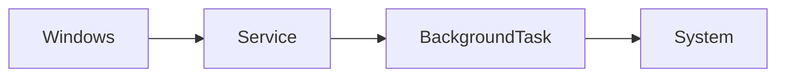

# Chapter 08 – Windows Processes & Services

## Overview

Whenever you open an application in Windows, such as Microsoft Edge, Notepad, or File Explorer, Windows creates a **process**. A process is simply a program that is currently running.

Some processes are started by users, while others run automatically in the background to help Windows operate correctly. These background programs are called **Windows Services**.

Understanding processes and services is important because they help you monitor system activity, troubleshoot problems, and investigate suspicious behavior during security incidents.

---

## Learning Objectives

After completing this chapter, you will be able to:

- Understand what a process is
- Understand what a Windows service is
- View running processes using Task Manager
- View Windows services
- Use basic CMD and PowerShell commands
- Understand why processes and services are important for Blue Teams

---

# What is a Process?

A **process** is a program that is currently running on your computer.

Examples include:

- Microsoft Edge
- Notepad
- Calculator
- File Explorer

Each running application has its own process.

---

## Process Workflow



---

# Viewing Running Processes

The easiest way to view running processes is by using **Task Manager**.

### Steps

1. Press **Ctrl + Shift + Esc**
2. Open the **Processes** tab.
3. View the running applications and background processes.

Task Manager displays useful information such as:

- Process name
- CPU usage
- Memory usage
- Disk usage
- Network usage

---

# What is a Windows Service?

A **Windows Service** is a program that runs in the background without requiring user interaction.

Many important Windows features depend on services.

Examples include:

- Windows Update
- Windows Defender
- Print Spooler
- Windows Time

Services usually start automatically when Windows starts.

---

## Service Workflow



---

# Viewing Services

You can view services in two ways.

### Method 1 – Services Console

1. Press **Windows + R**
2. Type:

```
services.msc
```

3. Press **Enter**

---

### Method 2 – Task Manager

Open **Task Manager** and select the **Services** tab.

---

# Essential Commands

### View Running Processes

```cmd
tasklist
```

---

### View Running Processes (PowerShell)

```powershell
Get-Process
```

---

### View Services

```powershell
Get-Service
```

---

### Display Running Services Only

```powershell
Get-Service | Where-Object Status -eq Running
```

---

# Common Windows Processes

| Process | Purpose |
|----------|---------|
| explorer.exe | Windows desktop and File Explorer |
| svchost.exe | Hosts Windows services |
| lsass.exe | Handles user authentication |
| services.exe | Manages Windows services |

> **Note**
>
> Do not end important system processes unless you understand their purpose. Stopping critical processes may cause Windows to become unstable.

---

# Blue Team Perspective

Blue Team analysts often investigate running processes and services when responding to security incidents.

They may check:

- Unknown or suspicious processes
- Programs using high CPU or memory
- Unexpected background services
- Malware disguised as legitimate applications

Monitoring processes and services helps detect suspicious activity and keep Windows secure.

---

# Key Points

- A process is a running program.
- Every application runs as one or more processes.
- Windows Services run in the background.
- Task Manager makes it easy to monitor processes and services.
- CMD and PowerShell can also display running processes.
- Blue Teams monitor processes and services during investigations.

---

# Summary

In this chapter, you learned:

- What a process is
- What a Windows service is
- How to view running processes
- How to view Windows services
- Basic commands for monitoring processes
- Why these concepts are important for Blue Teams

In the next chapter, you will learn about **Windows Networking Fundamentals**.

---

# Essential Commands

| Command | Purpose |
|---------|---------|
| tasklist | View running processes |
| Get-Process | Display running processes |
| Get-Service | Display Windows services |
| services.msc | Open the Services console |
| taskmgr | Open Task Manager |

---

# Further Reading

- [Microsoft Learn: Processes and Threads](https://learn.microsoft.com/en-us/windows/win32/procthread/processes-and-threads)
- [Microsoft Learn: Service Applications](https://learn.microsoft.com/en-us/windows/win32/services/services)
- [Sysinternals Utilities - Process Explorer](https://learn.microsoft.com/en-us/sysinternals/downloads/process-explorer)
- [MITRE ATT&CK: System Services: Service Execution (T1569.002)](https://attack.mitre.org/techniques/T1569/002/)


---

# Next Chapter

➡ **[Chapter 09 — Windows Networking Fundamentals](./Chapter%2009%20%E2%80%94%20Windows%20Networking%20Fundamentals.md)**
