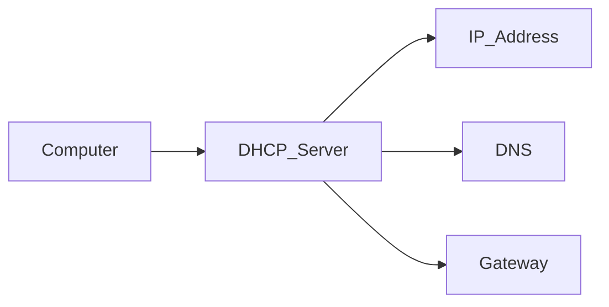

# Chapter 09 – Windows Networking Fundamentals

## Overview

Networking allows computers to communicate with each other and share information. Whether you are browsing the internet, downloading files, or accessing a shared folder, your computer uses networking.

Understanding basic networking concepts is important for Windows users and Blue Team professionals because many cyber attacks occur over a network. Learning how Windows communicates with other devices helps you troubleshoot network issues and investigate suspicious activity.

---

## Learning Objectives

After completing this chapter, you will be able to:

- Understand the basics of TCP/IP
- Learn about IP addresses
- Understand the purpose of DNS and DHCP
- Explain what network ports are
- Use basic Windows networking commands
- Perform simple network troubleshooting
- Understand why networking is important for Blue Teams

---

# What is a Network?

A **network** is a group of computers and devices connected together so they can communicate and share resources.

Examples include:

- Home Wi-Fi
- School network
- Office network
- The Internet

---

## How Devices Communicate


---

# TCP/IP

**TCP/IP (Transmission Control Protocol / Internet Protocol)** is the set of rules that allows devices to communicate over a network.

- **TCP** ensures that data is delivered correctly.
- **IP** identifies each device on the network using an IP address.

Together, TCP/IP allows computers to send and receive data.

---

# IP Configuration

Every device connected to a network has an **IP address**.

An IP address is like a home address—it helps data find the correct destination.

Example:

```text
192.168.1.100
```

Windows also uses:

- **Subnet Mask** – Identifies the network.
- **Default Gateway** – Connects your computer to other networks.
- **DNS Server** – Converts website names into IP addresses.

---

## View Your IP Configuration

Open Command Prompt and run:

```cmd
ipconfig
```

For more detailed information:

```cmd
ipconfig /all
```

---

# DNS (Domain Name System)

DNS converts easy-to-remember website names into IP addresses.

For example:

```
www.google.com
```

becomes something like:

```
142.250.183.78
```

Without DNS, you would have to remember the IP address of every website you visit.

---

## DNS Workflow

```mermaid
flowchart LR
User --> "www.google.com"
"www.google.com" --> DNS_Server
DNS_Server --> IP_Address
IP_Address --> Website
```

---

# DHCP (Dynamic Host Configuration Protocol)

DHCP automatically assigns network settings to devices.

Instead of manually entering an IP address, DHCP provides:

- IP Address
- Subnet Mask
- Default Gateway
- DNS Server

Most home and office networks use DHCP.

---

## DHCP Workflow



---

# Network Ports

A **port** is a communication endpoint used by applications and services.

Think of an IP address as a building address and a port as a specific room inside the building.

Some common ports are:

| Port | Service |
|------|----------|
| 20/21 | FTP |
| 22 | SSH |
| 25 | SMTP |
| 53 | DNS |
| 80 | HTTP |
| 443 | HTTPS |

---

# Basic Network Troubleshooting

Windows provides several commands to troubleshoot network problems.

### View Network Configuration

```cmd
ipconfig
```

---

### Test Connectivity

```cmd
ping google.com
```

---

### Display Active Network Connections

```cmd
netstat
```

---

### Test DNS Resolution

```cmd
nslookup google.com
```

---

### Trace the Network Path

```cmd
tracert google.com
```

---

# Essential Networking Commands

| Command | Purpose |
|---------|---------|
| ipconfig | Display IP configuration |
| ipconfig /all | Display detailed network information |
| ping | Test network connectivity |
| tracert | Trace the path to a destination |
| nslookup | Resolve domain names |
| netstat | Display active network connections |
| hostname | Display the computer name |

---

# Blue Team Perspective

Networking knowledge is essential for Blue Team professionals.

Security analysts use networking commands to:

- Verify a computer's IP address
- Test internet connectivity
- Investigate suspicious network connections
- Check DNS resolution
- Troubleshoot communication problems

Understanding networking helps analysts detect unusual activity, identify malicious connections, and respond to security incidents more effectively.

---

# Key Points

- Networks allow devices to communicate.
- TCP/IP is the foundation of network communication.
- Every device has an IP address.
- DNS converts domain names into IP addresses.
- DHCP automatically assigns network settings.
- Ports allow applications to communicate.
- Windows provides several commands for troubleshooting network issues.

---

# Summary

In this chapter, you learned:

- What a network is
- The basics of TCP/IP
- How IP addresses work
- The purpose of DNS and DHCP
- What network ports are
- Basic Windows networking commands
- Why networking is important for Blue Team investigations

In the next chapter, you will learn about **Windows Event Viewer & Logging**.

---

# Further Reading

- [Microsoft Learn: Windows TCP/IP Architecture](https://learn.microsoft.com/en-us/windows-server/networking/technologies/netsh/netsh-contexts)
- [Microsoft Documentation: Windows Firewall with Advanced Security](https://learn.microsoft.com/en-us/windows/security/operating-system-security/network-security/windows-firewall/)
- [Sysinternals Utilities - TCPView](https://learn.microsoft.com/en-us/sysinternals/downloads/tcpview)
- [MITRE ATT&CK: Remote Services: SMB/Windows Admin Shares (T1021.002)](https://attack.mitre.org/techniques/T1021/002/)


---

# Next Chapter

➡ **[Chapter 10 — Windows Event Viewer & Logging](./Chapter%2010%20%E2%80%94%20Windows%20Event%20Viewer%20%26%20Logging.md)**
