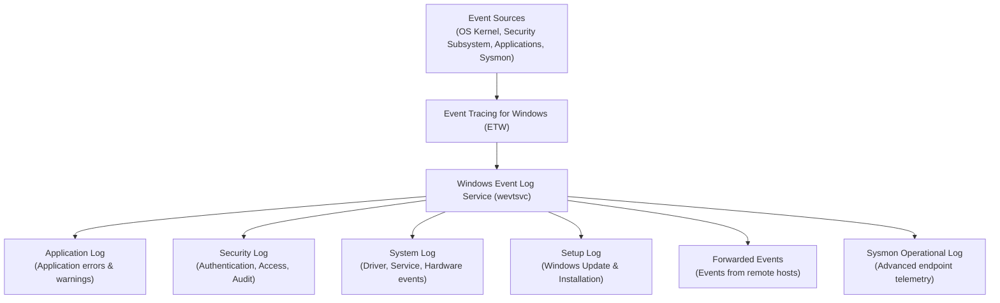

# Chapter 10 — Windows Event Viewer & Logging

---

# 📖 Overview

The Windows Event Logging system is the single most important data source for security monitoring, threat detection, and digital forensics on Windows endpoints. Every significant action—user logons, process executions, service installations, privilege escalations, and policy changes—is recorded as a structured event within the Windows Event Log framework.

Windows uses the **Windows Event Log** service (`wevtsvc`) and the **Event Tracing for Windows (ETW)** infrastructure to capture, store, and expose events from the operating system kernel, security subsystem, applications, and third-party agents like Sysmon.

For Blue Teams, mastery of Event Viewer and log analysis is non-negotiable. Security Operations Centers (SOCs) rely on forwarded Windows events to populate SIEM dashboards, trigger detection rules, and reconstruct attacker kill chains during incident response.

---

# 🎯 Learning Objectives

After completing this chapter, you will be able to:

- Navigate the Windows Event Viewer (`eventvwr.msc`) interface and understand log categories (Application, Security, System, Setup, Forwarded Events).
- Identify and interpret critical Security Event IDs for authentication, process creation, service installation, and privilege escalation.
- Query and filter event logs using PowerShell (`Get-WinEvent`, `Get-EventLog`).
- Understand Sysmon event types (Event IDs 1, 3, 7, 8, 10, 11, 13, 22) and their forensic value.
- Configure Windows Audit Policy to enable advanced logging categories.
- Export, archive, and analyze `.evtx` log files for offline forensic review.

---

# Why Blue Teams Care

Event logs are the eyes and ears of endpoint security:

1. **Attack Timeline Reconstruction**: During incident response, analysts reconstruct the attacker's kill chain by correlating logon events (4624), process creation (4688/Sysmon 1), and lateral movement indicators across timestamps.
2. **Real-Time Detection & Alerting**: SIEM platforms ingest Windows events to fire alerts on suspicious patterns—such as a burst of failed logons (4625) followed by a successful one (4624), indicating a brute-force attack.
3. **Insider Threat Detection**: Monitoring privilege escalation events (4672, 4732) and account management events (4720, 4726) identifies unauthorized administrative actions.
4. **Compliance & Audit Requirements**: Regulatory frameworks (PCI-DSS, HIPAA, SOX) mandate the collection and retention of security audit logs.

---

# Core Concepts

## 1. Windows Event Log Architecture



### Log File Locations
Event logs are stored as `.evtx` files in `C:\Windows\System32\winevt\Logs\`:
- `Security.evtx` — Authentication, access control, and audit events.
- `System.evtx` — Service, driver, and hardware events.
- `Application.evtx` — Application crashes and warnings.
- `Microsoft-Windows-Sysmon%4Operational.evtx` — Sysmon telemetry.

---

## 2. Critical Security Event IDs

These are the Event IDs that every Blue Team analyst must memorize:

### Authentication & Logon Events

| Event ID | Log | Description |
|---|---|---|
| **4624** | Security | Successful logon. Contains Logon Type, Source IP, and Account Name. |
| **4625** | Security | Failed logon attempt. Critical for brute-force detection. |
| **4634** | Security | Account logoff. |
| **4648** | Security | Explicit credential logon (e.g., `runas`). |
| **4672** | Security | Special privileges assigned to new logon (Admin logon). |

### Logon Types

| Type | Name | Description |
|---|---|---|
| 2 | Interactive | Console keyboard logon. |
| 3 | Network | SMB, WinRM, or mapped drive access. |
| 4 | Batch | Scheduled task execution. |
| 5 | Service | Service startup. |
| 7 | Unlock | Workstation unlock. |
| 10 | RemoteInteractive | RDP logon. |

### Process & Service Events

| Event ID | Log | Description |
|---|---|---|
| **4688** | Security | Process creation. Enable command-line logging via GPO. |
| **7045** | System | New service installed. Critical for persistence detection. |
| **4697** | Security | A service was installed in the system. |

### Account Management Events

| Event ID | Log | Description |
|---|---|---|
| **4720** | Security | User account created. |
| **4722** | Security | User account enabled. |
| **4724** | Security | Password reset attempt. |
| **4726** | Security | User account deleted. |
| **4732** | Security | Member added to a security-enabled local group. |
| **4733** | Security | Member removed from a security-enabled local group. |
| **4740** | Security | Account locked out. |

### Object Access & Policy Events

| Event ID | Log | Description |
|---|---|---|
| **4663** | Security | Object access attempt (file read/write/delete when SACL configured). |
| **4670** | Security | Permissions changed on an object. |
| **1102** | Security | Audit log was cleared. HIGH PRIORITY — attackers clear logs! |
| **4719** | Security | System audit policy was changed. |

---

## 3. Sysmon Event IDs

Sysmon (System Monitor) extends Windows logging with high-fidelity endpoint telemetry:

| Sysmon Event ID | Description |
|---|---|
| **1** | Process Creation (includes SHA256 hash, command line, parent process). |
| **3** | Network Connection (source/dest IP, port, initiating process). |
| **7** | Image Loaded (DLL loaded into a process — detects DLL injection). |
| **8** | CreateRemoteThread (thread injection into another process). |
| **10** | Process Access (detects credential dumping of `lsass.exe`). |
| **11** | File Created (new files written to disk). |
| **13** | Registry Value Set (persistence via registry modification). |
| **22** | DNS Query (logs domain lookups per process). |

---

# Practical Examples

## Navigating Event Viewer (GUI)

1. Press `Win + R` → type `eventvwr.msc` → press Enter.
2. Expand **Windows Logs** to see Application, Security, System, Setup.
3. Click **Security** to view authentication and audit events.
4. Right-click → **Filter Current Log** → Enter an Event ID (e.g., `4624`).

---

## Querying Events via PowerShell

```powershell
# Query the last 10 successful logon events
Get-WinEvent -FilterHashtable @{LogName='Security'; Id=4624} -MaxEvents 10 |
    Select-Object TimeCreated, Id, Message

# Query failed logon attempts in the last 24 hours
Get-WinEvent -FilterHashtable @{LogName='Security'; Id=4625; StartTime=(Get-Date).AddHours(-24)} |
    Select-Object TimeCreated, @{Name="Account";Expression={$_.Properties[5].Value}}, @{Name="SourceIP";Expression={$_.Properties[19].Value}}

# Query for new service installations
Get-WinEvent -FilterHashtable @{LogName='System'; Id=7045} -MaxEvents 20 |
    Select-Object TimeCreated, @{Name="ServiceName";Expression={$_.Properties[0].Value}}, @{Name="ImagePath";Expression={$_.Properties[1].Value}}

# Check if anyone cleared the Security log
Get-WinEvent -FilterHashtable @{LogName='Security'; Id=1102} -ErrorAction SilentlyContinue

# Export event log to .evtx file for offline analysis
wevtutil epl Security C:\Evidence\Security_Export.evtx
```

---

## Enabling Advanced Audit Policies

```cmd
:: Enable Process Creation auditing (generates Event ID 4688)
auditpol /set /subcategory:"Process Creation" /success:enable /failure:enable

:: Enable Logon/Logoff auditing
auditpol /set /subcategory:"Logon" /success:enable /failure:enable

:: View current audit policy settings
auditpol /get /category:*
```

> 💙 **Blue Team Note: Enable Command Line Logging**
> 
> By default, Event ID 4688 does NOT include the full command line of the executed process. To enable it:
> - Open `gpedit.msc` → Computer Configuration → Administrative Templates → System → Audit Process Creation
> - Enable **"Include command line in process creation events"**
> 
> This is critical for seeing the actual PowerShell commands, `cmd.exe` arguments, and script paths used by attackers.

---

# Blue Team Investigation Notes

> 💙 **Blue Team Note: Log Clearing is a Red Flag**
> 
> **Event ID 1102** is logged when the Security event log is cleared. This is one of the first things an attacker does after compromising a system. If you ever see Event ID 1102 in your SIEM, treat it as a HIGH PRIORITY alert and immediately investigate:
> - Who cleared the log? (Check the "Subject" field).
> - What events occurred BEFORE the clear? (Check backup/forwarded copies).
> - Was the system recently compromised?

---

# Common Mistakes

| Mistake | Consequence | How to Avoid |
|---|---|---|
| Not enabling advanced audit policies | Critical events like 4688 (process creation) are not generated. | Configure `auditpol` or Group Policy to enable detailed logging. |
| Not enabling command-line logging | Event ID 4688 fires but contains no useful command line data. | Enable via GPO: "Include command line in process creation events." |
| Relying solely on local logs | Attacker clears local `.evtx` files and evidence is lost. | Forward events to a centralized SIEM or Windows Event Collector. |
| Ignoring Sysmon deployment | Missing critical telemetry (hashes, DNS queries, DLL loads). | Deploy Sysmon with a community-maintained config (e.g., SwiftOnSecurity). |

---

# Best Practices

1. **Deploy Sysmon**: Install Sysmon across all endpoints with a well-tuned configuration for comprehensive endpoint telemetry.
2. **Centralize Log Collection**: Forward Security, System, and Sysmon logs to a SIEM platform (Splunk, Elastic, Microsoft Sentinel).
3. **Enable Advanced Audit Policies**: Use `auditpol` to enable Process Creation, Logon/Logoff, Object Access, and Account Management auditing.
4. **Monitor Event ID 1102**: Alert immediately on log clearing events.
5. **Retain Logs for 90+ Days**: Ensure sufficient log retention for incident investigation timelines.

---

# 🔑 Key Takeaways

- Windows Event Logs are stored as `.evtx` files and accessed via Event Viewer or PowerShell (`Get-WinEvent`).
- Critical Security Event IDs include 4624/4625 (logon), 4688 (process creation), 7045 (service install), 4720 (account creation), and 1102 (log cleared).
- Sysmon extends native logging with process hashes (Event ID 1), network connections (Event ID 3), and DNS queries (Event ID 22).
- Advanced Audit Policies and command-line logging MUST be enabled for effective threat detection.
- Always forward logs to a centralized SIEM to prevent evidence destruction by attackers.

---

# Key Commands

| Command / Cmdlet | Purpose | Example |
|---|---|---|
| `eventvwr.msc` | Opens Windows Event Viewer GUI | `eventvwr.msc` |
| `Get-WinEvent` | Queries event logs via PowerShell | `Get-WinEvent -FilterHashtable @{LogName='Security'; Id=4624}` |
| `wevtutil epl` | Exports an event log to `.evtx` file | `wevtutil epl Security C:\Export.evtx` |
| `wevtutil cl` | Clears an event log | `wevtutil cl Security` |
| `auditpol /get` | Displays current audit policy settings | `auditpol /get /category:*` |
| `auditpol /set` | Configures audit policy subcategories | `auditpol /set /subcategory:"Logon" /success:enable` |

---

# Quick Quiz

1. **Which Event ID indicates a successful user logon?**
   - A) 4625
   - B) 4624
   - C) 4688
   - D) 7045

2. **What Logon Type value represents an RDP (Remote Desktop) session?**
   - A) 2
   - B) 3
   - C) 7
   - D) 10

3. **Which Event ID is logged when a new Windows service is installed?**
   - A) 4688
   - B) 7045
   - C) 4624
   - D) 1102

4. **Which Event ID alerts Blue Teams that someone cleared the Security event log?**
   - A) 4719
   - B) 4670
   - C) 1102
   - D) 4740

5. **Which Sysmon Event ID logs process creation with SHA256 hashes and full command lines?**
   - A) Event ID 3
   - B) Event ID 1
   - C) Event ID 11
   - D) Event ID 22

6. **Where are Windows Event Log files physically stored on disk?**
   - A) `C:\Windows\Logs\Events\`
   - B) `C:\Windows\System32\winevt\Logs\`
   - C) `C:\Windows\System32\config\`
   - D) `C:\ProgramData\EventLogs\`

7. **Which PowerShell cmdlet is used to query Windows event logs?**
   - A) `Get-EventLog` (legacy)
   - B) `Get-WinEvent`
   - C) Both A and B work
   - D) `Read-Log`

8. **Which Event ID logs the creation of a new local user account?**
   - A) 4720
   - B) 4732
   - C) 4624
   - D) 4672

9. **Which Sysmon Event ID captures outbound network connections from a specific process?**
   - A) Event ID 1
   - B) Event ID 3
   - C) Event ID 10
   - D) Event ID 13

10. **What GPO setting must be enabled to include full command-line arguments in Event ID 4688?**
    - A) Enable script block logging
    - B) Include command line in process creation events
    - C) Enable PowerShell transcription
    - D) Audit object access

---

## Quiz Answers

1. **B** (4624)
2. **D** (10)
3. **B** (7045)
4. **C** (1102)
5. **B** (Event ID 1)
6. **B** (`C:\Windows\System32\winevt\Logs\`)
7. **C** (Both work, but `Get-WinEvent` is preferred)
8. **A** (4720)
9. **B** (Event ID 3)
10. **B** (Include command line in process creation events)

---

# Further Reading

- [Microsoft Learn: Windows Event Log](https://learn.microsoft.com/en-us/windows/win32/wes/windows-event-log)
- [Microsoft Learn: Advanced Security Audit Policy](https://learn.microsoft.com/en-us/windows/security/threat-protection/auditing/advanced-security-auditing)
- [Sysmon Documentation](https://learn.microsoft.com/en-us/sysinternals/downloads/sysmon)
- [MITRE ATT&CK: Indicator Removal: Clear Windows Event Logs (T1070.001)](https://attack.mitre.org/techniques/T1070/001/)

---

# Next Chapter

➡ **[Chapter 11 — Windows Security Features](./Chapter%2011%20%E2%80%94%20Windows%20Security%20Features.md)**
