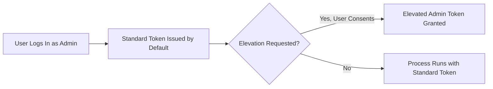

# Chapter 11 — Windows Security Features

## Introduction

Windows ships with a layered set of built-in security controls that protect an endpoint before, during, and after an attack. These controls span every layer of the operating system — from the boot chain and kernel, to the antimalware engine, to the reputation checks that run when a user downloads or opens a file.

For a SOC Analyst or Incident Responder, these features are not just "settings." They are the first evidence source and the first line of defense on any Windows host. Knowing whether Windows Defender is running, whether the firewall is enabled, and whether UAC has been tampered with is often the fastest way to tell whether a host has already been compromised.

This chapter introduces the core native Windows security features — Windows Defender, Windows Defender Firewall, SmartScreen, User Account Control (UAC), BitLocker, and the Windows Security app — and explains how each one is audited and interpreted from a Blue Team perspective.

---

## Learning Objectives

Students should be able to:

- Explain the role of Windows Defender Antivirus, including real-time protection and cloud-delivered protection.
- Describe how Windows Defender Firewall profiles (Domain, Private, Public) control inbound and outbound traffic.
- Explain how SmartScreen uses reputation data to warn users about untrusted apps and downloads.
- Describe how User Account Control (UAC) prevents silent privilege escalation.
- Explain how BitLocker protects data at rest using drive encryption.
- Use the Windows Security app and PowerShell to check the overall security status of an endpoint.

---

## Why Blue Teams Care

1. **Attackers Disable Defenses First**: A common post-exploitation step is turning off Windows Defender, disabling the firewall, or lowering UAC. Checking the state of these features is a quick indicator of compromise.
2. **Defense-in-Depth**: No single feature stops every attack. Defender catches known malware, the firewall limits network exposure, SmartScreen warns about untrusted files, UAC limits privilege escalation, and BitLocker protects stolen drives — together they reduce risk at different stages of an attack.
3. **Baseline for Every Investigation**: Before analyzing logs or processes, responders should confirm the endpoint's security posture. A disabled control is itself a finding.

---

## Core Concepts

### 1. Windows Defender Antivirus

Windows Defender Antivirus is the built-in anti-malware engine included with Windows. It provides:

- **Real-Time Protection**: Scans files as they are accessed, downloaded, or executed.
- **Cloud-Delivered Protection**: Sends suspicious file metadata to Microsoft's cloud service for a fast verdict on new or unknown threats.
- **Tamper Protection**: Blocks changes to Defender settings made outside the Windows Security app, including changes attempted by malware.

### 2. Windows Defender Firewall

The firewall filters inbound and outbound network traffic based on rules, and applies a different rule set depending on the network profile:

| Profile | Applies To | Default Behavior |
|---|---|---|
| **Domain** | Host is joined to an Active Directory domain network | Inbound blocked unless allowed; outbound allowed |
| **Private** | Trusted home or work network | Inbound blocked unless allowed; outbound allowed |
| **Public** | Untrusted network (coffee shop, airport, hotel) | Most restrictive profile |

### 3. SmartScreen

SmartScreen is a reputation-based filtering service. It checks downloaded files and visited websites against Microsoft's reputation data and warns the user before running unrecognized or low-reputation applications. It does not scan file contents the way an antivirus engine does — it evaluates trust based on publisher signature and download prevalence.

### 4. User Account Control (UAC)

UAC prevents applications from silently making system-level changes. Even an administrator account runs most processes with a standard-user token; an explicit consent prompt is required before a process is granted an elevated (administrator) token.



### 5. BitLocker Drive Encryption

BitLocker encrypts an entire volume so that data cannot be read without the correct key. On systems with a Trusted Platform Module (TPM), BitLocker ties the encryption key to the integrity of the boot process — if the boot chain is altered, the key is not released automatically and a recovery key is required instead.

### 6. Windows Security App

Windows Security is the central dashboard that reports the combined status of Defender, the firewall, SmartScreen (under App & Browser Control), account protection, and device security (including TPM and Secure Boot status) in one place.

---

## Practical Examples

### Checking Defender Status

```powershell
# Check core Defender protection status
Get-MpComputerStatus | Select-Object AntivirusEnabled, RealTimeProtectionEnabled, AntispywareEnabled

# Run a quick scan
Start-MpScan -ScanType QuickScan

# View recent threat detections
Get-MpThreatDetection
```

### Checking Firewall Profiles

```powershell
# View status of all three firewall profiles
Get-NetFirewallProfile | Select-Object Name, Enabled

# List firewall rules that are currently enabled
Get-NetFirewallRule -Enabled True | Select-Object DisplayName, Direction, Action
```

### Checking UAC Configuration

```cmd
:: Check the current UAC registry setting (1 = enabled)
reg query "HKLM\SOFTWARE\Microsoft\Windows\CurrentVersion\Policies\System" /v EnableLUA
```

### Checking BitLocker Status

```powershell
# Check BitLocker protection status for all volumes
Get-BitLockerVolume | Select-Object MountPoint, VolumeStatus, ProtectionStatus
```

---

## Blue Team Investigation Notes

> **Blue Team Insight: Rapid Security Posture Check**
>
> When triaging a potentially compromised host, quickly confirm:
>
> - Is `Get-MpComputerStatus` reporting `RealTimeProtectionEnabled : True`? If not, an attacker may have disabled it post-exploitation.
> - Are all three firewall profiles `Enabled : True`? A disabled Public profile on a laptop is a common red flag.
> - Does `EnableLUA` still equal `1`? A value of `0` means UAC has been turned off.
> - Is `Get-MpThreatDetection` empty even though other indicators suggest infection? This can mean Defender was blinded before the threat executed.

---

## Common Mistakes

| Mistake | Consequence | How to Avoid |
|---|---|---|
| Assuming Defender is active without checking | Missing an already-disabled control during triage | Always run `Get-MpComputerStatus` at the start of an investigation |
| Treating SmartScreen as a full antivirus scan | Malicious files with good reputation data can still slip through | Treat SmartScreen as a reputation filter, not a malware scanner |
| Losing a BitLocker recovery key | Permanent loss of access to an encrypted drive | Escrow recovery keys to Active Directory or Microsoft Entra ID |
| Disabling UAC to "avoid prompts" | Removes a barrier against silent privilege escalation | Keep UAC at its default notification level |

---

## Best Practices

1. **Enable Tamper Protection** on Windows Defender so its settings cannot be changed outside the Windows Security app.
2. **Keep all three Firewall profiles enabled**, especially the Public profile on portable devices.
3. **Leave SmartScreen enabled** for both apps and Microsoft Edge to warn users before running untrusted files.
4. **Keep UAC at the default "Notify me only" level or higher.**
5. **Enforce BitLocker** on all endpoints that store sensitive data, with recovery keys escrowed centrally.

---

## Summary

- Windows Defender provides real-time and cloud-based malware protection.
- Windows Defender Firewall applies different rule sets depending on the Domain, Private, or Public network profile.
- SmartScreen filters files and sites using reputation data rather than content scanning.
- UAC prevents processes from silently gaining administrator privileges.
- BitLocker protects data at rest by encrypting entire volumes, often backed by a TPM.
- The Windows Security app centralizes the status of all these features for quick review.

The next chapter looks at the Windows Registry and how it is used both for system configuration and as a target for persistence techniques.

---

## Key Commands

| Command / Cmdlet | Purpose | Example |
|---|---|---|
| `Get-MpComputerStatus` | Checks Windows Defender status | `Get-MpComputerStatus` |
| `Start-MpScan` | Runs a Defender scan | `Start-MpScan -ScanType QuickScan` |
| `Get-MpThreatDetection` | Lists recent Defender threat detections | `Get-MpThreatDetection` |
| `Get-NetFirewallProfile` | Shows firewall profile status | `Get-NetFirewallProfile` |
| `Get-NetFirewallRule` | Lists firewall rules | `Get-NetFirewallRule -Enabled True` |
| `Get-BitLockerVolume` | Checks BitLocker encryption status | `Get-BitLockerVolume` |
| `reg query` | Reads a registry value (e.g. UAC setting) | `reg query "HKLM\SOFTWARE\Microsoft\Windows\CurrentVersion\Policies\System" /v EnableLUA` |
---
# Further Reading

- [Microsoft Learn: Windows Defender Antivirus](https://learn.microsoft.com/en-us/microsoft-365/security/defender-endpoint/microsoft-defender-antivirus-windows)
- [Microsoft Learn: BitLocker Overview](https://learn.microsoft.com/en-us/windows/security/operating-system-security/data-protection/bitlocker/)
- [Microsoft Learn: Credential Guard](https://learn.microsoft.com/en-us/windows/security/identity-protection/credential-guard/)
- [CIS Benchmarks for Windows](https://www.cisecurity.org/benchmark/microsoft_windows_desktop)

---

# Next Chapter

➡ **[Chapter 12 — Windows Registry Fundamentals](./Chapter%2012%20%E2%80%94%20Windows%20Registry%20Fundamentals.md)**
