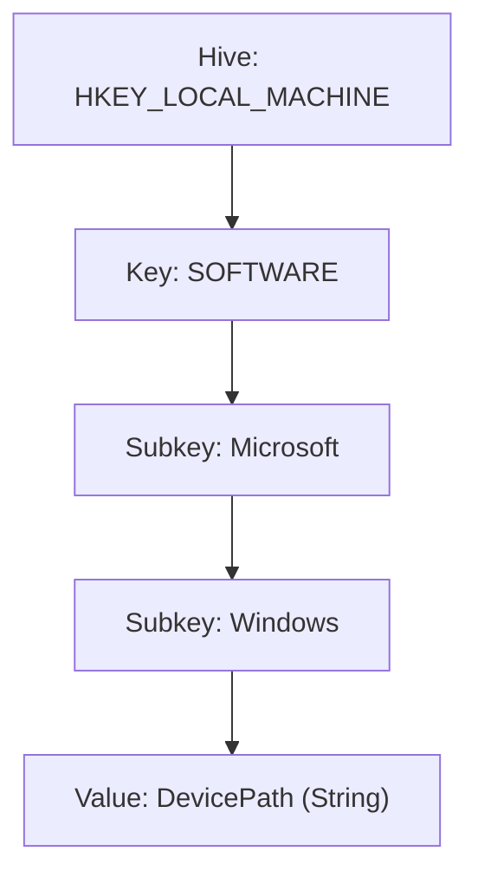

# Chapter 12 — Windows Registry Fundamentals

## Introduction

Windows needs somewhere to store all its settings — screen resolution, installed programs, which app opens a `.pdf` file, security policies, and thousands of other small preferences. Instead of scattering this information across countless separate files, Windows keeps almost all of it in one large, structured database called the **Registry**.

Think of the Registry as a giant filing cabinet full of folders and settings, organized in a tree structure much like File Explorer. Windows reads from it constantly, and so does almost every program installed on the system.

For a Blue Team beginner, the Registry matters for two reasons: it is a rich source of forensic evidence (it records what programs have run, what USB drives were plugged in, and more), and it is one of the most common places attackers hide **persistence** — a way for their malware to automatically start again after a reboot.

---

## Learning Objectives

Students should be able to:

- Describe the Registry's tree structure of hives, keys, and values.
- Identify the five root hives and explain what each one stores.
- Navigate the Registry using the Registry Editor (`regedit`) and the command line.
- Read and modify Registry values using `reg.exe` and PowerShell.
- Identify common Registry locations used by malware for persistence.
- Explain why unauthorized Registry changes are treated as a security concern.

---

## Why Blue Teams Care

1. **A Favorite Persistence Spot.** Malware frequently adds itself to a small set of well-known Registry locations so that it restarts every time the computer boots or a user logs in. Knowing these locations lets an analyst spot an infection quickly.
2. **A Forensic Timeline.** The Registry records details like which programs were recently opened, which USB devices were connected, and what network settings have been used — all useful during an investigation.
3. **A Target for Tampering.** Many security settings (like UAC and Windows Defender, covered in Chapter 11) are ultimately stored as Registry values. Checking these values is a fast way to confirm whether a protection has been secretly disabled.

---

## Core Concepts

### 1. Registry Structure: Hives, Keys, and Values

The Registry is organized like a folder tree:

- A **Hive** is one of the top-level "root folders." There are five of them, described below.
- A **Key** is like a folder inside a hive. Keys can contain more keys (subkeys) or values.
- A **Value** is the actual setting — it has a name, a data type, and the data itself.



### 2. The Five Root Hives

| Hive | Short Name | Stores |
|---|---|---|
| `HKEY_LOCAL_MACHINE` | `HKLM` | System-wide settings that apply to every user on the computer |
| `HKEY_CURRENT_USER` | `HKCU` | Settings for the user who is currently logged in |
| `HKEY_USERS` | `HKU` | Settings for every user profile on the computer, including ones not currently logged in |
| `HKEY_CLASSES_ROOT` | `HKCR` | File-type associations and program registration (e.g., what opens a `.pdf`) |
| `HKEY_CURRENT_CONFIG` | `HKCC` | Information about the current hardware configuration |

> **Note**
>
> As a beginner, you'll spend most of your time in `HKLM` and `HKCU` — these two hives contain almost everything relevant to security investigations.

### 3. Common Registry Data Types

| Data Type | Short Name | Example |
|---|---|---|
| String | `REG_SZ` | A folder path or a program name |
| Binary | `REG_BINARY` | Raw binary data, not human-readable directly |
| DWORD | `REG_DWORD` | A small number, often used as an on/off switch (`0` or `1`) |
| Multi-String | `REG_MULTI_SZ` | A list of several text values stored together |

### 4. Registry Locations Every Beginner Should Know

| Key | Why It Matters |
|---|---|
| `HKLM\SOFTWARE\Microsoft\Windows\CurrentVersion\Run` | Programs listed here automatically start every time **any** user logs in — a classic persistence location |
| `HKCU\SOFTWARE\Microsoft\Windows\CurrentVersion\Run` | Same idea, but only for the currently logged-in user |
| `HKLM\SYSTEM\CurrentControlSet\Services` | Lists every installed Windows service, including malicious ones disguised as legitimate services |
| `HKLM\SOFTWARE\Microsoft\Windows\CurrentVersion\Policies\System` | Stores security policy values, including the UAC setting (`EnableLUA`) covered in Chapter 11 |

---

## Practical Examples

You can browse the Registry visually using the built-in **Registry Editor** (type `regedit` into the Start menu), or read the same information from the command line — which is faster and easier to include in a report.

### Reading Registry Values with `reg.exe`

```cmd
:: List everything set to auto-start for the current user
reg query "HKCU\SOFTWARE\Microsoft\Windows\CurrentVersion\Run"

:: Read a single value (the UAC setting from Chapter 11)
reg query "HKLM\SOFTWARE\Microsoft\Windows\CurrentVersion\Policies\System" /v EnableLUA
```

### Reading and Writing Values with PowerShell

```powershell
# Read all auto-start entries for the current user
Get-ItemProperty -Path "HKCU:\SOFTWARE\Microsoft\Windows\CurrentVersion\Run"

# Read a specific value
(Get-ItemProperty -Path "HKLM:\SOFTWARE\Microsoft\Windows\CurrentVersion\Policies\System").EnableLUA

# Create a new value (useful in a lab to practice safely — never do this on a production machine)
New-ItemProperty -Path "HKCU:\SOFTWARE\Microsoft\Windows\CurrentVersion\Run" -Name "LabTestEntry" -Value "C:\Windows\System32\notepad.exe" -PropertyType String

# Remove the value again
Remove-ItemProperty -Path "HKCU:\SOFTWARE\Microsoft\Windows\CurrentVersion\Run" -Name "LabTestEntry"
```

---

## Blue Team Investigation Notes

> **Blue Team Insight: Checking Autorun Locations**
>
> When investigating a possibly infected computer, checking the Run keys is one of the fastest ways to find malware that's set to restart itself:
>
> - Compare entries in `HKLM...\Run` and `HKCU...\Run` against a known-good baseline of that machine.
> - Be suspicious of entries pointing to unusual folders like `%TEMP%` or `%APPDATA%`, rather than `C:\Program Files`.
> - Check whether a listed program actually exists on disk and whether it's digitally signed by a legitimate publisher.

---

## Common Mistakes

| Mistake | Consequence | How to Avoid |
|---|---|---|
| Editing the Registry without a backup | A mistaken change can make Windows unstable or fail to start | Export the affected key first (`reg export`) before making changes |
| Assuming every Run-key entry is malicious | Many legitimate programs (like antivirus software) also use these keys | Compare entries against a known-good baseline before assuming infection |
| Confusing `HKLM` and `HKCU` scope | Removing a value from the wrong hive may not actually stop the malware | Check both hives — malware may use either one depending on its permissions |

---

## Best Practices

1. **Always back up a key before editing it**, using `reg export "<KeyPath>" backup.reg`.
2. **Build a baseline** of what a clean, known-good machine's Run keys look like, so unusual entries stand out later.
3. **Use PowerShell or `reg.exe` for repeatable checks** rather than manually clicking through the Registry Editor during an investigation.
4. **Treat unexpected changes to security policy keys** (like `EnableLUA`) as an immediate red flag.

---

## Summary

- The Registry is a structured database of hives, keys, and values that stores nearly all of Windows' configuration.
- The five root hives are `HKLM`, `HKCU`, `HKU`, `HKCR`, and `HKCC` — beginners will mostly work with `HKLM` and `HKCU`.
- The `Run` keys are a classic malware persistence location, since anything listed there restarts automatically.
- Both `reg.exe` and PowerShell can read and modify Registry values from the command line.
- Security settings covered elsewhere in this handbook, like UAC, are ultimately stored as Registry values.

The next chapter covers how software is installed, tracked, and removed on Windows — including how to spot unauthorized or unexpected software during an investigation.

---

## Key Commands

| Command / Cmdlet | Purpose | Example |
|---|---|---|
| `reg query` | Reads Registry keys or values | `reg query "HKCU\SOFTWARE\Microsoft\Windows\CurrentVersion\Run"` |
| `reg export` | Backs up a key to a `.reg` file | `reg export "HKCU\SOFTWARE\Microsoft\Windows\CurrentVersion\Run" backup.reg` |
| `Get-ItemProperty` | Reads Registry values in PowerShell | `Get-ItemProperty -Path "HKCU:\SOFTWARE\Microsoft\Windows\CurrentVersion\Run"` |
| `New-ItemProperty` | Creates a new Registry value in PowerShell | `New-ItemProperty -Path "HKCU:\...\Run" -Name "Test" -Value "notepad.exe" -PropertyType String` |
| `Remove-ItemProperty` | Deletes a Registry value in PowerShell | `Remove-ItemProperty -Path "HKCU:\...\Run" -Name "Test"` |
---

## Further Reading

- [Microsoft Learn: Windows Registry Overview](https://learn.microsoft.com/en-us/windows/win32/sysinfo/registry)
- [Microsoft Learn: Structure of the Registry](https://learn.microsoft.com/en-us/windows/win32/sysinfo/structure-of-the-registry)
- [MITRE ATT&CK: Boot or Logon Autostart Execution: Registry Run Keys / Startup Folder (T1547.001)](https://attack.mitre.org/techniques/T1547/001/)
# Next Chapter

➡ **[Chapter 13 — Software & Package Management](./Chapter%2013%20%E2%80%94%20Software%20%26%20Package%20Management.md)**
