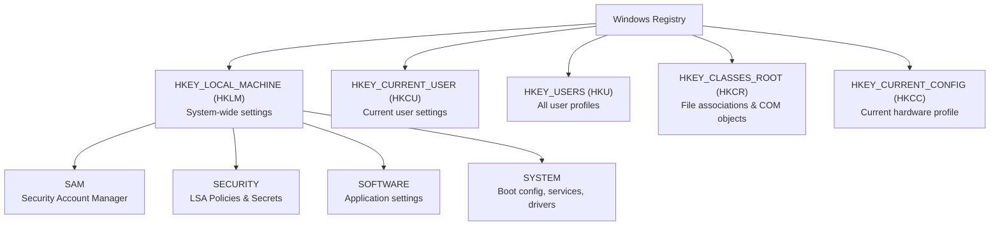

# Chapter 12 — Windows Registry Fundamentals

---

# 📖 Overview

The **Windows Registry** is a hierarchical database that stores low-level settings for the operating system, installed applications, hardware drivers, and user preferences. It is the central nervous system of Windows configuration — virtually every aspect of system behavior, from boot-time driver loading to desktop wallpaper, is controlled by registry values.

For Blue Teams, the registry is one of the most critical forensic artifacts. Attackers abuse registry keys to establish persistence (Run keys, services), disable security features (tamper with Defender), store encoded payloads, and modify system behavior. Understanding how to navigate, query, and monitor the registry is essential for threat hunting and incident response.

---

# 🎯 Learning Objectives

After completing this chapter, you will be able to:

- Explain the Windows Registry architecture: hives, keys, subkeys, values, and data types.
- Navigate the registry using `regedit.exe`, `reg.exe`, and PowerShell (`Get-ItemProperty`, `Set-ItemProperty`).
- Identify critical registry hive files and their on-disk locations.
- Locate common persistence mechanisms in the registry (Run, RunOnce, Services, Scheduled Tasks).
- Monitor registry modifications using Sysmon Event ID 13.
- Analyze registry artifacts for forensic investigations.

---

# Why Blue Teams Care

1. **Persistence via Registry Run Keys**: Attackers write malware paths to `HKCU\Software\Microsoft\Windows\CurrentVersion\Run` so their payload executes every time the user logs on.
2. **Security Feature Tampering**: Malware disables UAC (`EnableLUA = 0`), Defender (`DisableAntiSpyware = 1`), and the firewall via registry modifications.
3. **Forensic Evidence**: The registry contains timestamps (last write time), recently accessed files (MRU lists), USB device history, network connection history, and user activity traces.
4. **Service & Driver Configuration**: Every Windows service binary path is stored in `HKLM\SYSTEM\CurrentControlSet\Services`. Attackers modify these to redirect service execution to malware.

---

# Core Concepts

## 1. Registry Architecture



### Root Hives

| Hive | Abbreviation | Purpose |
|---|---|---|
| `HKEY_LOCAL_MACHINE` | HKLM | System-wide hardware, software, and security settings. |
| `HKEY_CURRENT_USER` | HKCU | Settings for the currently logged-in user. |
| `HKEY_USERS` | HKU | Profile settings for ALL user accounts on the system. |
| `HKEY_CLASSES_ROOT` | HKCR | File extension associations and COM class registrations. |
| `HKEY_CURRENT_CONFIG` | HKCC | Current hardware profile configuration. |

### On-Disk Hive Files

Registry hives are stored as binary files:

| Hive | File Location |
|---|---|
| SAM | `C:\Windows\System32\config\SAM` |
| SECURITY | `C:\Windows\System32\config\SECURITY` |
| SOFTWARE | `C:\Windows\System32\config\SOFTWARE` |
| SYSTEM | `C:\Windows\System32\config\SYSTEM` |
| NTUSER.DAT | `C:\Users\<username>\NTUSER.DAT` (per-user HKCU) |

---

## 2. Registry Value Data Types

| Type | Name | Description |
|---|---|---|
| `REG_SZ` | String | A fixed-length text string. |
| `REG_EXPAND_SZ` | Expandable String | A string containing environment variable references (e.g., `%SystemRoot%`). |
| `REG_DWORD` | 32-bit Integer | A 4-byte numeric value. |
| `REG_QWORD` | 64-bit Integer | An 8-byte numeric value. |
| `REG_BINARY` | Binary | Raw binary data. |
| `REG_MULTI_SZ` | Multi-String | An array of null-terminated strings. |

---

## 3. Critical Registry Locations for Blue Teams

### Persistence Keys (Autorun)

| Key Path | Scope | Description |
|---|---|---|
| `HKCU\Software\Microsoft\Windows\CurrentVersion\Run` | Current User | Programs that execute at user logon. |
| `HKCU\Software\Microsoft\Windows\CurrentVersion\RunOnce` | Current User | Programs that execute once then are deleted. |
| `HKLM\Software\Microsoft\Windows\CurrentVersion\Run` | All Users | System-wide autorun programs. |
| `HKLM\Software\Microsoft\Windows\CurrentVersion\RunOnce` | All Users | System-wide one-time execution. |
| `HKLM\SYSTEM\CurrentControlSet\Services` | System | All registered Windows services and drivers. |

### Security Configuration Keys

| Key Path | Purpose |
|---|---|
| `HKLM\SOFTWARE\Microsoft\Windows\CurrentVersion\Policies\System` | UAC settings (`EnableLUA`, `ConsentPromptBehaviorAdmin`). |
| `HKLM\SOFTWARE\Policies\Microsoft\Windows Defender` | Defender group policy overrides. |
| `HKLM\SOFTWARE\Microsoft\Windows Defender\Exclusions\Paths` | Defender exclusion paths. |

### Forensic Artifact Keys

| Key Path | Purpose |
|---|---|
| `HKCU\Software\Microsoft\Windows\CurrentVersion\Explorer\RecentDocs` | Recently opened documents. |
| `HKLM\SYSTEM\CurrentControlSet\Enum\USBSTOR` | USB device connection history. |
| `HKLM\SYSTEM\CurrentControlSet\Services\Tcpip\Parameters\Interfaces` | Network interface configuration history. |

---

# Practical Examples

## Navigating the Registry (GUI)

1. Press `Win + R` → type `regedit` → press Enter.
2. Navigate the tree structure in the left pane.
3. Right-click a key to export it as a `.reg` file for backup.

## Command-Line Registry Operations (`reg.exe`)

```cmd
:: Query a specific key
reg query "HKCU\Software\Microsoft\Windows\CurrentVersion\Run"

:: Query a specific value
reg query "HKLM\SOFTWARE\Microsoft\Windows\CurrentVersion\Policies\System" /v EnableLUA

:: Add a new registry value (simulating persistence)
reg add "HKCU\Software\Microsoft\Windows\CurrentVersion\Run" /v "MalwareTest" /t REG_SZ /d "C:\Temp\malware.exe"

:: Delete a registry value
reg delete "HKCU\Software\Microsoft\Windows\CurrentVersion\Run" /v "MalwareTest" /f

:: Export a registry key to a .reg file
reg export "HKCU\Software\Microsoft\Windows\CurrentVersion\Run" C:\Evidence\run_key_export.reg
```

## PowerShell Registry Operations

```powershell
# Query the Run key
Get-ItemProperty -Path "HKCU:\Software\Microsoft\Windows\CurrentVersion\Run"

# Query a specific value
(Get-ItemProperty -Path "HKLM:\SOFTWARE\Microsoft\Windows\CurrentVersion\Policies\System").EnableLUA

# Create a new value (simulating persistence)
Set-ItemProperty -Path "HKCU:\Software\Microsoft\Windows\CurrentVersion\Run" -Name "MalwareTest" -Value "C:\Temp\malware.exe"

# Remove a value
Remove-ItemProperty -Path "HKCU:\Software\Microsoft\Windows\CurrentVersion\Run" -Name "MalwareTest"

# List all registered services
Get-ItemProperty -Path "HKLM:\SYSTEM\CurrentControlSet\Services\*" | Select-Object PSChildName, ImagePath, Start
```

---

# Blue Team Investigation Notes

> 💙 **Blue Team Note: Registry Persistence Hunting**
> 
> The following registry locations should be checked during EVERY incident response engagement:
> 1. `HKCU\...\Run` and `HKLM\...\Run` — Autorun entries.
> 2. `HKLM\SYSTEM\CurrentControlSet\Services` — Look for services with suspicious `ImagePath` values.
> 3. `HKCU\...\RunOnce` — One-time execution entries that delete themselves after running.
> 4. `HKLM\SOFTWARE\Microsoft\Windows NT\CurrentVersion\Winlogon\Shell` — Should ONLY be `explorer.exe`.
> 5. `HKLM\SOFTWARE\Microsoft\Windows NT\CurrentVersion\Winlogon\Userinit` — Should ONLY be `C:\Windows\system32\userinit.exe,`.
> 
> Sysmon **Event ID 13** (RegistryEvent - Value Set) logs all registry value modifications, making it invaluable for detecting persistence establishment in real-time.

---

# Common Mistakes

| Mistake | Consequence | How to Avoid |
|---|---|---|
| Editing the registry without backup | Incorrect edits can prevent Windows from booting. | Always export the key to a `.reg` file before modifying. |
| Only checking HKCU Run keys | Missing system-wide persistence in HKLM. | Check both HKCU and HKLM Run/RunOnce keys. |
| Ignoring service ImagePath values | Attackers modify service paths to point to malware. | Audit `HKLM\SYSTEM\CurrentControlSet\Services\*` for suspicious paths. |

---

# Best Practices

1. **Deploy Sysmon Event ID 13**: Log all registry value modifications across the enterprise.
2. **Baseline Registry Snapshots**: Use tools like Autoruns to take a baseline of autorun entries and compare periodically.
3. **Restrict Registry Permissions**: Apply restrictive DACLs to sensitive keys like `Services` and `Run`.
4. **Monitor for Security Tampering**: Alert on modifications to `EnableLUA`, `DisableAntiSpyware`, and Defender exclusion paths.

---

# 🔑 Key Takeaways

- The Windows Registry is a hierarchical database stored in hive files (`SAM`, `SECURITY`, `SOFTWARE`, `SYSTEM`, `NTUSER.DAT`).
- Attackers abuse `Run`, `RunOnce`, and `Services` registry keys for persistence.
- Security settings (UAC, Defender) are controlled via registry values that attackers can tamper with.
- Registry forensic artifacts reveal USB history, recent documents, and network connection history.
- Sysmon Event ID 13 provides real-time monitoring of registry modifications.

---

# Key Commands

| Command / Cmdlet | Purpose | Example |
|---|---|---|
| `regedit` | Opens Registry Editor GUI | `regedit` |
| `reg query` | Queries a registry key/value | `reg query HKCU\...\Run` |
| `reg add` | Creates or modifies a registry value | `reg add HKCU\...\Run /v Name /d Value` |
| `reg delete` | Deletes a registry value | `reg delete HKCU\...\Run /v Name /f` |
| `reg export` | Exports a key to a `.reg` file | `reg export HKCU\...\Run C:\backup.reg` |
| `Get-ItemProperty` | Reads registry values via PowerShell | `Get-ItemProperty HKCU:\...\Run` |

---

# Quick Quiz

1. **Which registry hive contains system-wide hardware, software, and security settings?**
   - A) HKCU
   - B) HKLM
   - C) HKCR
   - D) HKCC

2. **Which registry key is commonly abused by malware to persist across user logons?**
   - A) `HKCU\...\Run`
   - B) `HKLM\...\Fonts`
   - C) `HKCR\...\Shell`
   - D) `HKCC\...\Display`

3. **Where is the per-user registry hive stored on disk?**
   - A) `C:\Windows\System32\config\HKCU`
   - B) `C:\Users\<username>\NTUSER.DAT`
   - C) `C:\Windows\System32\NTUSER.DAT`
   - D) `C:\ProgramData\Registry.dat`

4. **Which Sysmon Event ID logs registry value modifications?**
   - A) Event ID 1
   - B) Event ID 3
   - C) Event ID 13
   - D) Event ID 22

5. **What registry value controls whether User Account Control (UAC) is enabled?**
   - A) `EnableUAC`
   - B) `EnableLUA`
   - C) `UACLevel`
   - D) `AdminApprovalMode`

---

## Quiz Answers

1. **B** (HKLM)
2. **A** (`HKCU\...\Run`)
3. **B** (`C:\Users\<username>\NTUSER.DAT`)
4. **C** (Event ID 13)
5. **B** (`EnableLUA`)

---

# Further Reading

- [Microsoft Learn: Windows Registry](https://learn.microsoft.com/en-us/windows/win32/sysinfo/registry)
- [SANS: Windows Registry Forensics](https://www.sans.org/blog/windows-registry-forensics/)
- [MITRE ATT&CK: Registry Run Keys (T1547.001)](https://attack.mitre.org/techniques/T1547/001/)
- [Sysinternals Autoruns](https://learn.microsoft.com/en-us/sysinternals/downloads/autoruns)

---

# Next Chapter

➡ **[Chapter 13 — Software & Package Management](./Chapter%2013%20%E2%80%94%20Software%20%26%20Package%20Management.md)**
