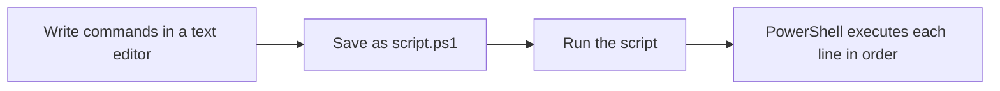

# Chapter 14 — PowerShell Scripting Basics

## Introduction

In Chapter 05, you learned to run PowerShell commands one at a time, directly in the console. That works well for quick checks, but it gets tedious fast if you need to run the same ten commands every time you triage a machine.

A **script** solves this problem. Instead of typing commands one by one, you save them in a text file with a `.ps1` extension, and PowerShell runs them all in order, exactly as if you'd typed them yourself. This chapter introduces the basics of writing your own PowerShell scripts — comments, variables, parameters, functions, and simple decision-making — using the security-focused examples from earlier chapters as a starting point.

---

## Learning Objectives

Students should be able to:

- Explain the difference between running commands interactively and running a `.ps1` script.
- Write and run a basic PowerShell script.
- Use comments to document a script.
- Accept input into a script using parameters.
- Group reusable logic into a function.
- Use `if`/`else` and `foreach` to add basic decision-making and repetition to a script.
- Explain why script execution is restricted by default, and how that relates to the Execution Policy from Chapter 05.

---

## Why Blue Teams Care

1. **Repeatable Triage.** Instead of re-typing the same checks from Chapters 05–13 (Defender status, firewall profiles, installed software, Registry Run keys), a script runs them all in seconds and produces the same output every time.
2. **Automation of Routine Work.** Analysts write scripts to collect evidence, generate reports, and check dozens of machines at once — work that would take far too long by hand.
3. **Attackers Script Too.** Malicious PowerShell scripts are extremely common in real attacks. Understanding how a legitimate script is structured makes it much easier to recognize when something written by an attacker looks unusual or suspicious.

---

## Core Concepts

### 1. What Is a Script?

A PowerShell script is simply a plain text file, saved with the `.ps1` extension, containing one or more PowerShell commands written in the order you want them to run.



### 2. Comments

A **comment** is a line PowerShell ignores completely — it exists only for humans reading the script. Comments start with a `#` symbol.

```powershell
# This line is a comment and will not run
Get-Process   # You can also add a comment after a command
```

Good comments explain *why* a script does something, not just what the command already says.

### 3. Variables

A **variable** stores a value so you can reuse it later in the script instead of typing it out repeatedly. In PowerShell, variable names always start with a `$`.

```powershell
$computerName = $env:COMPUTERNAME
Write-Host "Running checks on $computerName"
```

### 4. Parameters

A **parameter** lets someone running your script pass in a value, instead of you hardcoding it into the script itself. Parameters are declared at the very top of the script using a `param()` block.

```powershell
param(
    [string]$TargetProcess = "explorer"
)

Get-Process -Name $TargetProcess
```

If you save this as `checkprocess.ps1`, you could run it like this:

```powershell
.\checkprocess.ps1 -TargetProcess "notepad"
```

### 5. Functions

A **function** is a named, reusable block of code. Instead of copying the same lines multiple times, you define them once as a function and call that function whenever you need them.

```powershell
function Get-DefenderSummary {
    Get-MpComputerStatus | Select-Object AntivirusEnabled, RealTimeProtectionEnabled
}

# Call the function
Get-DefenderSummary
```

### 6. Decision-Making with `if` / `else`

An `if` statement lets a script make a decision and take a different action depending on a condition.

```powershell
$firewallStatus = Get-NetFirewallProfile -Profile Public

if ($firewallStatus.Enabled -eq $true) {
    Write-Host "[+] Public firewall profile is enabled." -ForegroundColor Green
} else {
    Write-Host "[!] WARNING: Public firewall profile is disabled!" -ForegroundColor Red
}
```

### 7. Repeating Actions with `foreach`

A `foreach` loop repeats the same action once for every item in a list — useful for checking several things (or several computers) without writing the same code over and over.

```powershell
$servicesToCheck = @("WinDefend", "wuauserv", "mpssvc")

foreach ($service in $servicesToCheck) {
    Get-Service -Name $service | Select-Object Name, Status
}
```

---

## Practical Examples

### A Simple Security Check Script

This example combines several ideas from this chapter — and reuses checks from Chapter 11 — into one reusable script.

```powershell
# SecurityCheck.ps1
# A simple script that reports basic security status for the local machine

param(
    [switch]$Detailed
)

function Get-DefenderStatus {
    Get-MpComputerStatus | Select-Object AntivirusEnabled, RealTimeProtectionEnabled
}

function Get-FirewallStatus {
    Get-NetFirewallProfile | Select-Object Name, Enabled
}

Write-Host "=== Defender Status ===" -ForegroundColor Cyan
Get-DefenderStatus

Write-Host "`n=== Firewall Status ===" -ForegroundColor Cyan
Get-FirewallStatus

if ($Detailed) {
    Write-Host "`n=== Recent Threat Detections ===" -ForegroundColor Cyan
    Get-MpThreatDetection
}
```

Running `.\SecurityCheck.ps1` shows the basic checks. Running `.\SecurityCheck.ps1 -Detailed` also shows recent Defender threat detections, because `-Detailed` is a **switch parameter** — a parameter that is either present (`$true`) or absent (`$false`), with no value needed.

### Running a Script

```powershell
# Navigate to the folder containing the script
cd C:\Scripts

# Run the script
.\SecurityCheck.ps1
```

> **Note**
>
> The `.\` before the script name tells PowerShell to look in the current folder. Without it, PowerShell may not run the script even if it's sitting right there.

---

## Blue Team Investigation Notes

> **Blue Team Insight: Reading Someone Else's Script**
>
> When you come across a `.ps1` script during an investigation — whether it belongs to your organization or was left behind by an attacker — read it the same way you'd read your own:
>
> - Check the `param()` block first to see what input it expects.
> - Look for functions to understand what reusable actions it performs.
> - Watch for suspicious cmdlets like `Invoke-Expression`, `DownloadString`, or `-EncodedCommand` (introduced in Chapter 05) — these are common in malicious scripts, though not proof of malice on their own.
> - A script with heavily obfuscated variable names or excessive encoding is a stronger warning sign than a script that's simply unfamiliar.

---

## Common Mistakes

| Mistake | Consequence | How to Avoid |
|---|---|---|
| Forgetting `.\` when running a local script | PowerShell may fail to find or run the script | Always prefix a local script with `.\ScriptName.ps1` |
| Hardcoding values instead of using parameters | The script only works for one specific case | Use `param()` to make scripts flexible and reusable |
| Writing a script with no comments | Hard for anyone (including your future self) to understand later | Add short comments explaining the purpose of each section |
| Assuming a script will run without checking the Execution Policy | The script may be silently blocked | Recall from Chapter 05 that Execution Policy affects whether local scripts run at all |

---

## Best Practices

1. **Comment your scripts**, especially anything that isn't immediately obvious.
2. **Use parameters** instead of hardcoded values so the same script can be reused in different situations.
3. **Break repeated logic into functions** rather than copying and pasting the same lines.
4. **Test scripts in a lab environment** before running them against a real system, especially anything that changes settings.
5. **Keep scripts version-controlled or backed up**, the same way you would any other important document.

---

## Summary

- A PowerShell script is a plain text file with a `.ps1` extension containing commands to run in order.
- Comments (`#`) document a script without affecting how it runs.
- Variables (`$name`) store values; parameters (`param()`) let a script accept input from whoever runs it.
- Functions group reusable logic under a single name.
- `if`/`else` adds decision-making, and `foreach` repeats an action across a list of items.
- Reading an unfamiliar script uses the same skills as writing one — start with its parameters and functions to understand what it does.

The next chapter builds on these scripting basics to look at Windows hardening — turning individual checks into a systematic process for reducing a machine's attack surface.

---

## Key Commands

| Command / Cmdlet | Purpose | Example |
|---|---|---|
| `.\script.ps1` | Runs a local PowerShell script | `.\SecurityCheck.ps1` |
| `param()` | Declares parameters at the top of a script | `param([string]$Name)` |
| `function` | Defines a reusable named block of code | `function Get-Status { ... }` |
| `if` / `else` | Adds conditional logic | `if ($x -eq $true) { ... } else { ... }` |
| `foreach` | Repeats an action for each item in a list | `foreach ($item in $list) { ... }` |
| `Get-ExecutionPolicy` | Shows whether scripts are allowed to run | `Get-ExecutionPolicy` |

---

## Further Reading

- [Microsoft Learn: About Functions](https://learn.microsoft.com/en-us/powershell/module/microsoft.powershell.core/about/about_functions)
- [Microsoft Learn: About Parameters](https://learn.microsoft.com/en-us/powershell/module/microsoft.powershell.core/about/about_functions_advanced_parameters)
- [Microsoft Learn: About Execution Policies](https://learn.microsoft.com/en-us/powershell/module/microsoft.powershell.core/about/about_execution_policies)
- [MITRE ATT&CK: Command and Scripting Interpreter: PowerShell (T1059.001)](https://attack.mitre.org/techniques/T1059/001/)
---

# Next Chapter

➡ **[Chapter 15 — Windows Hardening](./Chapter%2015%20%E2%80%94%20Windows%20Hardening.md)**
