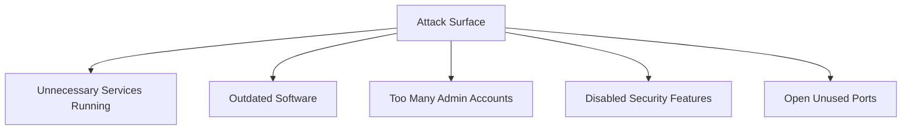

# Chapter 15 — Windows Hardening

## Introduction

Over the last several chapters, you've learned about individual Windows security features one at a time — Defender, the Firewall, UAC, BitLocker (Chapter 11), the Registry (Chapter 12), installed software (Chapter 13), and how to script routine checks (Chapter 14). **Hardening** is what happens when you stop thinking about these as separate topics and start treating them as one connected job: reducing the number of ways a machine can be attacked.

This is often called reducing the **attack surface** — every open port, enabled feature, outdated program, and misconfigured setting is a potential way in. Hardening means turning off what isn't needed, tightening what is, and checking regularly that nothing has quietly drifted out of a secure state.

---

## Learning Objectives

Students should be able to:

- Explain what "attack surface" means and why reducing it matters.
- Describe the principle of least privilege and how it applies to everyday Windows use.
- List core hardening actions covering accounts, security features, software, and services.
- Explain what a security baseline is and why organizations use one.
- Combine checks from earlier chapters into a single hardening review, using a script.

---

## Why Blue Teams Care

1. **Prevention Is Cheaper Than Response.** A hardened machine is harder to compromise in the first place, which means fewer incidents for the Blue Team to respond to later.
2. **Hardening Shrinks the Investigation.** When a machine follows a known baseline, anything that doesn't match that baseline — a new local account, a disabled firewall profile, an unexpected running service — stands out immediately.
3. **Compliance Expectations.** Many organizations are required to follow a documented hardening standard (such as a CIS Benchmark) as part of audits or industry regulations.

---

## Core Concepts

### 1. What Is Attack Surface?

The **attack surface** of a computer is the sum of everything an attacker could potentially use to get in or cause damage — open network ports, running services, installed software, enabled features, and user accounts with more access than they need.



Every item removed from this list — a service stopped, a program uninstalled, an unused account disabled — is one less thing an attacker can try.

### 2. Principle of Least Privilege

The **principle of least privilege** means giving a user, account, or program only the access it actually needs to do its job — nothing more.

In practice, this looks like:

- Using a **standard user account** for everyday work, and only using an administrator account when elevation is truly needed (this is exactly what UAC, from Chapter 11, enforces).
- Not leaving unused accounts (like `Guest`) enabled.
- Not granting broad file permissions (Chapter 07) when a narrower set would do.

### 3. Core Hardening Areas

| Area | What "Hardened" Looks Like |
|---|---|
| **Accounts** | Unused accounts (Guest, unused local admins) disabled; strong, unique passwords in use |
| **Security Features** | Defender, Firewall, UAC, and BitLocker all enabled and unmodified from Chapter 11 |
| **Software** | Only approved software installed; everything kept up to date (Chapter 13) |
| **Services** | Unused Windows services stopped or disabled, especially ones with network exposure |
| **Registry** | No unexpected entries in autorun locations like `Run` (Chapter 12) |
| **Updates** | Windows Update kept current so known vulnerabilities are patched |

### 4. Security Baselines

A **security baseline** is a documented, agreed-upon standard for how a system should be configured — which features must be on, which accounts should exist, which services are allowed to run. Instead of everyone hardening a machine slightly differently, a baseline gives a single target to check against.

Microsoft publishes its own **Security Compliance Toolkit** baselines for Windows, and the Center for Internet Security (CIS) publishes independent **CIS Benchmarks** — both are commonly used starting points rather than something an organization has to invent from scratch.

---

## Practical Examples

### Disabling an Unused Account

```powershell
# Disable the built-in Guest account if it's enabled
Disable-LocalUser -Name "Guest"

# Confirm the change
Get-LocalUser -Name "Guest" | Select-Object Name, Enabled
```

### Checking for Unnecessary Running Services

```powershell
# List services that are currently running
Get-Service | Where-Object { $_.Status -eq "Running" } | Select-Object Name, DisplayName
```

> **Note**
>
> Don't disable a service just because you don't recognize its name. Confirm what it does first — stopping the wrong service can break functionality the user or business depends on.

### Confirming Windows Update Status

```powershell
# Check when updates were last installed
Get-HotFix | Sort-Object InstalledOn -Descending | Select-Object -First 5
```

### Putting It Together: A Simple Hardening Review Script

This example reuses the scripting skills from Chapter 14 to check several hardening areas at once.

```powershell
# HardeningReview.ps1
# Runs a basic hardening review across accounts, security features, and updates

Write-Host "=== Account Check: Guest Account ===" -ForegroundColor Cyan
Get-LocalUser -Name "Guest" | Select-Object Name, Enabled

Write-Host "`n=== Security Features (Chapter 11) ===" -ForegroundColor Cyan
Get-MpComputerStatus | Select-Object RealTimeProtectionEnabled
Get-NetFirewallProfile | Select-Object Name, Enabled

Write-Host "`n=== Recent Windows Updates ===" -ForegroundColor Cyan
Get-HotFix | Sort-Object InstalledOn -Descending | Select-Object -First 3
```

---

## Blue Team Investigation Notes

> **Blue Team Insight: Hardening Gaps Are Findings, Too**
>
> A hardening review isn't just a one-time setup task — it's something an analyst can run against a machine at any point to answer, "Has this system drifted away from a secure baseline?"
>
> - A Guest account that's suddenly enabled, when the baseline says it should be disabled, is worth investigating on its own.
> - A running service that was previously stopped may indicate either a legitimate change or something an attacker enabled to help them move around the network.
> - Comparing today's results against last month's is often more useful than looking at a single snapshot in isolation.

---

## Common Mistakes

| Mistake | Consequence | How to Avoid |
|---|---|---|
| Disabling services without knowing what they do | Breaks functionality the user or business needs | Research a service before disabling it, and test the change |
| Hardening once and never checking again | Settings drift back to an insecure state over time | Re-run hardening checks on a regular schedule |
| Copying someone else's baseline without review | The baseline may not fit this organization's actual needs | Use published baselines (Microsoft, CIS) as a starting point, then adjust deliberately |
| Treating hardening as a single feature | Missing weaknesses in areas that weren't checked | Cover accounts, security features, software, services, and updates together |

---

## Best Practices

1. **Adopt a published baseline** (Microsoft Security Compliance Toolkit or CIS Benchmarks) rather than inventing hardening rules from scratch.
2. **Disable what isn't used** — accounts, services, and software alike — following the principle of least privilege.
3. **Automate the review** using a script like the example above, so hardening checks can run consistently and repeatedly.
4. **Re-check regularly.** Hardening is a maintenance habit, not a one-time task.
5. **Document any intentional exceptions** to the baseline, so a future analyst doesn't mistake a known, approved exception for a new problem.

---

## Summary

- Hardening means reducing a machine's attack surface — the sum of everything that could be used against it.
- The principle of least privilege means giving users, accounts, and programs only the access they actually need.
- Core hardening areas include accounts, security features (Chapter 11), installed software (Chapter 13), running services, and the Registry (Chapter 12).
- A security baseline (such as a CIS Benchmark) gives a consistent target to configure and check against.
- Scripts (Chapter 14) let a hardening review run consistently and be repeated over time, which makes future drift easy to spot.

The next and final chapter in this section ties everything together into a full Blue Team Windows investigation, drawing on every topic covered so far.

---

## Key Commands

| Command / Cmdlet | Purpose | Example |
|---|---|---|
| `Disable-LocalUser` | Disables a local user account | `Disable-LocalUser -Name "Guest"` |
| `Get-LocalUser` | Lists local user accounts and their enabled status | `Get-LocalUser -Name "Guest"` |
| `Get-Service` | Lists Windows services and their status | `Get-Service \| Where-Object Status -eq Running` |
| `Get-HotFix` | Lists installed Windows updates | `Get-HotFix \| Sort-Object InstalledOn -Descending` |
| `Get-MpComputerStatus` | Checks Windows Defender status (Chapter 11) | `Get-MpComputerStatus` |
| `Get-NetFirewallProfile` | Checks firewall profile status (Chapter 11) | `Get-NetFirewallProfile` |

---

## Further Reading

- [Microsoft Learn: Windows Security Baselines](https://learn.microsoft.com/en-us/windows/security/operating-system-security/device-management/windows-security-configuration-framework/windows-security-baselines)
- [CIS Benchmarks for Windows](https://www.cisecurity.org/benchmark/microsoft_windows_desktop)
- [Microsoft Learn: Security Compliance Toolkit](https://learn.microsoft.com/en-us/windows/security/operating-system-security/device-management/windows-security-configuration-framework/security-compliance-toolkit-10)
- [MITRE ATT&CK: Mitigations Overview](https://attack.mitre.org/mitigations/enterprise/)

---

# Next Chapter

➡ **[Chapter 16 — Blue Team Windows Investigation](./Chapter%2016%20%E2%80%94%20Blue%20Team%20Windows%20Investigation.md)**
