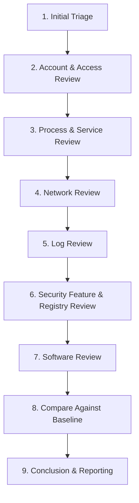

# Chapter 16 — Blue Team Windows Investigation

## Introduction

This chapter is a capstone — it doesn't introduce a brand-new Windows feature the way earlier chapters did. Instead, it walks through how an analyst actually uses everything from Chapters 04 through 15 together, in order, during a real investigation.

Imagine this scenario: a user reports that their computer has been "acting weird" — it's slower than usual, and a program they don't recognize appeared on the desktop. There's no confirmed malware yet, just a suspicion. This chapter follows that investigation from first login to final conclusion, using the exact commands and concepts you've already learned.

---

## Learning Objectives

Students should be able to:

- Describe a structured, repeatable approach to investigating a suspicious Windows machine.
- Apply command-line skills (Chapters 04–05) to gather evidence efficiently.
- Check accounts, permissions, processes, and network activity as part of one investigation (Chapters 06–09).
- Review logs, security features, the Registry, and installed software for signs of compromise (Chapters 10–13).
- Use a script to bring these checks together instead of running each one by hand (Chapter 14).
- Compare findings against a hardening baseline to spot what changed (Chapter 15).

---

## Why Blue Teams Care

An investigation is rarely about knowing one advanced trick — it's about checking the right things, in a sensible order, and not missing something obvious because you jumped straight to the exotic explanation. A structured process:

1. **Prevents Tunnel Vision.** Following a consistent order of checks means you're less likely to overlook an important artifact just because it wasn't the first thing that caught your eye.
2. **Produces Evidence, Not Guesses.** Every step in this chapter is backed by a specific command from an earlier chapter — this is what separates an investigation from a hunch.
3. **Builds a Timeline.** Combining account activity, process activity, network activity, and log timestamps lets you reconstruct roughly what happened and when — often the most valuable output of the whole investigation.

---

## Core Concepts: A Structured Investigation Workflow



Each stage below maps directly back to the chapter where you first learned it.

### Stage 1: Initial Triage (Chapters 04–05)

Start with basic situational awareness — who's logged in, what the system is, and how long it's been running.

```cmd
:: Confirm the current user and basic host info
whoami
hostname
systeminfo | findstr /B /C:"OS Name" /C:"System Boot Time"
```

### Stage 2: Account & Access Review (Chapters 06–07)

Check whether any accounts or group memberships look unexpected, and confirm nothing important has had its permissions loosened.

```powershell
# List local accounts and confirm none are unexpectedly enabled
Get-LocalUser | Select-Object Name, Enabled

# Confirm who's in the local Administrators group
Get-LocalGroupMember -Group "Administrators"
```

### Stage 3: Process & Service Review (Chapter 08)

Look for unfamiliar processes or services, especially ones using unusual resources or running from unusual locations.

```powershell
# List running processes sorted by CPU usage
Get-Process | Sort-Object CPU -Descending | Select-Object -First 10 Name, Id, CPU

# List running services
Get-Service | Where-Object { $_.Status -eq "Running" }
```

### Stage 4: Network Review (Chapter 09)

Check what the machine is actually talking to on the network right now.

```powershell
# List established network connections and the process behind each one
Get-NetTCPConnection -State Established |
    Select-Object LocalAddress, LocalPort, RemoteAddress, RemotePort, OwningProcess
```

### Stage 5: Log Review (Chapter 10)

Check the Security log for logon activity and account changes around the time the problem started.

```powershell
# View the 10 most recent logon events
Get-WinEvent -LogName Security -MaxEvents 10 |
    Where-Object { $_.Id -eq 4624 -or $_.Id -eq 4625 }
```

### Stage 6: Security Feature & Registry Review (Chapters 11–12)

Confirm the machine's core defenses are still active, and check the classic persistence locations in the Registry.

```powershell
# Confirm Defender and Firewall are still enabled
Get-MpComputerStatus | Select-Object RealTimeProtectionEnabled
Get-NetFirewallProfile | Select-Object Name, Enabled

# Check autorun entries for anything unfamiliar
Get-ItemProperty "HKCU:\SOFTWARE\Microsoft\Windows\CurrentVersion\Run"
Get-ItemProperty "HKLM:\SOFTWARE\Microsoft\Windows\CurrentVersion\Run"
```

### Stage 7: Software Review (Chapter 13)

Check the installed software list for anything that wasn't there before, or that doesn't belong.

```powershell
# List installed software with install dates
Get-ItemProperty "HKLM:\SOFTWARE\Microsoft\Windows\CurrentVersion\Uninstall\*" |
    Select-Object DisplayName, InstallDate, Publisher |
    Where-Object { $_.DisplayName }
```

### Stage 8: Compare Against Baseline (Chapter 15)

With all the evidence gathered, compare it against what the machine's hardening baseline says it should look like. Is the Guest account still disabled? Are all the expected services running, and nothing extra? Does the installed software list match what's approved?

### Stage 9: Conclusion & Reporting

Summarize what was found, whether it supports the original concern, and what — if anything — needs to change (removing software, disabling an account, escalating to a deeper forensic investigation).

---

## Practical Examples

### Combining the Workflow into One Script

This reuses the scripting approach from Chapter 14 to run the early triage stages in one pass.

```powershell
# InvestigationTriage.ps1
# Runs Stage 1-4 checks from this chapter's workflow

Write-Host "=== Stage 1: Initial Triage ===" -ForegroundColor Cyan
whoami
hostname

Write-Host "`n=== Stage 2: Account Review ===" -ForegroundColor Cyan
Get-LocalUser | Select-Object Name, Enabled

Write-Host "`n=== Stage 3: Top Processes by CPU ===" -ForegroundColor Cyan
Get-Process | Sort-Object CPU -Descending | Select-Object -First 5 Name, Id, CPU

Write-Host "`n=== Stage 4: Established Network Connections ===" -ForegroundColor Cyan
Get-NetTCPConnection -State Established |
    Select-Object LocalAddress, LocalPort, RemoteAddress, RemotePort, OwningProcess
```

Running this single script gathers the first four stages of the workflow in one pass, instead of typing each command out by hand.

---

## Blue Team Investigation Notes

> **Blue Team Insight: What Actually Matters**
>
> In our scenario — a slow computer with an unrecognized program on the desktop — a real investigation might turn up something like:
>
> - An unfamiliar entry in the Registry `Run` key pointing to a file in `%TEMP%` (Stage 6).
> - A recent `InstallDate` for a program with a generic-sounding name and no clear publisher (Stage 7).
> - A process consuming unusually high CPU, tied to that same unfamiliar program (Stage 3).
> - An established network connection to an address that doesn't match any known business service (Stage 4).
>
> No single one of these facts proves anything on its own. It's the **combination**, gathered in a structured way, that turns a vague complaint ("it's acting weird") into a supported conclusion.

---

## Common Mistakes

| Mistake | Consequence | How to Avoid |
|---|---|---|
| Jumping straight to the "interesting" finding | Missing simpler, more likely explanations first | Work through the stages in order, even when something catches your eye early |
| Treating one unusual artifact as proof of compromise | False conclusions and wasted remediation effort | Corroborate findings across multiple stages before concluding anything |
| Skipping the baseline comparison | No reference point for what "normal" looks like on this machine | Always compare findings against Chapter 15's hardening baseline concepts |
| Not documenting each step | Findings are hard to explain or repeat later | Record commands run and their output as you go, not just your final conclusion |

---

## Best Practices

1. **Follow a consistent workflow** every time, rather than improvising a different order for each investigation.
2. **Corroborate findings across categories** — accounts, processes, network, logs, Registry, and software — instead of relying on just one.
3. **Script the routine parts** (Chapter 14) so you can focus your attention on judgment calls, not repetitive typing.
4. **Compare against a baseline** (Chapter 15) so "unusual" has a concrete reference point, not just a gut feeling.
5. **Write down what you find as you go**, so your final report reflects the evidence, not just your memory of it.

---

## Summary

- A Blue Team investigation is a structured walk through the same skills covered in Chapters 04–15, applied in a sensible order.
- Initial triage, account review, process/service review, network review, log review, security feature and Registry review, and software review each build on a specific earlier chapter.
- No single finding is usually enough on its own — conclusions come from combining evidence across multiple stages.
- Comparing findings against a hardening baseline (Chapter 15) gives a concrete reference point for what counts as "unusual."
- Scripting the routine parts of an investigation (Chapter 14) frees up time for the judgment calls that actually require an analyst's attention.

This closes out the Windows Fundamentals track of the handbook. The skills in this chapter are exactly what a Tier 1 SOC Analyst is expected to apply on day one — everything from here builds toward deeper detection engineering and incident response.

---

## Key Commands

| Command / Cmdlet | Stage | Example |
|---|---|---|
| `whoami`, `hostname` | Initial Triage | `whoami` |
| `Get-LocalUser`, `Get-LocalGroupMember` | Account Review | `Get-LocalUser` |
| `Get-Process`, `Get-Service` | Process & Service Review | `Get-Process \| Sort-Object CPU -Descending` |
| `Get-NetTCPConnection` | Network Review | `Get-NetTCPConnection -State Established` |
| `Get-WinEvent` | Log Review | `Get-WinEvent -LogName Security -MaxEvents 10` |
| `Get-MpComputerStatus`, `Get-NetFirewallProfile` | Security Feature Review | `Get-MpComputerStatus` |
| `Get-ItemProperty` (Run keys) | Registry Review | `Get-ItemProperty "HKCU:\...\Run"` |
| `Get-ItemProperty` (Uninstall key) | Software Review | `Get-ItemProperty "HKLM:\...\Uninstall\*"` |

---

## Further Reading

- [Microsoft Learn: Incident Response Overview](https://learn.microsoft.com/en-us/security/operations/incident-response-overview)
- [MITRE ATT&CK Enterprise Matrix](https://attack.mitre.org/matrices/enterprise/)
- [SANS: Incident Handler's Handbook](https://www.sans.org/white-papers/33901/)
- [NIST SP 800-61: Computer Security Incident Handling Guide](https://csrc.nist.gov/pubs/sp/800/61/r2/final)