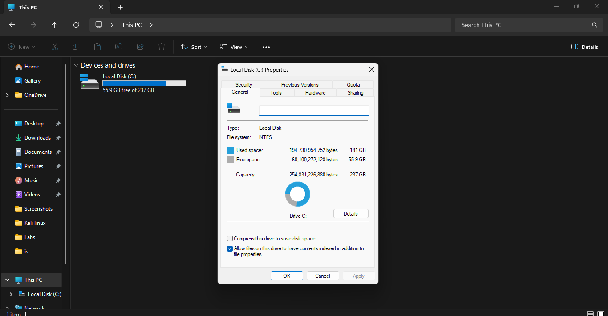
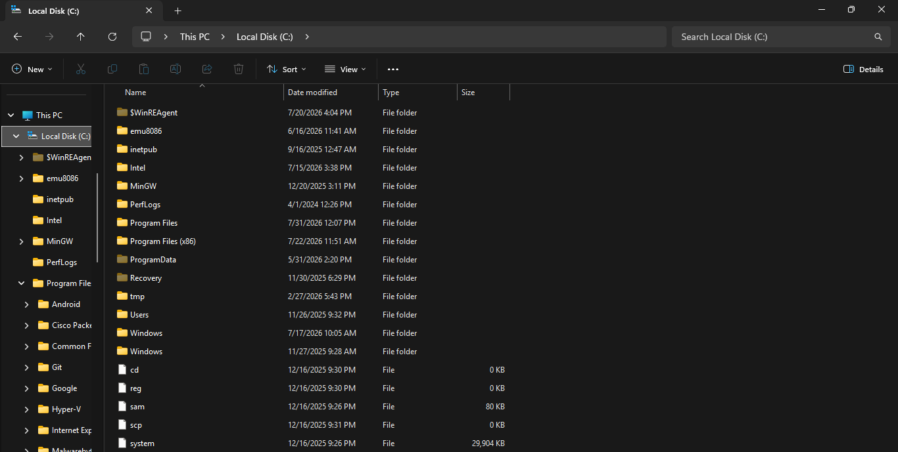
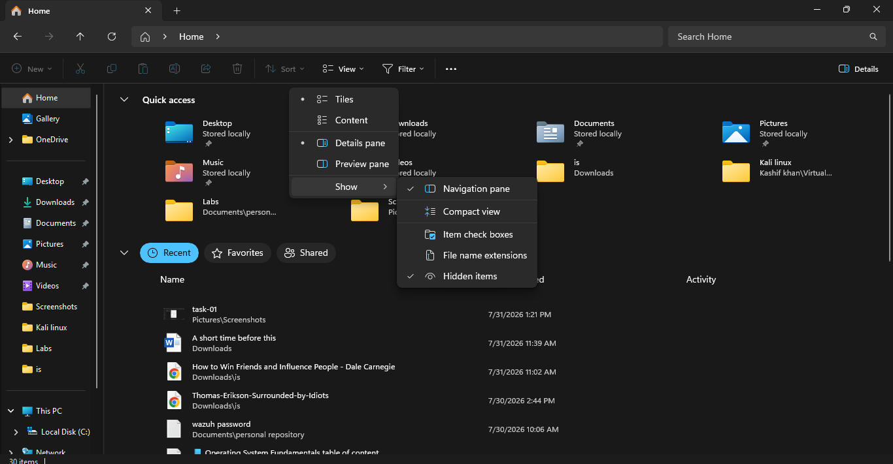
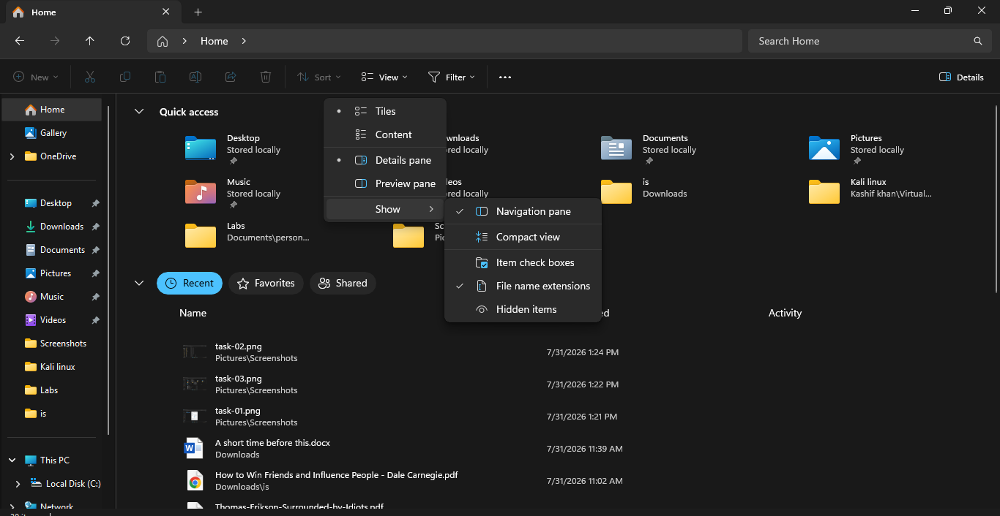
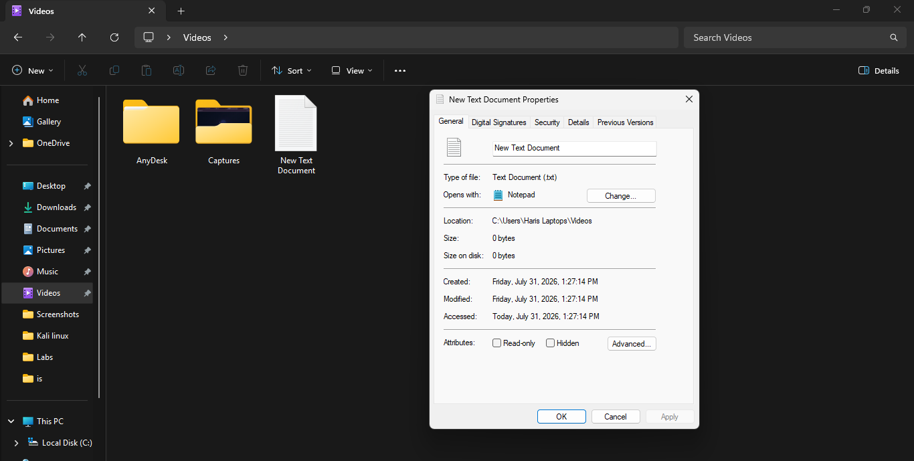
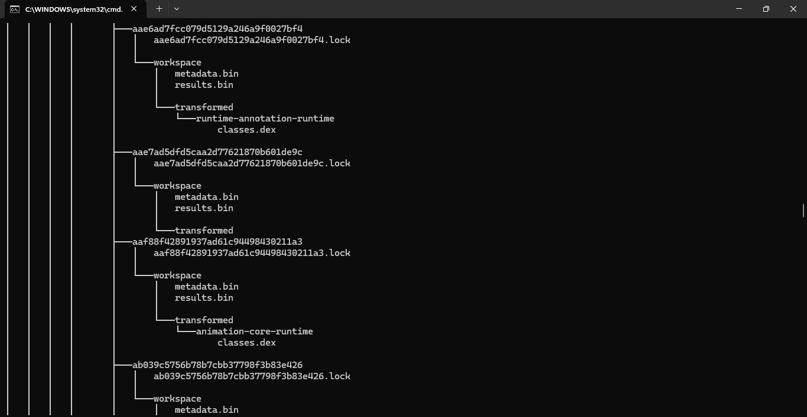
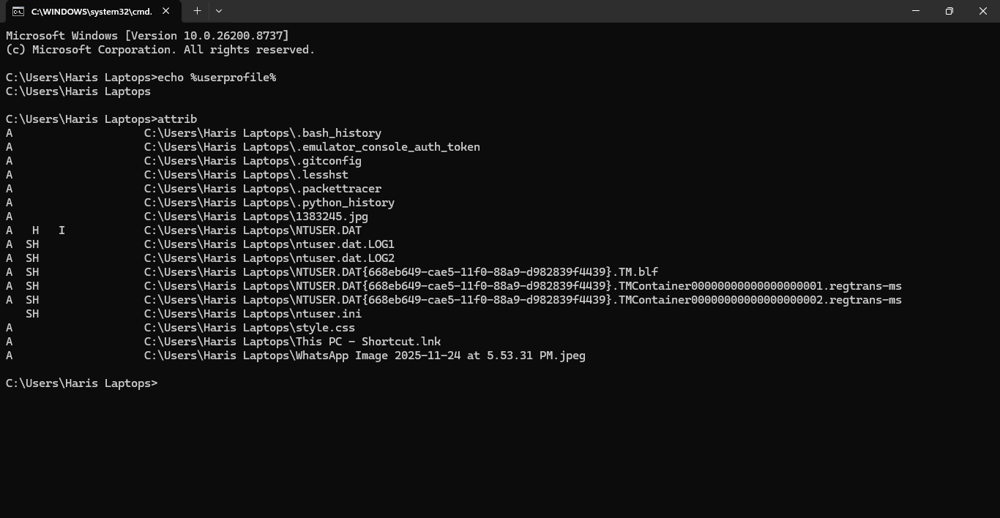
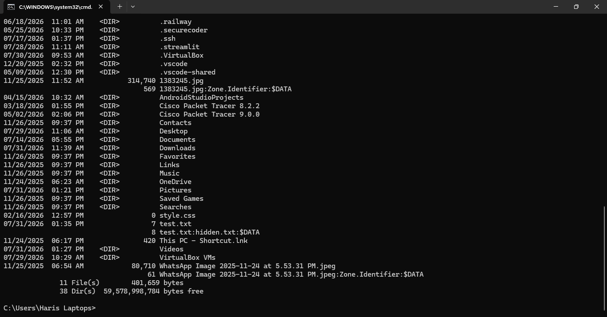

# Solution — Lab 02: File System Investigation

> This solution guide walks you through the scenario where a user downloaded a suspicious payload, demonstrating how to properly configure your file system visibility and hunt for the hidden artifacts.

---

# Task 1 — Map the Terrain

## Steps

1. Open **File Explorer**.
2. Select **This PC**.
3. View the available drives and note their file systems.

### Example Result



| Drive | File System | Purpose |
|--------|-------------|---------|
| C: | NTFS | Windows Operating System & Staging Ground |
| D: | NTFS | Data Storage |

### Investigation Note
Every drive letter represents a mounted volume. Attackers generally stage their payloads on the `C:` drive, but they can also pivot to connected external or mapped drives.

---

# Task 2 — Inspect Critical OS Directories

Navigate to the following directories on your primary drive (`C:\`).



- **`C:\Windows`**: Stores the Windows operating system files. Attackers often try to drop payloads here to masquerade as legitimate OS binaries (e.g., `svchost.exe`).
- **`C:\Users`**: Contains user profiles. If a specific user clicked a malicious link, their `Downloads` or `AppData` folder is ground zero.
- **`C:\Program Files`**: Stores installed 64-bit applications.
- **`C:\ProgramData`**: *(You might not see this yet!)* Stores application data shared between all users.

---

# Task 3 — Expose the Unseen

## Steps

File Explorer → **View** → **Show** → **Hidden Items**

### Expected Result



Hidden folders become visible. On the `C:\` drive, you will now see `ProgramData`. Inside your user profile, you will see `AppData`.

### Investigation Note
Windows hides important files to prevent accidental deletion. However, attackers know this and intentionally mark their malware directories as "Hidden" so users don't see them. Exposing hidden items is step one of any manual triage.

---

# Task 4 — Unmask the Extensions

## Steps

File Explorer → **View** → **Show** → **File Name Extensions**

### Example



Before:
```
invoice
```

After:
```
invoice.pdf.exe
```

### Investigation Note
The user thought they downloaded a PDF. Because Windows hides known file extensions by default, the `.exe` was hidden, and the user only saw `invoice.pdf`. Showing extensions reveals the true nature of the executable file.

---

# Task 5 — Extract the Metadata

## Steps

1. Create a file named `Evidence.txt` on your Desktop.
2. Right-click the file and select **Properties**.

### Example



| Property | Example |
|-----------|----------|
| Name | Evidence.txt |
| Type | Text Document |
| Location | C:\Users\Analyst\Desktop |
| Created | Today's Date |
| Modified | Today's Date |
| Accessed | Today's Date |

### Investigation Note
These timestamps form the basis of "Timestomping" attacks. Attackers can manipulate these timestamps to make a newly dropped malware file look like it has been on the system for years, blending in with legitimate OS files.

---

# Task 6 — Command Line Reconnaissance

## Steps

1. Open **Command Prompt**.
2. Run `echo %USERPROFILE%` to see your current home path.
3. Run `tree C:\Users\<YourName> /F` (replace with your actual username path).

### Example Output



```
C:\Users\John
├── Desktop
│      Evidence.txt
├── Documents
├── Downloads
│      invoice.pdf.exe
```

### Investigation Note
The `tree` command allows you to rapidly visualize the folder structure and spot anomalous files nested deep inside directories without clicking through the GUI.

---

# Task 7 — Investigate File Attributes

## Steps

1. In Command Prompt, navigate to your Desktop: `cd Desktop`
2. Run the command: `attrib`

### Example



```
A        Evidence.txt
H        Desktop.ini
```

### Investigation Note
If an attacker drops a payload and runs `attrib +h +s malware.exe`, it becomes both Hidden (`H`) and a System (`S`) file, making it exceptionally difficult to spot in standard explorer views.

---

# Task 8 — Uncover Alternate Data Streams (ADS)

## Steps

1. Create a clean file:
```cmd
echo "Clean Data" > safe.txt
```

2. Create a hidden ADS payload inside it:
```cmd
echo "Malicious Payload" > safe.txt:hidden.txt
```

3. Display the ADS:
```cmd
dir /r
```

### Example



```
08/02/2026  10:00 AM                13 safe.txt
                                    20 safe.txt:hidden.txt:$DATA
```

### Investigation Note
Even though `safe.txt` looks like a normal 13-byte text file, it is secretly carrying a hidden payload stream. Blue Team defenders use tools like `dir /r` or Sysinternals `Streams` to detect data smuggled within NTFS Alternate Data Streams.

---

# Scenario Conclusion

By unmasking hidden extensions, revealing hidden folders, and understanding Alternate Data Streams, you successfully traced the "invoice" incident back to a deceptive executable and uncovered how attackers exploit the Windows File System's default behaviors to maintain stealth.