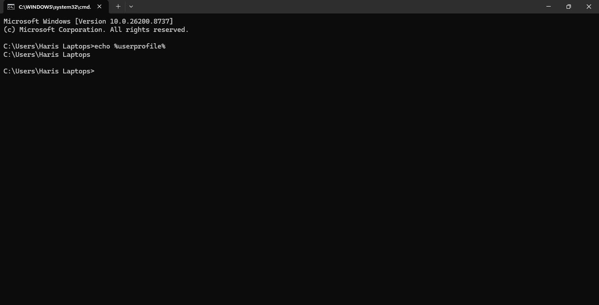
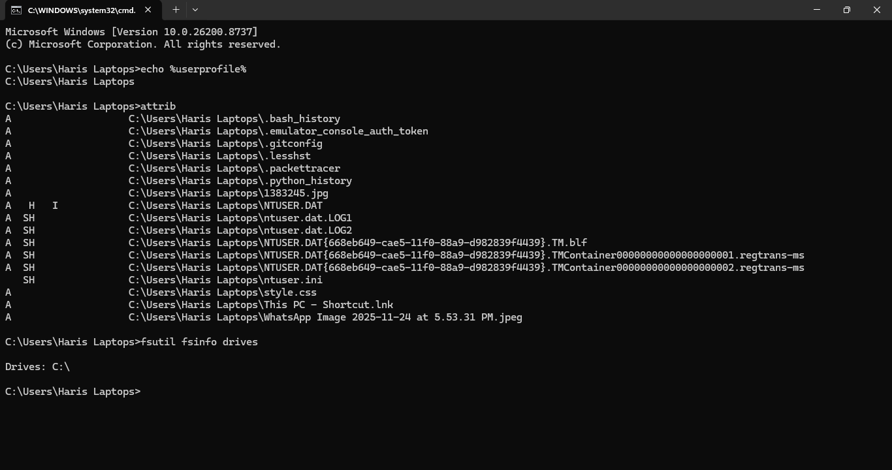

# Solution — Lab 02: File System Investigation

> This solution demonstrates one possible outcome of the lab. Depending on your Windows version and system configuration, your results may differ slightly.

---

# Task 1 — Explore Windows Drives

## Steps

1. Open **File Explorer**.
2. Select **This PC**.
3. View the available drives.

### Example Result


| Drive | File System | Purpose |
|--------|-------------|---------|
| C: | NTFS | Windows Operating System |
| D: | NTFS | Data Storage |
| E: | exFAT | USB Drive (Optional) |

### Explanation

- Every drive letter represents a mounted volume.
- Windows is usually installed on the **C:** drive.
- External storage devices receive the next available drive letter.

---

# Task 2 — Explore Important Windows Directories

Navigate to the following directories.


```
C:\Windows
```

Purpose:

Stores Windows operating system files.

---

```
C:\Users
```

Purpose:

Contains user profiles.

Example:

```
C:\Users

├── Administrator
├── Public
└── John
```

---

```
C:\Program Files
```

Purpose:

Stores installed 64-bit applications.

---

```
C:\Program Files (x86)
```

Purpose:

Stores installed 32-bit applications.

---

```
C:\ProgramData
```

Purpose:

Stores application data shared between all users.

---

# Task 3 — Display Hidden Items

## Steps

File Explorer

→ View

→ Show

→ Hidden Items

### Expected Result


Hidden folders become visible.

Examples:

```
AppData
Desktop.ini
ProgramData
```

### Explanation

Windows hides important files to prevent accidental deletion or modification.

---

# Task 4 — Show File Extensions

Enable:

```
View

↓

Show

↓

File Name Extensions
```

### Example


Before

```
Resume
```

After

```
Resume.pdf
```

### Explanation

Showing extensions helps identify executable files disguised as documents.

Example:

```
Invoice.pdf.exe
```

This is actually an executable, not a PDF document.

---

# Task 5 — Investigate File Properties

Create:

```
Investigation.txt
```

Right-click

↓

Properties

### Example


| Property | Example |
|-----------|----------|
| Name | Investigation.txt |
| Type | Text Document |
| Size | 1 KB |
| Location | Desktop |
| Created | Current Date |
| Modified | Current Date |
| Accessed | Current Date |

### Explanation

These values are stored as metadata and are useful during digital forensic investigations.

---

# Task 6 — Explore the Directory Structure

Run:

```cmd
tree C:\Users /F
```

### Example Output


```
C:\Users

├── Public

├── John

│      Desktop

│      Documents

│      Downloads

│      Pictures

│      Videos
```

### Explanation

The **tree** command displays folders and files in a hierarchical structure.

---

# Task 7 — Display User Profile

Run

```cmd
echo %USERPROFILE%
```

Example



```
C:\Users\John
```

### Explanation

The environment variable `%USERPROFILE%` points to the current user's home directory.

---

# Task 8 — Identify File Attributes

Navigate to the Desktop.

Run

```cmd
attrib
```

Example


```
A        Resume.pdf
A        Notes.txt
H        Desktop.ini
```

### Common Attributes

| Attribute | Meaning |
|-----------|----------|
| H | Hidden |
| S | System |
| R | Read Only |
| A | Archive |

### Explanation

Windows uses file attributes to identify special file properties.

---

# Task 9 — Investigate Drive Information

Run

```cmd
fsutil fsinfo drives
```

Example



```
Drives:

C:\

D:\
```

### Explanation

This command lists every mounted volume available on the system.

---

# Task 10 — Investigate Alternate Data Streams (ADS)

Create a file

```cmd
echo Hello > test.txt
```

Create an ADS

```cmd
echo Secret > test.txt:hidden.txt
```

Display ADS

```cmd
dir /r
```

Example


```
test.txt

26 test.txt:hidden.txt:$DATA
```

### Explanation

Although **test.txt** appears to contain only normal data, an additional hidden stream also exists.

Alternate Data Streams are an NTFS feature that allows multiple streams of data to be associated with a single file.

---

# Blue Team Investigation

## Suspicious File

```
invoice.pdf.exe
```

### Investigation

### Is the extension visible?

Yes.

Actual extension:

```
.exe
```

The file is an executable program.

---

### What is the actual file type?

Executable Application

---

### Where is the file located?

Example

```
C:\Users\John\Downloads
```

Downloads is a common location for malicious files.

---

### Who owns the file?

Open:

Properties

↓

Security

↓

Advanced

Record the Owner field.

Example

```
John
```

---

### Check File Metadata

Review

- Created Time
- Modified Time
- Accessed Time

Unexpected timestamps may indicate suspicious activity.

---

### Check for ADS

Run

```cmd
dir /r
```

If additional streams appear, further investigation is recommended.

---

### Should the File Be Trusted?

No.

Reasons:

- Double extension
- Executable file
- Located in Downloads
- Unknown source

The file should be scanned with Microsoft Defender or another antivirus solution before opening.

---

# Blue Team Summary

During this lab you learned how to:

- Navigate the Windows File System.
- Identify important Windows directories.
- Display hidden files.
- Display file extensions.
- View metadata.
- Identify file attributes.
- Investigate Alternate Data Streams.
- Examine suspicious files using basic Blue Team techniques.

---

# Key Takeaways

- Always display file extensions.
- Never trust files based only on their icon.
- Verify metadata before opening unknown files.
- Downloads and Temp folders are common malware locations.
- NTFS stores valuable forensic information.
- Alternate Data Streams can hide malicious data.
- File metadata is critical during incident response.

---

# Conclusion

You have successfully completed **Lab 02 – File System Investigation**.

The knowledge gained in this lab provides the foundation for understanding Windows storage, file management, digital forensics, and Blue Team investigations. These concepts will be used throughout the remaining Windows Fundamentals chapters.